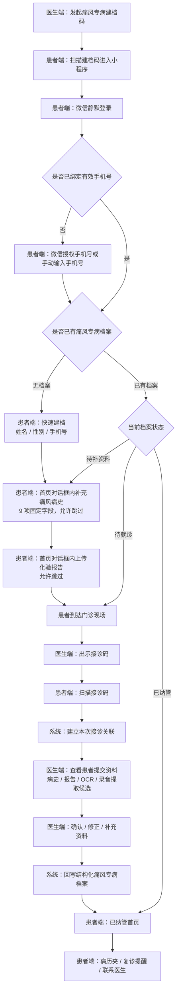
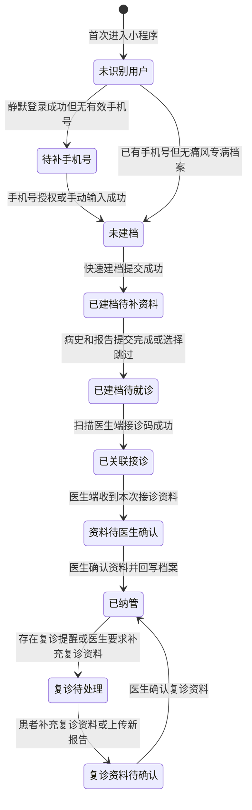
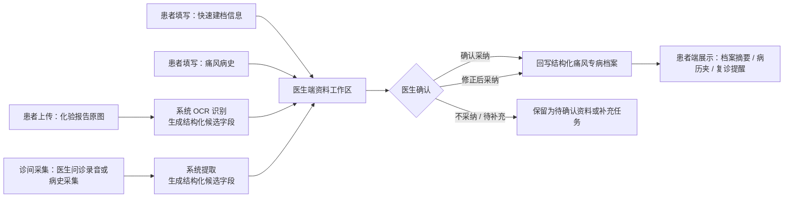

# 痛风专病智能体患者端 PRD v2.0.3

| 项目 | 内容 |
| --- | --- |
| 当前版本 | v2.0.3 |
| 更新日期 | 2026-07-15 |
| 原始版本 | v1.0.0，2026-07-08 |
| 整合来源 | 患者端首页状态规范 v1.2、上传报告状态反馈规范 v1.0、Demo 设计规范 AI 执行版、不同端口资料覆盖原则 v1.0.0、医生端患者端交互交叉确认断裂点反馈、字段字典 v1.1.1 |

## 文档说明

本文档是痛风专病智能体患者端唯一权威 PRD。本文档已将散落在设计规范、首页状态规范、上传报告状态反馈规范、资料覆盖原则、交互交叉确认和组件复用规则中的患者端相关决策全部整合进来，确保 PRD 与 Demo、设计规范和字段字典完全对齐、自洽且无遗漏。

患者端是本文档主体，医生端不作为完整独立模块展开，但本文档会写明患者端依赖的医生端发起建档码、出示接诊码、查看资料、确认资料、回写档案和状态同步规则，确保患者端流程能够被研发实现和测试验收。

## 目录

1. 产品背景与目标
2. 角色与使用场景
3. 入口与权限规则
4. 主流程与状态流转
5. 患者端信息架构与页面需求
6. 医生端关联规则
7. 字段、来源与回写规则
8. OCR、录音提取与资料合并规则
9. 空态、异常态与提示文案
10. 待确认事项
11. 验收标准
12. 引用文档

## 1. 产品背景与目标

### 1.1 背景

痛风专病管理需要覆盖患者从初次建档、诊前资料补充、门诊接诊、医生确认资料，到纳管后复诊提醒和持续管理的完整链路。现有门诊场景中，患者病史、用药情况、既往化验报告、复诊资料往往分散在患者口述、外院报告、历史就诊记录和医生问诊过程中，医生需要在有限接诊时间内完成信息收集、判断和归档，容易出现资料不完整、重复录入、确认成本高、患者就诊后缺少持续感知的问题。

本期患者端的建设目标，是通过小程序入口把患者纳入痛风专病管理流程，让患者在就诊前或就诊过程中完成基础建档、手机号补充、痛风病史补充和化验报告上传；医生端在接诊时查看患者提交资料，并结合诊间病史采集、OCR 识别结果和医生确认结果，形成结构化痛风专病档案。医生确认后的档案摘要、复诊提醒和联系医生入口同步展示到患者端，形成从诊前建档到纳管后管理的闭环。

### 1.2 产品定位

痛风专病智能体患者端 V1.0 定位为痛风专病管理流程中的患者侧入口，不是独立健康管理平台，也不是通用问诊工具。本版本重点服务门诊痛风患者的专病建档、资料补充、扫码就诊和纳管后基础管理，帮助医生减少重复采集成本，帮助患者获得清晰的病历摘要、复诊提醒和后续联系入口。

患者端只承担患者可完成、可确认、可补充的动作，不直接替代医生诊断，不直接生成最终医疗结论，不允许患者提交内容自动覆盖医生已确认的结构化档案。涉及诊断判断、关键病史确认、化验报告归档和档案回写的内容，均以医生端确认后的结果为准。

### 1.3 目标用户

本版本目标用户包括未建档痛风患者、已扫码建档但尚未完成就诊的患者、已完成医生确认并纳入痛风专病管理的患者，以及后续需要按复诊提醒补充资料或联系医生的复诊患者。

医生端相关使用者包括门诊医生、专病管理医生或承担痛风患者建档与随访管理的医护人员。医生端在本需求中不作为完整独立模块展开，但需要定义与患者端强相关的发起建档码、出示接诊码、查看患者资料、确认资料、回写档案和同步患者状态等规则。

### 1.4 版本目标

V1.0 需要完成患者端从建档到纳管后的最小闭环。患者可以通过医生发起的痛风专病建档入口进入小程序，完成静默登录、手机号授权或手动补充，并以最少字段完成快速建档。快速建档字段只包含姓名、性别、手机号，年龄、病史、用药、化验等信息进入后续专病档案或资料补充流程。

患者建档后，可以按流程补充痛风病史、上传化验报告，并在门诊现场扫描医生端出示的接诊码完成就诊关联。医生端收到患者资料后，可以查看患者提交的病史、报告、OCR 识别结果和诊间采集信息，对结构化资料进行确认、修正或补充。医生确认后，系统将确认后的结构化内容回写痛风专病档案，并同步患者端状态。

患者完成纳管后，患者端需要展示与患者有直接获得感的内容，包括个人档案摘要、病历夹、复诊提醒、联系医生等入口。复诊提醒仅作为提醒能力，不表示患者已完成预约，不展示"预约成功"等容易误解的状态。

### 1.5 版本边界

V1.0 不做完整互联网医院问诊，不做患者自行诊断，不做复杂 AI 对话分诊，不做健康打卡和饮食问答，不把患者端设计成医生端工作台的替代品。患者端的核心链路围绕"快速建档、补充病史、上传报告、扫码就诊、医生确认、档案回写、纳管后管理"展开。

本版本中，医生端只定义与患者端闭环相关的关联规则，不在本文档中完整展开医生端全部页面和管理功能。医生端完整工作台、患者列表、接诊详情、结构化档案编辑等内容如需详细展开，可作为医生端 PRD 或关联章节另行编写。

### 1.6 成功标准

患者可以在 5 分钟内完成痛风专病快速建档和基础资料提交。医生可以在接诊时看到患者已提交的关键资料，并能对患者病史、报告识别结果和诊间采集内容进行确认后回写结构化档案。患者完成医生确认后，患者端状态能够正确进入已纳管，并展示病历夹、复诊提醒和联系医生等后续管理入口。

本版本验收时，应重点验证主流程是否闭环、患者端状态是否清晰、建档码和接诊码是否区分、患者提交资料是否需要医生确认后才进入正式档案、医生确认后的内容是否能同步到患者端。

## 2. 角色与使用场景

### 2.1 角色范围

本版本以患者端为主要建设对象，患者是小程序内所有页面和状态流转的直接使用者。医生端不在本文档中完整展开，但医生端的建档发起、接诊关联、资料确认和档案回写会直接影响患者端入口、状态和展示内容，因此作为关联角色纳入需求定义。

| 角色 | 角色说明 | 本版本相关动作 | 与患者端的关系 |
| --- | --- | --- | --- |
| 未建档患者 | 尚未在痛风专病智能体中建立专病档案的患者 | 扫描医生端发起的痛风专病建档码，进入患者端完成手机号补充和快速建档 | 进入患者端主流程的起点 |
| 已建档待就诊患者 | 已完成快速建档，但尚未完成本次门诊接诊关联的患者 | 补充痛风病史、上传化验报告、到诊后扫描医生端接诊码 | 处于诊前资料补充和就诊关联阶段 |
| 资料待确认患者 | 已提交病史或报告，医生端尚未完成资料确认和档案回写的患者 | 查看资料提交状态，必要时继续补充报告或等待医生处理 | 患者提交内容不能直接成为正式档案 |
| 已纳管患者 | 医生已确认资料并回写痛风专病档案的患者 | 查看个人档案摘要、病历夹、复诊提醒、联系医生入口 | 进入纳管后管理状态 |
| 复诊患者 | 已纳管且需要按复诊提醒再次就诊或补充资料的患者 | 查看复诊提醒、补充复诊资料、上传新的化验报告、联系医生 | 复诊提醒仅为提醒，不代表预约成功 |
| 门诊医生 / 专病管理医生 | 在医生端发起建档、接诊、确认资料和回写档案的医护人员 | 发起痛风专病建档码、出示接诊码、查看患者资料、确认或修正资料、回写结构化档案 | 患者端状态变化和档案展示的主要触发方 |

### 2.2 患者端核心使用场景

患者端核心场景围绕"进入、建档、补资料、就诊、纳管后查看"展开。每个场景都需要明确患者当前状态、患者可执行动作、医生端是否参与，以及该场景结束后患者状态如何变化。

| 场景 | 触发条件 | 患者端动作 | 医生端关联动作 | 场景结果 |
| --- | --- | --- | --- | --- |
| 扫建档码进入 | 医生端在工作台或患者 / 居民列表发起痛风专病建档码，患者通过微信扫描进入小程序 | 小程序静默登录，检查是否已有手机号和专病建档记录 | 医生端生成建档码，建档码携带痛风专病上下文 | 患者进入手机号补充或快速建档流程 |
| 补充手机号 | 患者首次进入或系统未获取到有效手机号 | 患者通过微信授权手机号或手动输入手机号 | 医生端不录入患者手机号 | 患者获得继续建档资格 |
| 快速建档 | 患者已进入痛风专病建档链路，且未完成快速建档 | 患者填写姓名、性别、手机号并提交 | 医生端可在后续患者资料中看到建档信息 | 生成痛风专病临时档案或待确认档案 |
| 补充痛风病史 | 患者完成快速建档后，进入诊前资料补充阶段 | 患者在首页对话框内按 9 项固定字段补充痛风病史，每一步允许跳过 | 医生端后续查看患者提交的病史内容，并决定是否采纳、修正或补充 | 患者病史进入待医生确认资料 |
| 上传化验报告 | 患者有既往或本次化验报告需要提交 | 患者在首页对话框内通过附件面板拍照或上传化验报告，可继续上传多张 | 医生端查看报告原图、OCR 识别结果和异常字段 | 报告进入待识别、待确认或已归档状态 |
| 扫码就诊 | 患者到达门诊现场，医生端出示接诊码 | 患者扫描接诊码，完成本次就诊关联 | 医生端展示接诊码，并接收患者本次就诊关联关系 | 患者与本次门诊接诊建立关联 |
| 医生确认资料 | 患者已提交病史、报告或完成扫码就诊 | 患者端展示资料已提交或待医生处理状态 | 医生查看患者资料、结合录音提取和 OCR 结果进行确认、修正、补充 | 确认后的内容回写结构化痛风专病档案 |
| 纳管后查看 | 医生确认资料并完成档案回写后 | 患者查看个人档案摘要、病历夹、复诊提醒、联系医生入口 | 医生端已完成患者纳管或档案确认动作 | 患者端进入已纳管状态 |
| 复诊资料补充 | 患者已纳管，存在复诊提醒或医生希望患者补充资料 | 患者查看复诊提醒，补充复诊资料或上传新报告 | 医生端后续查看复诊资料，并按需确认或回写 | 新资料进入复诊资料补充和医生确认流程 |

### 2.3 医生端关联使用场景

医生端在本文档中的作用，是为患者端提供入口、状态变化和档案回写依据。医生端相关需求在患者端 PRD 中只写到与患者端闭环直接相关的部分，不展开医生端完整工作台和全部业务页面。

医生在建档阶段需要能够从工作台或患者 / 居民列表外层发起痛风专病建档入口，生成患者可扫码进入的小程序建档码。建档码用于引导患者进入痛风专病快速建档链路，并自动带出痛风专病上下文。建档码不用于门诊现场接诊，不等同于接诊码。

医生在接诊阶段需要能够出示本次门诊接诊码。患者端扫描接诊码后，系统建立患者与本次接诊的关联关系。接诊码用于门诊现场就诊关联，不用于患者快速建档入口。患者端统一使用"扫码就诊"或"扫接诊码"的口径，不使用"扫码签到"。

医生在资料确认阶段需要能够查看患者提交的快速建档信息、痛风病史、化验报告原图、OCR 识别结果，以及诊间录音或病史采集形成的结构化候选内容。医生可以确认、修正或补充这些内容。只有医生确认后的内容才能回写正式痛风专病档案，并作为患者端病历夹和档案摘要的展示依据。

医生在纳管和复诊管理阶段需要能够维护患者复诊提醒、查看患者补充的复诊资料，并按需联系患者。患者端展示的复诊提醒只代表医生或系统对患者的复诊提示，不代表患者已完成挂号或预约。患者端不得展示容易让患者误解为预约成功的状态。

### 2.4 使用场景边界

患者端不承担医生端录入替代功能。患者可以补充信息、上传报告、查看医生确认后的摘要，但患者不能直接修改医生已确认的关键医疗字段，不能直接覆盖正式结构化档案，不能自行生成诊断结论。

医生端不在患者快速建档环节代替患者录入手机号。手机号补充发生在患者端页面，可通过微信授权或手动输入完成。医生端快速建档或发起建档码时，快速建档字段只保留姓名、性别、手机号，年龄进入后续专病档案，病史、用药、化验资料进入后续资料补充或医生确认流程。

健康打卡和饮食问答不纳入患者端 V1.0；如后续立项，应另行定义入口、数据范围和交互规则，不影响"建档、补病史、上传报告、扫码就诊、医生确认、档案回写、复诊提醒"的主流程闭环。

## 3. 入口与权限规则

### 3.1 入口类型

患者端 V1.0 支持三类核心入口：痛风专病建档码入口、接诊码入口、患者端常规访问入口。不同入口对应不同业务目的，不得混用。

痛风专病建档码由医生端发起，用于引导未建档或未完成痛风专病建档的患者进入患者端建档流程。患者扫描建档码后，系统进入小程序静默登录、手机号补充和快速建档流程，并自动带出痛风专病上下文。建档码用于"进入专病建档链路"，不用于门诊现场接诊。建档码是医生端生成的固定二维码，绑定医生身份和专病（如"王文龙医生 · 痛风专病"），适用于候诊前自助建档、宣传物料和诊室门口张贴。

接诊码由医生端在门诊现场出示，用于患者扫描后完成本次就诊关联。患者扫描接诊码后，系统应识别患者身份、当前专病档案状态和本次接诊信息，并将患者与医生端当前接诊场景建立关联。接诊码用于"扫码就诊"，不用于首次建档入口。接诊码是医生端在诊间实时刷新的动态二维码，就诊结束后失效。患者端统一使用"扫码就诊"或"扫接诊码"口径，不使用"扫码签到"。

患者端常规访问入口用于已建档或已纳管患者再次进入小程序。患者通过微信小程序历史访问、服务通知、复诊提醒或医生分享入口进入时，系统应根据患者当前状态进入对应首页，包括待补资料状态、待医生确认状态、已纳管首页或复诊提醒相关页面。

### 3.2 登录与身份识别规则

患者端采用微信小程序静默登录。患者首次进入小程序时，系统通过微信登录能力获取用户身份标识，并检查该微信身份是否已绑定有效手机号和痛风专病档案。

如果系统已识别到患者微信身份、手机号和既有痛风专病档案，患者进入小程序后应直接进入与当前档案状态对应的页面，不重复要求患者填写快速建档信息。

如果系统仅识别到微信身份，但未获取到有效手机号，患者应先进入手机号补充流程。手机号补充支持微信授权手机号和手动输入手机号两种方式。手机号补充发生在患者端页面，不放在医生电脑或医生端建档表单中完成。

两种手机号补充方式的验证要求不同，必须严格区分。通过微信授权带回的手机号视为已由微信平台完成实名与所有权验证，患者端不再重复校验，可直接进入后续建档或绑定流程。凡患者手动输入的手机号，患者端必须完成验证后才能放行，验证包含两层：一是格式校验，输入内容需符合中国大陆手机号格式（11 位、以 1 开头的合法号段），格式不通过不允许提交；二是号码所有权校验，患者需接收该号码收到的短信验证码并回填，验证码校验通过才视为手机号有效。手动输入的手机号在未通过上述验证前，系统不得将其写入档案，也不得允许患者进入后续快速建档、资料补充或接诊关联流程。

如果系统识别到手机号对应多个疑似患者档案，V1.0 不在患者端开放复杂合并能力。系统应进入安全提示或待医生确认状态，由医生端在后续接诊或档案确认环节处理身份匹配问题，避免患者自行选择错误档案。

### 3.3 建档码规则

医生端应在工作台或患者 / 居民列表外层提供痛风专病建档入口，医生点击后生成患者可扫描的建档码。建档入口不应隐藏在居民详情深层，避免影响门诊快速建档效率。

建档码应携带痛风专病上下文，至少能够让患者端识别当前进入的是痛风专病建档流程。患者扫描建档码后，快速建档表单不要求患者选择病种。当前版本默认由医生端痛风专病建档入口或痛风专病建档码自动带出病种。

建档码进入后的快速建档字段只包含姓名、性别、手机号。年龄、痛风病史、用药情况、化验报告等信息不放在快速建档表单中，而进入后续专病档案补充或医生确认流程。

建档码失效、解析失败或不属于痛风专病建档入口时，患者端应展示明确异常提示，并提供重新扫码或联系医生的处理方式，不进入错误建档流程。

### 3.4 接诊码规则

医生端在门诊接诊阶段出示接诊码。接诊码是动态生成的实时二维码，就诊结束后失效。患者端扫描接诊码后，系统应完成患者与本次门诊接诊的关联，并将患者已提交的建档信息、痛风病史、化验报告和 OCR 识别结果提供给医生端查看。

接诊码和建档码必须区分。建档码用于患者进入专病建档链路，接诊码用于患者到诊后建立本次接诊关系。患者端不得把接诊码描述为"签到码"，不得把扫码动作写成"扫码签到"。

患者扫描接诊码时，如果患者尚未完成快速建档，系统应引导患者先完成手机号补充和快速建档，再建立接诊关联。若患者已完成快速建档但未补充病史或未上传报告，系统允许继续扫码就诊，不得因资料未补齐阻断接诊关联。

### 3.5 患者权限规则

患者只能查看与本人微信身份、手机号或医生端确认档案关联的患者端内容。患者可以填写和补充本人基础建档信息、痛风病史、化验报告和复诊资料，但患者提交内容默认属于待确认资料，不直接覆盖医生已确认的正式结构化档案。

患者可以查看医生确认后同步到患者端的档案摘要、病历夹、复诊提醒和联系医生入口。患者不能直接修改医生已确认的关键医疗字段，不能自行改变纳管状态，不能自行生成诊断结论，不能将复诊提醒改成预约成功状态。

患者跳过病史补充或未上传化验报告时，系统仍允许患者继续主流程。跳过行为只影响资料完整度，不影响患者完成扫码就诊。医生端应能看到患者哪些资料已提交、哪些资料未提交。

### 3.6 医生端关联权限规则

医生端只有具备痛风专病管理权限或接诊权限的医生，才能发起痛风专病建档码、出示接诊码、查看患者提交资料、确认资料并回写结构化档案。

医生端确认资料后，患者端才能展示对应的正式档案摘要和病历夹内容。医生端未确认前，患者端可以展示"资料已提交""待医生查看"等状态，但不得展示为已写入正式档案。

医生端修改、确认或补充患者资料后，系统应同步更新患者端状态。患者端不需要展示医生端内部审核过程，只展示患者需要知道的状态和下一步动作。

### 3.7 异常入口处理规则

患者通过过期建档码、过期接诊码、错误二维码或非痛风专病入口进入时，患者端应展示异常提示，不创建错误档案，不建立错误接诊关联。

患者已纳管后再次扫描建档码时，系统不应重复创建新的痛风专病档案。系统应识别既有档案，并根据入口来源引导患者进入已纳管首页、补充资料流程或扫码就诊流程。

患者已完成快速建档但尚未医生确认时，再次进入小程序应恢复到当前待处理状态，不重复要求患者填写姓名、性别、手机号。

## 4. 主流程与状态流转

### 4.1 主流程概述

患者端 V1.0 主流程围绕"医生发起建档、患者补充资料、门诊扫码就诊、医生确认回写、患者纳管后查看"展开。患者端负责承接患者可以自行完成的动作，医生端负责发起入口、完成接诊关联、确认资料并回写正式结构化档案。

主流程中需要区分两个二维码入口。建档码用于患者进入痛风专病建档链路，接诊码用于患者到诊后建立本次门诊接诊关系。患者可以先扫建档码完成建档和资料补充，再到诊后扫接诊码；如果患者直接扫接诊码但尚未完成快速建档，系统应先引导患者完成手机号补充和快速建档，再继续建立接诊关联。

患者端各步骤允许患者在不影响就诊关联的前提下跳过部分资料补充。病史补充和报告上传的跳过行为只影响资料完整度，不阻断扫码就诊。医生端需要能看到患者资料的完成情况，并在接诊时通过医生确认、修正或补充完成正式档案回写。

### 4.2 端到端主流程图

### 4.3 患者状态流转图

患者端状态用于决定患者再次进入小程序时看到的首页、主按钮和下一步动作。状态变化由患者提交动作、扫码就诊动作和医生端确认回写动作共同触发。

### 4.4 首页状态体系（S1–S6-B）

患者端首页根据患者当前管理状态展示不同的状态卡内容，共定义 7 种首页状态。所有状态共用同一套首页壳子（对话容器 + 底部快捷入口），只替换状态卡内容、主行动和次行动。患者扫码成功后不新增首页状态，不进入独立到诊页或就诊中页，只在扫码前原首页的对话区追加一条结果消息。

#### 4.4.1 首页状态判断优先级

| 优先级 | 状态 | 业务含义 | 命中条件 |
| --- | --- | --- | --- |
| 1 | S5 逾期未复诊 | 患者已超过建议复诊时间，但本次复诊未完成 | 已纳管，复诊日期已过，且本次复诊未完成 |
| 2 | S4 复诊当天 | 今天就是建议复诊日期 | 已纳管，当前日期等于建议复诊日期 |
| 3 | S2 建档中 | 患者已提交基本信息，医生尚未确认回写 | 已提交快速建档，医生尚未确认回写档案 |
| 4 | S3 待复诊 | 医生已安排未来复诊 | 已纳管，有未来复诊计划 |
| 5 | S6-A 确认无复诊需求 | 医生明确判断当前无需复诊 | 已纳管，医生明确标记无需复诊 |
| 6 | S6-B 暂无复诊安排 | 系统暂无医生下发的复诊计划 | 已纳管，但无复诊计划，也无无需复诊标记 |
| 7（最低） | S1 未建档 | 患者尚未进入痛风专病管理 | 无痛风专病档案，或未提交快速建档 |

#### 4.4.2 首页页面区域定义

首页统一分为四个页面区域，所有状态共用：

| 区域 | 页面位置 | 包含内容 |
| --- | --- | --- |
| 上方状态栏 | 页面顶部 hero 区 | 问候语「你好，{name}」、状态大标题（随状态变化）、状态说明（标题下小字）、右侧吉祥物 |
| 中间信息卡 | 上方状态栏下方 | 「我的病历夹」入口（右上角）、弱化状态说明、数据行（下次复诊 / 倒计时 / 复查项目等）；不含进度条 |
| 主行动 · 次行动 | 中间信息卡下方 | 主行动按钮（视觉权重高）+ 次行动入口 |
| 下方机器人消息 | 主行动下方、底部快捷胶囊上方 | 一句固定引导文案；S6-A 默认隐藏 |

#### 4.4.3 各状态页面字段

**S1 · 未建档**

S1 是通用健康助手状态，不预设病种，不强制建档。页面使用统一的首页对话容器承接所有首屏内容：AI 开场提示、扫码关联医生主行动、1-2 个常见问题入口、后续动态对话。不展示中间信息卡，不展示病历夹入口。

| 区域 | 内容 |
| --- | --- |
| 上方状态栏 | 问候语「你好~」、状态标题「我是你的健康助手」（吉祥物旁主标题）、无状态说明 |
| 主对话卡片 | AI 首条消息 + 扫码关联医生大卡 + 常见问题快捷列表（≤3 条） |
| 主行动 | 「扫码关联医生，进入痛风专病管理」（调起扫码识别建档码） |
| 次行动 | 常见问题胶囊 ≤2 条 |
| 底部 | 全局快捷胶囊 + 输入框 |

**S2 · 建档中**

| 区域 | 内容 |
| --- | --- |
| 上方状态栏 | 标题「基本信息已提交」、说明「补充病史和化验报告，方便医生接诊时查看。」 |
| 中间信息卡 | 病历夹入口（右上角）、档案完整度 `{archiveCompletion}%`、待补资料（按未完成任务展示「痛风病史」「化验报告」，全部完成则隐藏）、footer「已关联 {doctorName} 医生 · 痛风专病」 |
| 主行动 | 默认「补充诊前资料」（进入病史逐项问诊流程）；资料已完成或跳过后改为「扫码就诊」 |
| 次行动 | 「给医生留言」（联系医生未开通时隐藏） |
| 机器人消息 | 按子场景切换固定文案（建档成功首次、病史未补充、病史已提交报告未上传、资料已完成或跳过、已扫码就诊） |

**S3 · 待复诊**

| 区域 | 内容 |
| --- | --- |
| 上方状态栏 | 标题「等待复诊」、说明「已安排下次复诊，请提前做好准备。」 |
| 中间信息卡 | 病历夹入口、下次复诊 `MM月DD日`、剩余天数「还有 N 天」、复查项目 `{examItems}`（无则隐藏）、弱化状态说明「已纳入痛风专病管理」 |
| 主行动 | 临近复诊或有待补资料时「补充复诊资料」；否则不展示 |
| 次行动 | 「提前到院也可扫码就诊」 |
| 机器人消息 | 「可以提前整理近期用药和发作情况，复诊时医生能更快了解你的变化。」 |

**S4 · 复诊当天**

| 区域 | 内容 |
| --- | --- |
| 上方状态栏 | 标题「今日复诊」、说明「今天复诊，到院后扫码就诊。」 |
| 中间信息卡 | 病历夹入口、建议复诊日期 `MM月DD日`、复查项目 `{examItems}`（无则隐藏） |
| 主行动 | 「我已到院，扫码就诊」 |
| 次行动 | 联系医生已开通时「联系医生」；否则不展示 |
| 机器人消息 | 「到院后扫描医生的接诊码，就可以关联本次就诊。」 |

**S5 · 逾期未复诊**

| 区域 | 内容 |
| --- | --- |
| 上方状态栏 | 标题「复诊已逾期」、说明「已错过复诊时间，请及时前往医院复诊。」 |
| 中间信息卡 | 病历夹入口、原复诊日期 `MM月DD日`、已逾期「N 天」 |
| 主行动 | 「联系医生」 |
| 次行动 | 「已到院？扫码就诊」 |
| 机器人消息 | 「建议先联系医生确认新的复诊时间；如果已经到院，也可以直接扫码就诊。」 |

**S6-A · 确认无复诊需求**

| 区域 | 内容 |
| --- | --- |
| 上方状态栏 | 标题「暂无复诊需求」、说明「当前无需复诊。」 |
| 中间信息卡 | 病历夹入口、复诊结论「当前无需复诊」 |
| 主行动 | 不展示 |
| 次行动 | 联系医生已开通时「联系医生」；否则不展示 |
| 机器人消息 | 默认隐藏 |

**S6-B · 暂无复诊安排**

| 区域 | 内容 |
| --- | --- |
| 上方状态栏 | 标题「暂无复诊安排」、说明「本次就诊后暂未安排下次复诊。」 |
| 中间信息卡 | 病历夹入口、复诊安排「暂无复诊安排」 |
| 主行动 | 「联系医生」（引导主动联系安排复诊） |
| 次行动 | 不展示 |
| 机器人消息 | 「如有不适或需要复查，可以联系医生安排复诊。」 |

#### 4.4.4 状态切换规则

| 当前状态 | 触发动作 | 切换至 |
| --- | --- | --- |
| S1 未建档 | 患者提交快速建档 | S2 建档中 |
| S2 建档中 | 医生确认并回写档案，有复诊计划 | S3 待复诊 |
| S2 建档中 | 医生确认并回写档案，无复诊计划 | S6-B 暂无复诊安排 |
| S3 待复诊 | 到达复诊当天 | S4 复诊当天 |
| S3 待复诊 | 复诊日期过期且未完成复诊 | S5 逾期未复诊 |
| S2 / S3 / S4 / S5 | 患者扫码就诊成功 | 建立本次接诊关联，返回扫码前首页，并在首页对话区追加扫码成功消息；首页其余内容保持不变 |
| S2 / S3 / S4 / S5（后台已有本次接诊关联） | 医生正式保存记录，有新复诊计划 | 发送订阅消息；患者进入小程序后更新为 S3 待复诊 |
| S2 / S3 / S4 / S5（后台已有本次接诊关联） | 医生正式保存记录，标记无需复诊 | 发送订阅消息；患者进入小程序后更新为 S6-A 确认无复诊需求 |
| S2 / S3 / S4 / S5（后台已有本次接诊关联） | 医生正式保存记录，无新复诊计划 | 发送订阅消息；患者进入小程序后更新为 S6-B 暂无复诊安排 |
| S5 逾期未复诊 | 医生确认改期申请 | S3 待复诊 |
| S6-A 确认无复诊需求 | 医生下发复诊计划 | S3 待复诊 |
| S6-B 暂无复诊安排 | 医生下发复诊计划 | S3 待复诊 |
| S6-B 暂无复诊安排 | 医生标记无需复诊 | S6-A 确认无复诊需求 |

#### 4.4.5 扫码就诊入口专项汇总

患者端一律称「扫码就诊」或「扫接诊码」；严禁出现「扫码签到」；接诊码由医生端出示，患者端只扫不展示。

| 状态 | 是否展示扫码就诊 | 入口文案 | 位置 |
| --- | --- | --- | --- |
| S1 未建档 | 否 | — | — |
| S2 建档中 | 资料完成/跳过时展示 | 「扫码就诊」 | 主按钮 |
| S3 待复诊 | 是 | 「提前到院也可扫码就诊」 | 次行动 |
| S4 复诊当天 | 是（必展示） | 「我已到院，扫码就诊」 | 主按钮 |
| S5 逾期未复诊 | 是 | 「已到院？扫码就诊」 | 次行动 |
| S6-A | 否 | — | — |
| S6-B | 否 | — | — |

#### 4.4.6 档案完整度定义

档案完整度 `{archiveCompletion}%` 仅在 S2 建档中状态展示，表示患者侧诊前资料的完善比例。统计口径只计患者自己可补充的资料项，不含「医生待确认」。以所有待补资料字段总数为分母，已完成字段数为分子，按比例折算百分比。只显示百分比数值文本，不绘制进度条。跳过某资料项时，该项不计入已完成，但完整度不为 0；跳过仅影响完整度数值，不阻断扫码就诊。

#### 4.4.7 中间信息卡视觉规范

卡片使用圆角白/浅底卡片形式：`border-radius: 24px`，浅绿→浅蓝渐变底 `linear-gradient(135deg,#F0FFF9 0%,#E8F6FF 100%)`，柔和阴影 `0 10px 24px rgba(1,161,255,0.08)`，同色系细边框 `1px solid rgba(3,212,159,0.18)`。不使用左侧硬塞的渐变图标方块；不展示进度条。

信息层级从上到下：弱化状态说明（仅 S3–S6 展示）→ 病历夹入口（右上角）→ 数据行（数值 15px 深蓝 800，字段名 11px 淡灰 700，每行前带淡蓝小图标容器）→ 渐变装饰线 → 关联医生 footer（S2 起展示）。

### 4.5 资料流向图

患者端资料不能直接成为正式档案。患者填写、患者上传、OCR 识别和诊间录音提取均属于资料来源或候选结果，最终需要经过医生端确认后，才能回写结构化痛风专病档案，并同步到患者端展示。

资料流向需要遵循以下规则：患者填写的姓名、性别、手机号用于快速建档和身份关联；患者补充的痛风病史用于医生接诊参考，医生确认前不作为正式结构化档案；患者上传的化验报告原图应保留原图并按报告或化验时间归档，OCR 识别结果只作为候选字段；诊间录音或病史采集提取结果只作为医生确认候选，不在患者端展示为系统已诊断结论。

医生端确认后，系统应将确认后的结构化字段回写痛风专病档案。患者端病历夹、个人档案摘要和后续复诊提醒中展示的正式内容，应以后端已回写的医生确认结果为准。患者端可以展示"资料已提交""医生待确认"等状态，但不得把未确认内容展示为已写入正式档案。

### 4.6 主流程关键规则

建档码和接诊码必须在系统数据结构和页面文案中明确区分。建档码对应专病建档入口，接诊码对应本次门诊接诊关联。患者端所有与接诊码相关的文案统一使用"扫码就诊"或"扫接诊码"，不得使用"扫码签到"。

快速建档必须保持轻量。快速建档字段只包含姓名、性别、手机号，不要求患者填写年龄，不要求患者选择病种，不要求患者在快速建档页填写痛风病史、用药情况或化验资料。痛风专病上下文由医生端发起入口或建档码带出。

病史补充和报告上传是诊前资料补充路径，但不应成为扫码就诊的强阻断条件。患者可以跳过其中任一步继续扫码就诊。系统应记录跳过状态，医生端应能看到资料缺失情况，并可在诊间通过问诊、录音提取、手动补充或后续患者补充完成资料完善。

医生确认是正式档案回写的必要前置条件。患者提交资料、OCR 识别结果和录音提取结果均不能自动覆盖医生已确认档案。存在多来源冲突时，应进入医生端确认流程，由医生确认最终采用内容。

患者纳管后的首页应体现患者获得感，展示个人档案摘要、病历夹、复诊提醒和联系医生等内容。复诊提醒只表示提醒患者按医嘱复诊，不表示系统已经完成挂号或预约，不得展示"预约成功"等状态。

## 5. 患者端信息架构与页面需求

### 5.1 信息架构总则

患者端整体是一个微信小程序，按 390 x 844 手机视口设计。患者端采用阿福式陪伴体验：不是一个功能菜单列表页，也不是传统问答列表页，而是贯穿患者建档、候诊补资料、复诊准备、就诊结束后记录下次随访等流程的 AI 陪诊容器。视觉保持轻量、亲和、连续，像一个助手在陪患者一步步处理事情。

患者端只有一个首页壳子，首页根据患者当前状态切换状态卡内容。所有轻量任务（病史补充、报告上传、复诊前准备、补充复诊资料）在首页对话框内完成，不跳转独立页面。只有以下三类强任务允许跳转独立页面：扫码、联系医生、病历夹总览。上传报告只允许调起系统相机、相册或文件选择器，选择完成后回到当前对话框继续识别和追问。

独立页面清单：快速建档页（含手机号补充）、扫码就诊页、我的病历夹页、联系医生页。其余功能全部在首页对话框内完成。

### 5.2 阿福式对话规范（全局强制）

#### 5.2.1 基本结构

- 上方：说明患者当前状态
- 中间：AI 气泡或轻卡片承接当前任务，提供少量快捷问题或结构化选项
- 底部：统一输入框（语音按钮 + 圆角胶囊输入框 + 加号附件入口 + 发送按钮）

患者可以点选推荐问题，也可以直接输入或语音补充。所有任务优先在当前对话框内完成。

#### 5.2.2 承接的动作范围

建档成功后继续补资料、补充痛风病史、补充化验报告、复诊前准备、补充复诊资料、就诊结束后记录下次随访日期。联系医生是独立强任务，从相关入口跳转到独立联系医生页面。

#### 5.2.3 视觉风格

浅青绿到浅蓝背景氛围，白色圆角对话卡，轻描边、轻阴影，小尺寸图标，柔和胶囊按钮。除扫码页外，所有页面保持同一套阿福式氛围。扫码页是强任务例外，保持深色背景、扫描框、动态扫描线和底部结果浮层。

#### 5.2.4 底部输入框

全局一致：语音按钮 + 圆角胶囊输入框 + 加号附件入口 + 发送按钮。加号用于上传附件，可继续区分报告、患处照片、用药照片、外院资料等类型；右侧按钮只承担发送动作，不再作为拍照上传入口。不使用传统大 textarea 和独立大提交按钮。

#### 5.2.5 文案硬限制

AI 不直接照念后台字段名，必须把固定字段转成口语化提问。字段固定，提问方式要像真人陪诊助手。例：后台字段「发病时间」→ AI 问「你还记得第一次痛风大概是什么时候开始的吗？不用特别准，说个大概时间就行。」

#### 5.2.6 对话交互规则

点击问题卡、建议问题等轻量操作时，界面必须先追加一条患者发送的消息，再追加 AI 回复，不能直接展开一段静态说明，也不能跳转到新页面。AI 角色统一使用左侧小助手图标和白色气泡，不使用文字「AI」头像，不把 AI 回复署名成"阿福"。

普通问答回复不默认追加"上传检验结果"或"联系医生"操作。复诊前准备、尿酸偏高、痛风发作处理、饮食禁忌、用药常识等轻量问答只展示患者提问和 AI 回复，避免把每个回答都导向上传。只有当患者明确点击化验单、报告、上传、复查结果或"我有尿酸结果"等报告资料相关问题时，才在对话回复下方提供"上传报告""只记得数值"等操作入口。联系医生入口只在页面明确的联系医生场景出现，不能作为普通问答的默认附加按钮。

### 5.3 底部全局快捷入口

首页及对话主界面底部快捷胶囊在所有首页状态下统一固定为两个，不随患者状态增减，位置和视觉保持不变：

| 固定入口 | 文案 | 业务含义 |
| --- | --- | --- |
| 联系医生 | 「联系医生」 | 进入医生联系或留言能力；未建档时提示先关联医生 |
| 上传报告 | 「上传报告」 | 上传化验报告、检查资料或历史资料 |

「我的病历夹」不使用这组底部快捷胶囊。「报告解读」名称全局废弃，改为「上传报告」。

### 5.4 快速建档页（含手机号补充）

#### 5.4.1 定位

快速建档页用于在 5 分钟建档目标下完成患者基础信息采集，同时承担手机号补充功能。手机号补充发生在患者端，不在医生电脑或医生端建档表单中完成。

#### 5.4.2 字段

| 字段 | 是否必填 | 填写方式 | 规则 |
| --- | --- | --- | --- |
| 手机号 | 必填 | 微信授权带入或手动输入 | 支持微信授权手机号和手动输入手机号两种方式；微信授权使用底部弹层样式，展示应用名称、医院科室、授权目的和脱敏手机号，授权带回的号码视为已验证，不重复校验；手动输入的号码必须先通过格式校验（11 位、1 开头合法号段），再通过短信验证码校验（接收并回填验证码），两层验证均通过后方可提交，未通过不允许进入后续流程 |
| 姓名 | 必填 | 手动输入 | 用于建立患者基础身份信息 |
| 性别 | 必填 | 单选 | 仅用于基础建档，不承载病情判断 |
| 授权协议 | 必填 | 勾选 | 需同意用户协议和隐私政策 |

快速建档页不展示年龄、身份证、病种选择、详细病史、化验报告等额外必填项。专病类型由建档码带出，页面可展示"已扫描{doctorName}医生建档码，当前进入痛风专病管理"，但不要求患者手选。

#### 5.4.3 视觉要求

快速建档页必须在 390 x 844 手机视口内一屏展示完成，不让患者为了提交基础建档而下滑。医生二维码识别结果只保留紧凑状态卡，表单区只保留手机号、姓名、性别、协议和确认按钮。

#### 5.4.4 提交后行为

患者提交快速建档后，系统生成痛风专病临时档案或待确认档案，不跳转到独立的建档成功页，而是停留在首页壳子内进入 S2 建档中状态。若患者是通过接诊码直接进入且尚未建档，快速建档成功后应继续回到扫码就诊关联流程。

### 5.5 首页对话框内痛风病史补充

#### 5.5.1 定位

痛风病史采集默认发生在首页对话框内，不作为独立页面。患者点击"补充痛风病史"后，AI 在当前对话框里先问一个问题，并给出结构化选项。患者每回答一题，AI 再披露下一题，不提前展示完整表单。

#### 5.5.2 字段

痛风病史采集字段固定为 9 项，AI 只能调整提问口吻，不能自由增删字段。固定字段依次为：

| 序号 | 字段 | 字段编码 | AI 口语化问法示例 |
| --- | --- | --- | --- |
| 1 | 首次痛风样疼痛时间 | `gout_history.first_pain_time` | 你第一次出现像痛风一样的关节疼痛，大概是什么时候？ |
| 2 | 首次发作部位 | `gout_history.first_attack_site` | 第一次发作时，主要疼的是哪个部位？ |
| 3 | 是否有痛风石 | `gout_history.has_tophus` | 医生有没有说你有痛风石，或者你自己有没有摸到关节附近有硬结？ |
| 4 | 合并症/并发症 | `gout_history.comorbidities` | 您有没有下列疾病？ |
| 5 | 当前疼痛和红肿活动状态 | `gout_history.current_pain_status` | 你现在还有没有疼痛、红肿，或者活动受影响？ |
| 6 | 长期降尿酸用药情况 | `gout_history.urate_lowering_medication` | 有些痛风药是长期把尿酸降下来的，比如非布司他、别嘌醇、苯溴马隆。你有没有长期吃过这类药？ |
| 7 | 当前消炎止痛用药情况 | `gout_history.anti_inflammatory_medication` | 你现在正在用哪些消炎止痛？ |
| 8 | 近 1 年发作次数 | `gout_history.attack_count_1y` | 近 1 年大概发作过几次？ |
| 9 | 图片或资料补充 | `gout_history.attachments` | 你有没有和痛风相关的照片或资料想补充？ |

每个问题都必须支持快捷选项、文字/语音输入、单题跳过；"不知道"必须作为常规选项之一。患者回答后，后台整理成对应结构化字段值，前端不显示字段名。

#### 5.5.3 交互规则

对话框内部不放"自由输入"胶囊，也不插入局部输入框或局部发送按钮。所有开放式补充内容统一使用页面底部全局输入框完成。AI 可以提示"也可以直接在底部输入框输入"，但不能在对话色块内再生成第二套输入入口。

患者可以跳过单题，也可以跳过整个诊前任务；跳过后仍停留在建档中首页，并可继续上传报告或扫码就诊。

#### 5.5.4 提交后展示

患者提交后展示"病史已提交，医生确认后更新档案"。页面不得展示"AI 已诊断""AI 已确认"等医疗判断型文案。如需体现系统辅助整理能力，可在患者端弱化为"已整理为医生可查看的资料"。

### 5.6 首页对话框内化验报告上传

#### 5.6.1 定位

化验报告上传在首页对话框内完成，不跳转独立业务页面。患者通过底部「+」附件面板或「上传报告」快捷胶囊触发，只允许调起系统相机、相册或文件选择器，选择完成后回到当前对话框继续识别和追问。

#### 5.6.2 附件面板规则

底部输入框的「+」打开通用附件面板，从底部弹出，可包含拍摄、相册、文件、报告、患处、用药等医疗附件分类。附件面板出现时，当前页面、对话内容和底部输入区整体上滑，附件面板作为输入区下方的键盘区域露出；禁止使用半透明遮罩盖住页面内容，也禁止跳转新页面。

点击「上传报告」快捷胶囊或「拍照上传报告」后，打开报告专用附件面板，只展示「拍照」「相册」「文件」三种来源。联系医生页点击「发送报告」也复用同一个三项面板。

#### 5.6.3 附件消息卡

患者发送附件后，附件必须进入患者右侧消息气泡内，一条消息最多 10 个附件。附件卡包含小图标、附件类型、来源和数量。AI 再以左侧小助手气泡继续识别、追问或记录。

#### 5.6.4 上传状态反馈（九状态机）

上传报告流程包含 9 个状态，每个状态都有页面级状态卡（非仅 toast），同一时刻上传屏内只显示一个主状态卡，状态切换时整体替换，不堆叠。

| 编号 | 状态 | 触发时机 | 页面级反馈 | 患者可操作 |
| --- | --- | --- | --- | --- |
| 1 | 上传前（idle） | 进入上传屏，未选来源 | 状态卡：标题"上传化验报告"+ 说明"可拍照或从相册选择" | 选择拍照 / 相册 / 文件 |
| 2 | 上传中（uploading） | 选来源后开始上传 | 状态卡：加载动画 + "正在上传报告…" + 进度百分比 | 取消上传 |
| 3 | 上传成功（uploaded） | 文件传到服务端 | 状态卡：成功图标 + "报告已提交，等待医生确认" | 查看结果 / 继续补充 |
| 4 | 上传失败（upload-failed） | 网络或解析异常 | 状态卡：警告图标 + "上传失败，请重试" + 失败原因 | 重新上传 / 换来源 |
| 5 | 重复上传（duplicate） | 检测到同源同名报告 | 状态卡：提示图标 + "这份报告已上传过" + 上次上传时间 | 仍要上传 / 取消 |
| 6 | 审核中（reviewing） | 医生端进入审核 | 状态卡：时钟图标 + "医生审核中" + 预计时长 | 等待 / 联系医生 |
| 7 | 审核通过（approved） | 医生确认报告有效 | 状态卡：成功图标 + "报告已通过，已纳入档案" | 查看档案 / 继续 |
| 8 | 审核失败（rejected） | 医生退回或报告不可用 | 状态卡：警告图标 + "报告未通过" + 退回原因 | 重新上传 / 联系医生 |
| 9 | 重新上传（re-upload） | 失败后用户主动重传 | 复用状态 1/2 卡片，顶部加"正在重新上传" | 同状态 1、2 |

状态卡不遮挡底部导航，返回入口始终可达。失败态必须提供"重新上传"或"联系医生"出口。重复上传先提示，不直接覆盖或静默忽略。状态 6/7/8 一期为模拟同步，不计入上线验收硬性项。

#### 5.6.5 OCR 识别规则

OCR 识别结果不直接写入正式档案。患者端可以展示上传状态和识别状态，但不应把 OCR 候选结果展示为医生已确认内容。识别失败时，应保留报告原图并提示"报告已上传，医生仍可查看原图"，不得要求患者必须重新上传才能继续扫码就诊。

#### 5.6.6 归档规则

报告应按报告时间或化验时间归档，无法识别时间时进入待确认。

### 5.7 扫码就诊页

#### 5.7.1 定位

扫码就诊页用于患者扫描医生端出示的接诊码，建立患者与本次门诊接诊的关联关系。页面文案统一使用"扫码就诊"或"扫接诊码"，不得使用"扫码签到"。

#### 5.7.2 扫码页视觉

深色背景、扫描框、动态扫描线和底部结果浮层。两种码（建档码和接诊码）的扫码页视觉相同，通过识别结果浮层区分后续流程。

#### 5.7.3 扫码结果处理

| 场景 | 页面规则 |
| --- | --- |
| 接诊码有效且患者已建档 | 建立本次接诊关联，返回扫码前首页并追加扫码成功消息 |
| 接诊码有效但患者未建档 | 引导完成手机号补充和快速建档，再建立接诊关联 |
| 接诊码过期或无效 | 展示异常提示，支持重新扫码 |
| 扫描到建档码 | 按建档码入口规则处理，不建立接诊关联 |
| 患者已纳管 | 建立本次复诊或接诊关联，不重复创建专病档案 |

扫码就诊成功后，患者端返回扫码前首页，并在首页对话区追加消息：「已完成扫码就诊，资料已同步给医生。医生完成记录后会通知你。」不进入独立到诊页、就诊中页，不新增首页状态栏，也不改变信息卡、按钮或功能入口。医生端应能在当前接诊场景中看到该患者及其提交资料。

### 5.8 资料提交状态（首页内展示）

资料提交状态不需要独立页面，只在患者实际提交病史、报告等资料后于首页对话框内展示。扫码就诊成功不进入资料提交状态，返回扫码前首页并在对话区追加扫码成功消息。不把"等待医生确认"作为主按钮。

| 状态 | 展示规则 | 可执行动作 |
| --- | --- | --- |
| 已提交待查看 | 提示资料已提交给医生 | 继续补充资料、返回首页 |
| 医生要求补充 | 医生明确要求患者补充资料时展示补充说明 | 继续补充资料 |
| 已确认回写 | 提示档案已更新 | 进入已纳管首页或病历夹 |
| 需补充资料 | 提示医生需要患者补充资料 | 进入对应补充页面 |

### 5.9 已纳管首页

已纳管首页用于患者完成医生确认和档案回写后的长期入口。页面应体现患者获得感，展示患者真正需要看到的内容，包括个人档案摘要、复诊提醒、病历夹和联系医生入口。已纳管首页根据复诊状态切换为 S3/S4/S5/S6-A/S6-B 状态，各状态字段定义见第 4.4.3 节。

已纳管首页不展示健康打卡和饮食问答入口，优先展示复诊提醒、病历夹和联系医生。

已纳管首页展示内容必须来自医生确认后回写的正式档案或医生端维护的管理信息。患者提交但尚未确认的内容，可以作为"待确认资料"提示，不得混入正式档案摘要。

### 5.10 我的病历夹页

#### 5.10.1 定位

患者侧可读病情总览页，不是医生侧完整档案，也不是审核工作台。目标是让患者进入后快速看懂：我的痛风病史可以怎样概括、有没有需要注意的阳性/异常信息、下次什么时候复诊、最近一次医生怎么说、最近尿酸/报告情况、现在在用什么药。

页面标题统一叫「我的病历夹」，顶栏和页面内不出现「我的档案」「专病档案」「档案」等混用命名。

#### 5.10.2 页面结构（五模块）

**① 我的信息与绑定医生（首屏第一模块）**

展示姓名、性别、脱敏手机号、已关联医生、医院科室和专病名称。右上角放轻入口「详情」，点击进入资料详情页。

**② AI 病史小结**

用一段患者能看懂的话总结当前痛风管理状态。直接展示摘要正文，不用「一句话总结：」开头。示例：「痛风 10 余年，近一年反复发作，目前伴有痛风石。」主要来自病程、首发部位、近一年发作次数、是否痛风石、当前疼痛/红肿、长期用药情况等固定问诊信息，不能写成管理建议。该模块可放轻入口「查看依据」或「展开」，承接病史背景、既往史、家族史和资料来源。

**③ 近期需要关注**

只展示近期有变化、需要患者下一步留意或复诊时带给医生看的检查检验和报告信息，必须区分优先级。第一优先级是已明确异常或可能影响治疗判断的指标（如血尿酸高于目标），用最醒目的关注样式。第二优先级是复诊前需补齐的检查项目（如肾功能、肌酐、eGFR），用次级样式。长期固定存在的既往史、家族史和稳定风险背景不放在这里常驻展示。模块标题右侧可放小胶囊「上传报告」。

**④ 下次复诊**

展示下次复诊日期、复查项目和提醒状态，只保留 1-3 行关键信息。患者自填复诊时间标注「我的备忘」，医生下发正式复诊安排标注「医生安排」。两条并列时以医生安排为主。患者自填记录可修改。

**⑤ 门诊记录 / 用药记录 Tab（页面底部）**

拆成两个 Tab：「门诊记录」和「用药记录」。门诊记录按时间倒序展示每次就诊、医生建议、复诊安排；用药记录按时间倒序展示药物名称、剂量/频次、调整原因和起止时间。每个 Tab 内使用时间轴样式，收起态只展示日期、记录类型和一句摘要，展开后查看完整内容。无记录时显示患者能理解的空状态。来源标注「医生填写」或「患者自填」。

#### 5.10.3 交互要求

- 病历夹是独立病情总览页，不使用首页底部快捷胶囊，也不放底部快捷入口
- 页面默认展示摘要，不默认展开完整历史记录、完整化验单、完整病史字段
- 「去补充」「更新用药」「补充复诊安排」等入口点击后返回首页对话框由 AI 接续问诊，不在病历夹内部开启独立表单页
- 图标使用线性图标或系统图标，不使用单个汉字作为 icon
- 必须有清晰视觉重心：异常指标用警示色突出，关键药物用稳定强调色突出，复诊日期用轻量强调色突出

### 5.11 复诊提醒（首页内展示）

复诊提醒不做成独立页面，而是收敛为已纳管首页的复诊状态模块。视觉结构、顶部问候、核心卡片、对话框、底部全局四胶囊都沿用纳管后首页，只替换复诊状态模块的文案和动作。

复诊提醒必须避免造成已挂号错觉。页面必须明确提示「记得提前挂号」或「请提前完成挂号」。

患者端扫码就诊后返回扫码前首页，在首页对话区追加扫码成功消息，不锁定患者功能，也不因医生端未操作、门诊结束或隔天补录跳转页面。状态栏、信息卡、按钮和功能入口保持不变，不持续轮询接诊状态。医生正式保存记录后发送订阅消息；患者进入小程序时拉取最新数据，首页再按既有 S3、S6-A 或 S6-B 规则更新。

### 5.12 复诊时间患者自填流程

#### 5.12.1 状态流转

患者扫码就诊 → 返回原首页并追加扫码成功消息 → 医生正式保存门诊记录并发送订阅消息 → 患者进入小程序并同步最新数据 → AI 在当前首页对话框内顺势提问 → 患者记录复诊时间和提醒备忘 → 生成「患者自填」提醒记录 → 同步至首页和病历夹 → 医生端可见作参考

#### 5.12.2 就诊结束后的 AI 提问

就诊结束后，AI 在当前对话框内追加一条自然提问：「这次看诊结束了，医生有交代你下次什么时候复诊吗？我可以帮你记下来，到时间提醒你。」同时展示两个胶囊：「记录下次复诊时间」（主操作）、「暂时不记录」（次操作）。患者点击「暂时不记录」后，AI 回复「好的，之后想记录随时告诉我」，流程结束，首页恢复纳管状态。

#### 5.12.3 填写流程（对话框内逐步完成）

患者点击「记录下次复诊时间」后，AI 依次逐项确认，每次只问一项：

1. 下次复诊日期（「医生说大概什么时候来？说个月份或者具体日期都行。」）
2. 我的备忘（例如「记得提前挂号」「带上近期用药和发作记录」）
3. 提醒方式（「要我在复诊前几天提醒你吗？」，给出「提前 3 天」「提前 1 周」「不需要提醒」三个胶囊）

复查项目、检查备注这类医学内容不默认让患者自己填复杂项。优先来源是医生端下发、医生口述、诊间录音识别或医生端复诊记录；识别不到时再让患者确认或补充。

全部填写完成后，AI 汇总确认，患者确认后生成记录。

#### 5.12.4 生成记录的规则

下次复诊日期、提醒方式和我的备忘直接保存并生效，不需要医生确认。同步显示在首页复诊状态模块和「我的病历夹」复诊安排分区，标注「我的备忘」。医生端可见但无需操作，仅作参考。患者自填记录不覆盖医生端已下发的正式复诊安排，两条并列展示，以医生下发版本为主。若医生后续录入了相同日期的复诊安排，系统自动合并，以医生版本为准。

此规则只适用于复诊时间/提醒记录；痛风病史、化验资料、用药信息等诊前资料仍标注为「待医生确认」，必须由医生确认后才进入正式档案。

### 5.13 门诊记录时间轴

门诊记录以时间轴形式在病历夹内展示，不作为首页常驻模块，但已纳管首页可展示最近一条门诊记录快捷卡。

每条记录包含：就诊日期、就诊医生、就诊原因（主诉）、医生填写的用药调整、下次复诊时间和复查项目。来源标注「医生填写」或「患者自填」。时间轴按就诊日期倒序排列，最新一条在最上方。每条记录展开后可查看完整内容，收起时只显示日期、医生、就诊原因摘要。

首页最近门诊记录卡只展示最近一条，点击后进入病历夹门诊记录分区。无门诊记录时不显示该卡。

### 5.14 联系医生页

#### 5.14.1 两阶段释放规则

**第一阶段（通用健康助手 · 未建档 / 未绑定医生）**

底部快捷胶囊第一位显示「联系医生」，但未建档或未绑定医生时不进入联系医生页，点击后在首页对话容器里追加 AI 引导（如「先扫码关联医生，就可以给医生留言」），并提供「去扫码关联医生」动作。未建档首页不出现「加入患者群」入口。

**第二阶段（专病管理 · 已建档 / 已绑定医生）**

「给医生留言」首次作为可触达能力出现在建档成功反馈的状态区中；「加入患者群」只作为「联系医生」页面内的附加选项承接。

#### 5.14.2 页面结构

联系医生页是对话式页面，不是传统留言表单。输入区、消息气泡、上传入口和快捷按钮的视觉风格与患者端 AI 对话框保持一致。

1. 顶部展示医生信息和专病信息（如「王文龙医生 · 痛风专病」），并提示「医生会在空余时间查看并回复」
2. 中间为对话流，展示患者已发送的问题、资料、图片和医生回复状态
3. 对话内容区可放「快捷提问」引导（如「这次复诊需要带什么？」「最近尿酸偏高要不要调药？」「发作时这几天怎么处理？」）
4. 底部使用与 AI 对话一致的圆角胶囊输入栏，支持文字、语音、加号附件面板和发送按钮
5. 底部输入框上方固定放业务快捷动作胶囊：「发送病历夹」「复诊改期」「发送报告」「发作咨询」
6. 页面必须提供「发送病历夹」轻量按钮，患者可一键把病历夹摘要作为资料卡发送给医生
7. 页面底部或医生服务提示区可放弱化小卡片「加入痛风患者群，接收复诊提醒」

#### 5.14.3 资料上传能力

页面必须支持上传复诊资料、化验报告、关节红肿照片、痛风石照片、用药照片、外院病历、检查单照片等材料。上传入口使用与首页输入框一致的加号附件入口。

#### 5.14.4 文案限制

页面显著位置提示「医生会在空余时间查看并回复」，避免患者误以为这是实时聊天、电话咨询或急诊通道。不承诺医生即时回复。

### 5.16 页面跳转规则

患者再次进入小程序时，系统应根据患者当前状态恢复到对应首页。待补手机号进入快速建档页，未建档进入快速建档页，已建档待补资料进入 S2 建档中首页，已建档待就诊优先展示扫码就诊入口，资料待医生确认进入资料提交状态，已纳管按复诊状态进入 S3/S4/S5/S6-A/S6-B 首页。

患者从病历夹返回时回到首页，保留已填写内容。上传报告、补充病史等操作失败时，不应导致患者已填写内容丢失。患者跳过某项任务后，页面应保留"继续补充"入口。

### 5.17 同页入口去重规则

同一页面、同一视觉层级里，相同功能只能出现一次。底部全局快捷胶囊已经覆盖「上传报告、联系医生」时，页面内容区不得再放同名大卡片或同名强按钮。若某个流程正在进行（如 AI 正在追问补充化验报告），可以在当前 AI 气泡下出现一次任务级操作；任务完成或跳过后，该局部入口不再重复保留。

### 5.18 全局组件复用规范

同一功能语义只允许一种组件样式。不同页面只允许调整文案数量和排列，不允许改变组件的背景色体系、圆角、描边、图标形态、箭头位置和字体层级。

| 组件语义 | 统一样式 |
| --- | --- |
| AI 快捷问题 | 白底、轻阴影、18px 圆角、左侧小图标（可选）、右侧 `›` 箭头、正文 14px 900 字重 |
| 对话内胶囊按钮 | 白色半透明底、青绿/蓝色描边、22px 圆角、13-14px 900 字重；主操作渐变填充，次操作白底深色文字 |
| 底部快捷胶囊 | 与对话内胶囊按钮共用视觉语言，所有首页状态完全一致的图标和文字 |
| 附件面板 | 微信式底部弹出，白/浅灰底，图标宫格；页面整体上滑，不用遮罩 |
| 底部发送按钮 | 右侧，只表达发送动作，不使用相机/报告/加号等上传语义图标 |
| 患者附件消息卡 | 嵌在患者右侧浅绿色气泡里，含小图标、附件类型、来源和数量 |
| 档案完整度卡片 | 复用未建档首页扫码主行动卡视觉语言，浅青绿到浅蓝渐变背景、22px 圆角 |
| 补充资料入口 | 浅色系背景、对应颜色描边、16px 圆角、左侧 28px 图标块 |

### 5.19 视觉规范

患者端主色使用青绿到蓝色渐变，整体轻盈、亲和。全页统一色板四档语义色：主渐变(青绿→蓝)、主青绿(#03D49F/#03A98A)、主蓝(#01A1FF/#0184CF)、警告橙(#ED7B2F/#FFAA44)；禁止引入第四种主题色。警告态临时借用医生端 `--doctor-orange (#ED7B2F)`，待设计 token 固化后补患者端 `--patient-warning` 变量。

患者端主要卡片圆角 18-26px，按钮圆角 20-25px，任务卡片圆角 18px。可使用轻阴影。对话框采用微信式气泡对话：AI 消息在左侧带小助手图标和白色气泡；患者消息在右侧使用浅绿色气泡。

患者端所有普通内容区不得横向滑动。对话内胶囊、问题卡、状态卡、任务卡必须在当前屏宽内完成换行或网格排列；只有底部固定快捷胶囊一行允许横向滑动。

图标必须使用 SVG、CSS 图形或现有图标库图标，不使用 emoji、符号或单字占位；头像姓名首字、流程编号、演示导航缩写等非正式业务按钮可以保留文字。

## 6. 医生端关联规则

### 6.1 关联范围

本文档中的医生端关联规则，只定义患者端流程必须依赖的医生端能力，不替代完整医生端需求文档。医生端在患者端 V1.0 闭环中承担五类动作：发起痛风专病建档码、出示本次接诊码、查看患者提交资料、确认或修正结构化资料、回写痛风专病档案并同步患者端状态。

| 医生端动作 | 触发阶段 | 对患者端的影响 |
| --- | --- | --- |
| 发起痛风专病建档码 | 患者未建档或需进入专病建档流程 | 患者扫码后进入手机号补充和快速建档流程 |
| 出示接诊码 | 门诊现场接诊阶段 | 患者扫码后建立本次就诊关联 |
| 查看患者提交资料 | 患者已建档、已补资料或已扫码就诊后 | 患者端展示资料已提交或待医生确认 |
| 确认 / 修正资料 | 医生接诊或资料审核阶段 | 患者提交内容转为正式档案候选或正式档案内容 |
| 回写结构化档案 | 医生确认完成后 | 患者端进入已纳管状态或更新病历夹内容 |

### 6.2 发起痛风专病建档码

医生端应在工作台或患者 / 居民列表外层提供痛风专病建档入口。医生点击发起建档后，系统生成痛风专病建档码。建档码应至少携带专病类型、发起医生或机构、有效期、入口来源等信息。患者扫码后，患者端不要求患者再选择病种。

| 规则项 | 说明 |
| --- | --- |
| 入口位置 | 医生端工作台、患者 / 居民列表外层或接诊前可快速触达的位置 |
| 二维码类型 | 建档码（固定二维码），不是接诊码 |
| 携带信息 | 痛风专病上下文、发起医生或机构、有效期、入口来源 |
| 患者端结果 | 进入小程序静默登录、手机号补充、快速建档流程 |
| 限制 | 不要求患者在快速建档页选择病种 |

### 6.3 出示接诊码

医生端在门诊现场出示本次接诊码。接诊码是动态生成的实时二维码，就诊结束后失效。接诊码用于患者扫描后建立患者与本次门诊接诊的关联关系，不承担首次建档入口职责，不得与建档码混用。

| 场景 | 医生端规则 | 患者端结果 |
| --- | --- | --- |
| 患者已完成快速建档 | 接诊码校验通过后建立本次接诊关联 | 返回扫码前首页并在对话区追加扫码成功消息 |
| 患者未完成快速建档 | 系统引导患者先完成建档，再建立接诊关联 | 完成建档后继续扫码就诊流程 |
| 患者已纳管 | 建立本次复诊或接诊关联，不重复建档 | 保持已纳管状态并关联本次就诊 |
| 接诊码过期或无效 | 不建立接诊关联 | 患者端提示重新扫码或联系医生 |

### 6.4 查看患者提交资料

医生端至少需要查看以下资料类型：

| 资料类型 | 来源 | 医生端展示要求 |
| --- | --- | --- |
| 快速建档信息 | 患者填写或手机号授权带入 | 展示姓名、性别、手机号 |
| 痛风病史 | 患者端补充 | 按结构化字段展示填写值、来源和提交时间 |
| 化验报告原图 | 患者上传 | 展示原图、上传时间、报告时间候选 |
| OCR 识别结果 | 系统识别 | 展示识别字段、置信度或异常提示、待确认状态 |
| 诊间采集内容 | 医生问诊、录音提取或医生手动补充 | 展示候选结构化字段和来源 |
| 复诊补充资料 | 患者复诊阶段提交 | 展示补充内容、上传报告和提交时间 |

### 6.5 资料确认与修正规则

医生端需要对患者提交资料、OCR 识别结果和诊间采集候选字段进行确认。确认动作可以是直接采纳、修正后采纳、标记不采纳、要求患者补充资料。只有被医生确认采纳或修正后采纳的内容，才能进入正式结构化痛风专病档案。

医生确认时应保留字段来源。对于同一字段存在患者填写、OCR 识别、诊间录音提取、医生手动填写等多个来源时，医生端应支持查看来源差异，并由医生选择或修正最终值。系统不得自动用患者提交内容或 OCR 结果覆盖医生已确认字段。

### 6.6 档案回写规则

| 回写类型 | 触发条件 | 回写内容 | 患者端结果 |
| --- | --- | --- | --- |
| 首次建档确认回写 | 医生完成首次资料确认 | 基础信息、痛风病史、报告摘要、诊间确认内容 | 患者进入已纳管首页 |
| 报告确认回写 | 医生确认报告原图和 OCR 候选字段 | 报告时间、检验项目、关键指标、报告来源 | 病历夹化验模块更新 |
| 病史修正回写 | 医生修正患者填写或录音提取的病史字段 | 医生确认后的病史字段 | 病情小结或病史详情更新 |
| 复诊资料回写 | 医生确认患者复诊补充资料 | 新报告、复诊说明、处理结果 | 复诊提醒或病历夹更新 |
| 复诊提醒维护 | 医生设置或调整复诊提醒 | 建议复诊时间、提醒说明、准备事项 | 患者端展示复诊提醒 |

回写失败时，医生端应提示失败并允许重试。患者端不得提前展示回写成功状态。

### 6.7 患者端状态同步规则

| 医生端动作 | 患者端状态变化 | 患者端展示 |
| --- | --- | --- |
| 生成建档码 | 无直接状态变化 | 患者扫码后进入建档流程 |
| 患者扫码接诊码成功 | 建立本次接诊关联 | 返回扫码前首页并在对话区追加扫码成功消息，首页其他内容不变 |
| 医生开始查看资料 | 仅更新医生端处理进度 | 患者端不跳转、不新增状态栏 |
| 医生要求补充资料 | 保持待确认或进入复诊待处理 | 展示补充资料入口 |
| 医生确认并回写档案成功 | 资料待医生确认变为已纳管 | 展示已纳管首页 |
| 医生更新复诊提醒 | 已纳管变为复诊待处理或更新提醒内容 | 展示复诊提醒 |

患者端不需要展示医生端所有内部处理节点。

### 6.8 来源标记六类体系与展示边界

系统内部统一记录六类来源，用于医生端追溯候选资料；患者端不展示来源标签、置信度、字段冲突或内部确认过程：

| 来源标记 | 含义 | 出现端 |
| --- | --- | --- |
| 患者自填 | 患者端自行填写/补充的字段 | 医生端追溯；患者端仅展示提交或确认结果 |
| 患者上传 | 患者端拍照上传的化验单/报告 | 医生端追溯；患者端仅展示上传或确认结果 |
| 录音识别 | 医生语音接诊录音后 AI 提取 | 仅医生端展示来源 |
| AI 识别 | OCR/系统自动识别（病历照片、化验单） | 仅医生端展示来源 |
| 医生补录 | 医生事后手动补充/修改 | 仅医生端展示来源 |
| 医生确认 | 医生在资料确认页采纳或修正的字段 | 患者端仅展示确认后的正式结果 |

### 6.9 医生端权限与安全规则

只有具备痛风专病管理权限或当前接诊权限的医生，才能发起痛风专病建档码、出示接诊码、查看患者提交资料、确认资料并回写档案。涉及患者手机号、身份证号、报告图片等敏感信息时，医生端和患者端均应按系统隐私和脱敏规则展示。

### 6.10 与患者端不一致时的处理

当医生端状态和患者端本地缓存不一致时，以服务端最新状态为准。患者端再次进入、刷新或完成关键操作后，应重新拉取状态并更新页面。

## 7. 字段、来源与回写规则

### 7.1 字段规则总则

字段定义以《痛风专病智能体患者端字段字典 v1.1.1》为准，对应本地文件为 `docs/02-字段字典/痛风专病智能体患者端字段字典_v1.1.1_20260706.md`。该字段字典已经定义患者端 V1.0 所需的数据实体、字段编码、数据类型、枚举编码、状态流转、报告 / 指标模型、接口方向和确认规则。本文档不重新定义字段编码，不新增与该字段字典冲突的字段。

患者端提交内容、OCR 识别结果、录音提取结果均不能直接等同于正式档案内容。正式档案、患者端病历夹和档案摘要，应使用医生确认且回写成功后的字段。

### 7.2 快速建档字段

| 字段 | 字段编码 | 数据实体 | 患者端规则 | 来源规则 | 回写规则 |
| --- | --- | --- | --- | --- | --- |
| 姓名 | `patient.name` | `patient_profile` | 快速建档页必填 | 患者填写优先，医生端可后续修正 | 写入患者基础档案 |
| 性别 | `patient.gender` | `patient_profile` | 快速建档页必填 | 患者填写优先，医生端可后续修正 | 写入患者基础档案 |
| 手机号 | `patient.mobile` | `patient_profile` | 快速建档页必填 | 微信授权优先，其次患者手动填写 | 用于身份关联、消息和复诊提醒 |
| 管理病种 | `relation.disease_code` | `patient_doctor_relation` | 患者端不填写、不选择 | 建档码带入，医生端可修正 | 建立医患专病关系 |
| 建档状态 | `archive.status` | `temporary_archive` | 系统生成 | 快速建档、资料补充、医生确认触发状态变化 | 驱动患者端首页状态 |

### 7.3 痛风病史字段

痛风病史字段使用患者端字段字典中的 `gout_history.*` 字段。患者端 V1.0 病史采集围绕 9 项固定字段组织，不得另造字段。页面可以采用口语化提问或分步表单，但后台落库必须对应字段字典中的字段编码。

| 采集项 | 字段编码 | 患者端规则 | 医生端确认规则 |
| --- | --- | --- | --- |
| 首次痛风样疼痛时间 | `gout_history.first_pain_time` | 可填写、可跳过 | 医生确认后入档 |
| 首次发作部位 | `gout_history.first_attack_site` | 可填写、可跳过，可补充其他部位 | 医生确认后入档 |
| 是否有痛风石 | `gout_history.has_tophus` | 可填写、可选择不确定、可跳过 | 医生确认后入档 |
| 痛风石部位 | `gout_history.tophus_site` | 有痛风石时可补充 | 医生确认后入档 |
| 合并症 / 并发症 | `gout_history.comorbidities` | 可多选，可补充其他 | 医生确认后入档 |
| 合并症当前治疗药物 | `gout_history.comorbidity_medications` | 可补充，可跳过 | 医生确认后入档 |
| 当前疼痛和红肿活动状态 | `gout_history.current_pain_status` | 可多选，可跳过 | 医生确认后入档 |
| 长期降尿酸用药情况 | `gout_history.urate_lowering_medication` | 可填写、可跳过 | 医生确认后入档 |
| 当前消炎止痛用药情况 | `gout_history.anti_inflammatory_medication` | 可填写、可跳过 | 医生确认后入档 |
| 近 1 年发作次数 | `gout_history.attack_count_1y` | 可填写、可跳过 | 医生确认后入档 |
| 图片或资料补充 | `gout_history.attachments` | 可上传、可跳过 | 原件保存，归档需医生确认 |

### 7.4 化验报告字段

化验报告字段使用患者端字段字典中的 `lab_report`、`lab_result`、`lab_indicator_dict`、`attachment_file`、`ocr_task` 等模型。

| 数据对象 | 关键字段编码 | 患者端规则 | 医生端确认规则 |
| --- | --- | --- | --- |
| 报告记录 | `report.source`、`report.report_date` 等 | 患者端上传原图，只展示上传和识别状态 | 缺失、冲突、低置信度时需医生确认 |
| 指标结果 | `result.indicator_code`、`result.value` 等 | 患者端不把 OCR 候选展示为正式指标 | 异常、重要或低置信度指标需医生确认 |
| 血尿酸与目标 | `gout_archive.uric_acid_target` 等 | 医生确认前不展示为正式达标结论 | 个体化目标必须医生确认 |
| 附件归档 | `attachment.archive_status` 等 | 展示附件已上传、识别中、待确认等状态 | 归档需医生确认 |

### 7.5 诊间采集与医生确认字段

诊间采集包括医生问诊录音、医生手动采集、医生端结构化表单编辑、系统从录音或文本中提取的候选字段。诊间采集结果不直接展示给患者作为最终结论，必须经过医生确认后才进入正式档案。

| 字段类型 | 业务状态 | 医生端处理 | 患者端展示规则 |
| --- | --- | --- | --- |
| 患者填写 / 患者对话输入 | 患者自填、已提交、待医生确认、医生已确认、医生修正后确认、医生已忽略 | 医生按资料类型确认、修正或忽略 | 确认前展示提交状态，确认后展示正式摘要 |
| 附件上传 / OCR 识别 | 已上传、识别中、待医生确认、医生已确认、医生修正后确认、医生已忽略 | 医生查看原图后确认、修正、忽略或归档 | 确认前不展示为正式指标 |
| 医生确认回写 | 医生已确认、医生修正后确认 | 医生确认、修正或补充后保存 | 回写成功后展示正式内容 |
| 线下简表录入 | 已提交、待医生确认、医生已确认、医生修正后确认、医生已忽略 | 医生确认后入档 | 确认前不展示为正式内容 |

### 7.6 复诊管理字段

复诊管理字段使用患者端字段字典中的 `followup_plan`、`encounter_record`、`doctor_contact_thread`、`patient_message` 等实体和字段编码。

| 复诊信息类型 | 字段来源规则 | 患者端展示 | 医生端规则 |
| --- | --- | --- | --- |
| 计划复诊日期 | `followup.plan_date` | 展示为复诊提醒，不展示预约成功 | 医生下发为正式安排，患者自填保留来源 |
| 复诊提醒状态 | `followup.reminder_status` 和 `followup_status` 枚举 | 展示未到期、今日复诊、逾期、已扫码、等待记录、已完成等状态 | 由系统和医生端记录共同决定 |
| 扫码就诊状态 | `encounter.scan_status`、`encounter.arrival_time` | 展示扫码就诊结果 | 接诊码识别后写入 |
| 复诊改期申请 | `doctor_contact_thread`、`contact.message_content` 等 | 展示已发送、待医生处理、已确认新日期等 | 医生确认后更新复诊计划 |
| 复诊报告 / 复查结果 | `lab_report`、`lab_result`、`attachment_file` | 展示上传、识别、待确认、已确认状态 | 医生确认后进入报告详情、近期关注或病历夹 |

### 7.7 字段状态与来源标记

字段业务状态统一为：暂无资料、患者自填、已提交、待医生确认、医生已确认、医生修正后确认、医生已忽略。

| 状态类型 | 关键枚举 | 患者端展示 | 医生端 / 后端用途 |
| --- | --- | --- | --- |
| 建档状态 | `archive_status.none/basic_submitted/in_progress/pending_confirm/managed` | 驱动未建档、建档中、待确认、已纳管首页 | 写入 `temporary_archive` 或 `gout_archive` |
| 任务状态 | `task_status.not_started/collecting/submitted/skipped/pending_confirm/confirmed` | 驱动病史、报告、扫码就诊任务卡 | 标识患者任务进度 |
| OCR 状态 | `ocr_status.not_started/processing/success/partial_success/failed/manual_review` | 展示报告识别中、识别失败、需人工复核 | 写入 `ocr_task` |
| 确认状态 | `confirm_status.candidate/confirmed/corrected/ignored` | 候选资料不展示为正式内容；确认后展示 | 医生确认、修正、忽略 |
| 附件归档状态 | `attachment_archive_status.not_archived/pending_confirm/archived/ignored` | 展示附件是否已归档或待确认 | 写入 `attachment_file` |
| 复诊状态 | `followup_status.not_due/due_today/overdue/arrived/waiting_record/completed` | 驱动复诊提醒和扫码就诊状态 | 写入 `followup_plan`、`encounter_record` |

### 7.8 回写优先级与冲突处理

同一字段存在多来源内容时，不允许系统自动覆盖医生已确认内容。业务优先级为医生确认最高，其次医生端手动记录或医生端录音确认结果，再次 OCR、患者填写、线下简表和 AI 整理候选。

| 冲突场景 | 处理规则 |
| --- | --- |
| 患者填写与医生问诊不一致 | 进入医生确认，最终以医生确认值回写 |
| OCR 识别与报告原图不一致 | 医生查看原图后修正，修正值回写 |
| 患者重复提交病史 | 医生端按提交时间展示，医生选择采纳版本 |
| 患者重复上传报告 | 按报告时间或上传时间归档，医生确认是否为同一报告 |
| 已确认字段后续被患者再次补充 | 新内容作为补充资料，不自动覆盖已确认字段 |
| 医生端回写失败 | 患者端不展示正式更新，保持待确认或处理中状态 |

同一个业务字段可以同时存在一个正式值和多条待医生确认资料。医生采纳或修正后形成新的正式值，旧值进入历史记录；医生不采纳时，新内容标记为医生已忽略，正式值不变。

## 8. OCR、录音提取与资料合并规则

### 8.1 规则范围

本章定义患者端提交资料、OCR 识别、患者对话输入、线下简表录入、诊间录音提取和医生确认回写之间的合并规则。字段、实体、状态和接口方向均以字段字典为准，本章不新增字段编码。

OCR、AI 整理和录音提取只能生成候选资料，不能直接生成正式医疗结论。正式痛风专病档案、患者端病历夹正式摘要、近期关注、报告详情中的正式指标和复诊状态，必须以医生确认回写或系统已确认状态为准。

### 8.2 OCR 识别流程

| 阶段 | 输入 | 输出 | 患者端展示 | 医生端处理 |
| --- | --- | --- | --- | --- |
| 上传附件 | 报告图片、PDF、文件 | `attachment_file`、`lab_report`、`ocr_task` | 已上传或上传失败 | 可查看原始附件 |
| OCR 处理中 | `ocr_task` | `ocr_status=processing` | 识别中 | 暂不作为正式结果 |
| OCR 成功 | OCR 结构化结果 | `lab_result[]`、`ocr_status=success/partial_success` | 识别完成或待医生确认 | 查看报告、指标、单位、参考范围 |
| OCR 失败 | 无法识别或文件不可读 | `ocr_status=failed/manual_review` | 报告已上传，医生仍可查看原图 | 查看原图，必要时手动录入 |
| 医生确认报告 | `report_id`、`result_id[]`、`confirm_status` | 确认后的报告和指标 | 医生确认后更新报告详情或近期关注 | 确认、修正、忽略或归档 |

OCR 识别失败不得阻断患者扫码就诊。

### 8.3 患者对话输入与 AI 整理规则

患者在病史采集、复诊资料补充、联系医生页或首页对话中输入的文字、语音、快捷选项和附件，可以由系统整理为候选资料。候选资料应落到字段字典中的对应实体。AI 整理的作用是把患者输入转成医生可确认的结构化候选，不直接入正式档案。

患者端展示时应使用口语化问题和患者可理解的状态，不展示字段编码、内部确认状态、AI 推理过程或"AI 已诊断"等文案。

### 8.4 录音提取规则

诊间录音或医生问诊文本属于医生端资料采集来源，不在患者端作为显眼模块出现。录音只作为病史采集、字段回填、查看依据和证据来源中的材料，用于生成医生端可确认的候选字段。

录音提取结果应进入医生端确认区，不能直接覆盖患者已提交内容，也不能直接覆盖医生已确认字段。患者端不展示录音转写全文，不展示医生端内部确认过程。患者端只在医生确认并回写成功后，展示患者可见的病历夹摘要、门诊记录摘要、用药记录或复诊结果。

### 8.5 多来源合并优先级

| 来源 | 是否可直接入正式档案 | 合并规则 |
| --- | --- | --- |
| 医生确认回写 | 可以 | 作为患者端正式展示依据 |
| 医生端记录 / 诊间录音确认结果 | 医生确认后可以 | 作为医生端采集来源，确认后入档 |
| OCR 识别 | 不直接入正式档案 | 生成报告和指标候选，低置信度、异常、重要项需医生确认 |
| 患者填写 | 基础资料可保存；医疗判断类字段需确认 | 病史、用药、检验相关内容作为候选资料 |
| 患者对话输入 / AI 整理 | 不直接入正式档案 | 只作为结构化候选，医生确认后入档 |
| 附件上传 | 原文件保存；归档需确认 | 原图保留，OCR 和归档结果需医生确认 |
| 线下简表录入 | 基础资料可保存；医疗内容需确认 | 作为候选资料或医生端录入来源 |

### 8.6 报告合并与去重规则

| 场景 | 处理规则 |
| --- | --- |
| 同一附件重复上传 | 保留一份主记录，重复上传可关联到同一 `attachment_file` 或标记重复 |
| 同一报告不同图片页 | 合并为同一 `lab_report` 的多附件或多页报告 |
| 患者上传与医生端录入疑似同一报告 | 保留医生端记录优先，患者上传作为附件证据，需医生确认 |
| OCR 识别报告日期缺失 | 使用医生确认日期；确认前不用于趋势排序 |
| 报告日期与标本采集时间冲突 | 进入医生确认；趋势排序按字段字典规则处理 |
| 同一指标存在多个结果 | 按报告日期、指标名称、单位、来源和确认状态区分；医生确认最终展示值 |
| 外院报告无法完全识别 | 保留原图和可识别字段，未识别字段进入人工确认 |

### 8.7 病史资料合并规则

同一病史字段存在多来源时，医生端应能看到来源、提交时间和候选值。医生可选择采纳某一来源、手动修正、合并多个来源或忽略某些来源。患者端只展示医生确认后的病史小结或病历夹查看依据，不展示多来源冲突详情。

### 8.8 复诊资料合并规则

复诊阶段产生的报告、留言、复诊改期申请、发作咨询、近期疼痛部位、近期用药情况等资料，应分别进入字段字典定义的对应实体。复诊资料不应自动覆盖首次建档时医生确认的病史字段。

### 8.9 患者端展示边界

患者端只展示患者需要知道的结果、状态和下一步动作。候选资料、OCR 置信度、字段冲突、医生端内部确认过程、AI 整理依据等不在患者端直接展示。

## 9. 空态、异常态与提示文案

### 9.1 通用原则

患者端空态和异常态只展示患者当下需要知道的信息、可执行动作和必要提示，不展示内部错误码、字段编码、OCR 置信度、医生端处理细节或产品说明。所有提示文案应使用患者能理解的表述。

患者端不得出现以下文案或同义表达："扫码签到""预约成功""AI 已诊断""AI 已确认""OCR 已确认异常""已自动写入正式档案""等待医生确认"作为主按钮。

### 9.2 小程序进入与登录异常

| 场景 | 页面展示 | 可执行动作 |
| --- | --- | --- |
| 微信静默登录失败 | 暂时无法进入，请稍后重试 | 重新进入、刷新 |
| 未获取手机号 | 请补充手机号，方便医生识别和后续提醒 | 微信授权手机号、手动输入 |
| 手机号格式错误（手动输入） | 手机号格式不正确，请重新输入 | 重新输入 |
| 未获取验证码（手动输入） | 请先获取短信验证码 | 获取验证码 |
| 验证码错误或过期（手动输入） | 验证码不正确或已过期，请重新获取 | 重新获取验证码、重新输入 |
| 手机号未通过验证仍尝试提交 | 请先完成手机号验证 | 获取并回填验证码 |
| 手机号对应多个疑似档案 | 暂时无法自动匹配档案，请到就诊时由医生确认 | 联系医生或扫码就诊 |
| 未同意用户协议或隐私政策 | 请先阅读并同意相关协议后继续 | 勾选协议 |

### 9.3 建档码异常

| 场景 | 页面展示 | 可执行动作 | 处理规则 |
| --- | --- | --- | --- |
| 建档码过期 | 建档码已过期，请让医生重新出示 | 重新扫码 | 不创建档案 |
| 建档码无效 | 未识别到有效建档信息，请重新扫码 | 重新扫码、联系医生 | 不创建档案 |
| 建档码不是痛风专病入口 | 当前二维码不是痛风专病建档入口 | 重新扫码 | 不进入痛风建档 |
| 患者已纳管后再次扫建档码 | 已找到你的痛风管理档案 | 进入已纳管首页、继续补充资料 | 不重复创建档案 |
| 建档码缺少医生或机构信息 | 当前建档信息不完整，请联系医生重新生成 | 重新扫码 | 不建立医患关系 |

### 9.4 接诊码异常

| 场景 | 页面展示 | 可执行动作 | 处理规则 |
| --- | --- | --- | --- |
| 接诊码过期 | 接诊码已过期，请让医生重新出示 | 重新扫码 | 不建立接诊关联 |
| 接诊码无效 | 未识别到有效接诊信息，请重新扫码 | 重新扫码、联系医生 | 不建立接诊关联 |
| 扫到建档码 | 当前是建档码，将进入建档流程 | 继续建档、返回扫码 | 按建档码规则处理 |
| 患者未完成快速建档 | 请先完成基础信息，再继续扫码就诊 | 补充手机号、快速建档 | 建档后继续接诊关联 |
| 患者资料未补齐 | 资料还可以继续补充，不影响本次扫码就诊 | 继续扫码就诊、稍后补充 | 不阻断接诊 |
| 接诊关联失败 | 本次就诊关联失败，请重新扫码 | 重新扫码 | 不清空已有资料 |

### 9.5 快速建档空态与异常

| 场景 | 页面展示 | 可执行动作 | 处理规则 |
| --- | --- | --- | --- |
| 姓名为空 | 请填写姓名 | 填写姓名 | 必填校验 |
| 性别未选择 | 请选择性别 | 选择性别 | 必填校验 |
| 手机号为空 | 请补充手机号 | 授权或手动输入 | 必填校验 |
| 建档提交失败 | 提交失败，请稍后重试 | 重新提交 | 保留已填内容 |
| 网络异常 | 网络不稳定，请稍后重试 | 重新提交 | 不清空表单 |
| 建档成功 | 基础信息已提交 | 继续补充资料 | 进入 S2 建档中首页 |

### 9.6 痛风病史补充空态与异常

| 场景 | 页面展示 | 可执行动作 | 处理规则 |
| --- | --- | --- | --- |
| 病史未开始 | 补充痛风病史，医生接诊时可参考 | 开始补充、暂时跳过 | 任务状态为未开始 |
| 病史填写中退出 | 已保留当前填写内容 | 继续填写 | 保留草稿或当前进度 |
| 单项不会回答 | 这一项可以先跳过 | 跳过本题、继续下一项 | 记录跳过 |
| 病史提交成功 | 病史已提交，医生确认后会更新档案 | 查看已提交、继续上传报告 | 状态为候选资料 |
| 病史提交失败 | 提交失败，请稍后重试 | 重新提交 | 保留已填内容 |
| 医生要求补充 | 医生需要你补充部分病史 | 去补充 | 进入对应补充项 |

### 9.7 报告上传与 OCR 异常

| 场景 | 页面展示 | 可执行动作 | 处理规则 |
| --- | --- | --- | --- |
| 未上传报告 | 如有化验报告，可以先上传给医生参考 | 上传报告、暂时跳过 | 不阻断扫码就诊 |
| 上传中 | 报告上传中 | 等待 | 防止重复提交 |
| 上传失败 | 上传失败，请重新上传 | 重新上传 | 不影响其他流程 |
| OCR 识别中 | 报告识别中，医生也可以查看原图 | 等待、继续下一步 | 可继续扫码就诊 |
| OCR 识别失败 | 报告已上传，医生仍可查看原图 | 重新上传、继续下一步 | 原图保留 |
| OCR 部分识别 | 报告已上传，部分内容待医生确认 | 继续上传、继续下一步 | 低置信度进入医生确认 |
| 重复上传 | 这份报告已上传过 | 仍要上传 / 取消 | 先提示不静默覆盖 |
| 审核中 | 医生审核中 | 等待 / 联系医生 | 一期模拟同步 |
| 审核通过 | 报告已通过，已纳入档案 | 查看档案 / 继续 | 展示医生确认后内容 |
| 审核失败 | 报告未通过 | 重新上传 / 联系医生 | 展示退回原因 |

### 9.8 资料待确认状态

| 场景 | 页面展示 | 可执行动作 | 处理规则 |
| --- | --- | --- | --- |
| 资料已提交 | 资料已提交，医生接诊时可以查看 | 继续补充资料、返回首页 | 不要求患者等待 |
| 医生处理中 | 医生正在处理你的资料，确认后会更新档案 | 继续补充资料 | 不展示医生端内部进度 |
| 医生已确认 | 档案已更新 | 查看我的病历夹 | 进入已纳管首页 |
| 医生忽略某项资料 | 不单独提示为"被拒绝" | 查看当前档案 | 患者端不展示内部审核结果 |
| 需要患者补充 | 医生需要你补充资料 | 去补充 | 展示具体补充入口 |

### 9.9 已纳管首页空态与异常

| 场景 | 页面展示 | 可执行动作 | 处理规则 |
| --- | --- | --- | --- |
| 已纳管但病历夹暂无完整摘要 | 医生确认后将逐步完善病历夹 | 查看已有资料、联系医生 | 不展示空白大区块 |
| 暂无复诊提醒 | 暂无新的复诊提醒 | 查看病历夹、联系医生 | 不制造待办 |
| 暂无近期关注 | 暂无需要特别关注的新报告 | 上传报告、查看病历夹 | 不展示异常提示 |
| 联系医生不可用 | 当前暂未开通在线联系，请按医生提供方式联系 | 返回首页 | 不承诺即时回复 |
| 首页数据加载失败 | 内容加载失败，请重试 | 重试 | 不清空已纳管状态 |

### 9.10 复诊提醒异常与提示

| 场景 | 页面展示 | 可执行动作 | 处理规则 |
| --- | --- | --- | --- |
| 复诊未到期 | 下次复诊提醒：YYYY-MM-DD | 查看准备事项、上传报告 | 明确提醒不是预约 |
| 今日复诊 | 今天是建议复诊时间，请按医院规则就诊 | 扫码就诊、上传报告 | 提醒提前挂号 |
| 复诊逾期 | 复诊时间已过，建议尽快联系医生 | 联系医生、申请改期 | 不自动关闭提醒 |
| 已扫码就诊 | 首页对话区追加「已完成扫码就诊，资料已同步给医生。医生完成记录后会通知你。」 | 继续使用原有功能 | 不展示预约成功，不展示到诊页或就诊中页，不改变首页控件 |
| 医生尚未落档 | 原首页保持不变 | 无额外患者操作 | 不展示内部处理进度，不持续轮询；可跨天等待医生补录 |
| 本次复诊完成 | 订阅消息提示「本次门诊记录已更新，点击查看诊疗记录和复诊安排。」 | 点击消息或正常进入小程序 | 进入小程序后拉取最新首页和病历夹数据 |

复诊提醒页必须包含"请按医院实际规则挂号或就诊"含义的提示。

### 9.11 联系医生异常

| 场景 | 页面展示 | 可执行动作 | 处理规则 |
| --- | --- | --- | --- |
| 未绑定医生 | 暂未绑定医生，请先扫码关联医生 | 扫码关联医生 | 不进入联系医生页 |
| 留言为空 | 请输入想咨询的内容 | 输入内容 | 前端校验 |
| 留言发送失败 | 发送失败，请稍后重试 | 重新发送 | 保留输入内容 |
| 报告发送失败 | 报告发送失败，请重新发送 | 重新上传或发送 | 不影响已有留言 |
| 改期申请已发送 | 改期申请已发送，医生确认后会更新提醒 | 返回首页 | 不直接改复诊计划 |
| 医生暂未回复 | 医生暂未回复，请留意后续消息 | 返回首页 | 不承诺即时回复 |

### 9.12 文案禁用清单

| 禁用文案 | 替代表达 |
| --- | --- |
| 扫码签到 | 扫码就诊、扫接诊码 |
| 签到成功 | 已完成扫码就诊 |
| 预约成功 | 复诊提醒已记录、请按医院规则挂号 |
| AI 已诊断 | 已整理为医生可查看的资料 |
| AI 已确认 | 医生确认后更新档案 |
| OCR 已确认异常 | 报告待医生确认 |
| 已自动写入正式档案 | 医生确认后写入档案 |
| 等待医生确认（按钮） | 继续补充资料、查看已提交资料、返回首页 |
| 报告解读 | 上传报告 |

## 10. 待确认事项

### 10.1 患者建档时是否需要选择病种

当前 V1.0 需求默认患者不需要手动选择病种。痛风专病上下文由医生端痛风专病建档码或医生端发起入口自动带出。待与主任确认：真实门诊场景中是否存在一个二维码对应多个专病、患者跨专病建档、或需要患者自行选择病种的情况。

### 10.2 候诊自填是否作为一期主路径

当前 V1.0 需求默认患者在扫码建档后、就诊前或候诊阶段自行补充痛风病史、上传报告。待与主任确认：候诊自填是否是一期开通的主路径。如果真实流程更倾向于诊间由医生引导患者完成，则需要调整主流程。

### 10.3 复诊提醒的来源和生效规则

当前 V1.0 需求中，复诊提醒可以来自医生端维护、系统规则生成或患者自填补充，但患者端展示必须明确"提醒不是预约"。患者自填的下次复诊日期、提醒方式和我的备忘直接保存并生效，无需医生确认；医生端可见但无需操作，仅作参考。患者自填记录不覆盖医生端已下发的正式复诊安排；两条并列展示时以医生安排为主。

### 10.4 联系医生能力范围

待确认：V1.0 是否实现医生端真实消息接收和回复。如果不实现，患者端只能展示联系渠道或提交留言，不承诺医生即时回复。

### 10.5 健康打卡和饮食问答是否保留

已明确：健康打卡和饮食问答暂不纳入患者端 V1.0，不在首页或底部快捷入口展示。

### 10.6 医生端确认范围

待确认：哪些字段必须医生确认，哪些字段可以患者提交后直接作为展示资料，哪些字段只保留在医生端不展示给患者。

### 10.7 上传报告审核态的真实触发源

当前 Demo 中审核中 / 审核通过 / 审核失败为模拟同步。待确认：一期是否需要对接医生端真实回写推送，以及重复检测粒度是否需按"报告期 + 化验项目"去重。

## 11. 验收标准

### 11.1 主流程验收

| 验收项 | 验收标准 |
| --- | --- |
| 建档码进入 | 医生端生成痛风专病建档码后，患者扫码进入患者端建档流程，并自动带出痛风专病上下文 |
| 静默登录 | 患者进入小程序后完成微信静默登录，未获取手机号时进入患者端手机号补充流程 |
| 快速建档 | 快速建档页只包含手机号、姓名、性别、授权协议，不出现年龄、身份证、病种选择、病史、化验报告等额外必填项；一屏完成 |
| 诊前任务 | 患者完成快速建档后进入 S2 建档中首页，可以补充痛风病史、上传化验报告、扫码就诊，每一步允许跳过 |
| 阿福式对话 | 病史补充和报告上传在首页对话框内完成，不跳独立页面；AI 提问口语化，不照念字段名 |
| 扫码就诊 | 患者扫描医生端接诊码后，系统建立本次接诊关联；接诊码不得与建档码混用 |
| 医生确认 | 患者提交的病史、报告、OCR 识别结果和录音提取候选，必须经医生确认后才能进入正式档案 |
| 已纳管状态 | 医生确认并回写档案后，患者端进入已纳管首页，并展示病历夹、复诊提醒、联系医生等入口 |

### 11.2 入口与权限验收

| 验收项 | 验收标准 |
| --- | --- |
| 建档码 | 建档码用于进入痛风专病建档链路，不用于门诊现场接诊 |
| 接诊码 | 接诊码用于患者扫码就诊和建立本次接诊关系，不用于首次建档入口 |
| 病种带入 | `relation.disease_code` 由建档码或医生端入口带入，患者端不要求手动选择病种 |
| 医生权限 | 只有具备痛风专病管理权限或接诊权限的医生，才能发起建档码、出示接诊码、确认资料和回写档案 |
| 患者权限 | 患者只能查看与本人身份、手机号或医生端确认档案关联的患者端内容 |
| 重复扫码 | 已纳管患者再次扫描建档码时，不重复创建痛风专病档案 |

### 11.3 首页状态验收

| 验收项 | 验收标准 |
| --- | --- |
| 状态判断优先级 | 按 S5 > S4 > S2 > S3 > S6-A > S6-B > S1 优先级判断；患者扫码成功不新增首页状态 |
| 状态切换 | 各状态切换规则符合第 4.4.4 节定义 |
| 底部快捷入口 | 所有首页状态底部固定两个快捷胶囊：联系医生、上传报告 |
| 扫码就诊文案 | 统一使用"扫码就诊"或"扫接诊码"，不出现"扫码签到" |
| 档案完整度 | S2 展示档案完整度百分比，不绘制进度条 |
| 中间信息卡 | 圆角浅底卡片，病历夹入口固定右上角，不含进度条，不展示状态标签 pill |
| 信息卡视觉 | 不使用左侧渐变图标方块；不展示进度条 |

### 11.4 页面验收

| 页面 | 验收标准 |
| --- | --- |
| 快速建档页 | 只采集 `patient.name`、`patient.gender`、`patient.mobile`；一屏完成；手机号支持微信授权和手动输入；微信授权号码免校验，手动输入号码必须通过格式校验并完成短信验证码校验后才能提交 |
| 首页病史补充 | 9 项固定字段在对话框内逐题完成；AI 口语化提问；每题可跳过 |
| 首页报告上传 | 通过附件面板调起拍照/相册/文件；九状态机有页面级状态卡；失败有补救出口；重复有拦截 |
| 扫码就诊页 | 文案使用"扫码就诊"或"扫接诊码"，不出现"扫码签到" |
| 扫码成功承接 | 返回扫码前首页，仅在首页对话区追加扫码成功消息；不展示独立到诊页、就诊中页或「正在就诊」首页状态，不改变状态栏、信息卡、按钮或入口 |
| 接诊状态刷新 | 不持续轮询；仅在小程序启动、从后台回到前台、进入首页或患者下拉刷新时查询一次最新数据 |
| 落档通知 | 医生正式保存记录后发送订阅消息；消息未授权或发送失败不影响落档，患者下次进入小程序时仍同步最新数据 |
| 资料提交状态 | 展示资料已提交或待医生确认，但不把"等待医生确认"作为主按钮 |
| 已纳管首页 | 展示病历夹、复诊提醒、联系医生等患者有获得感的内容 |
| 我的病历夹 | 五模块结构（我的信息、AI病史小结、近期关注、下次复诊、门诊/用药Tab）；不使用底部四胶囊 |
| 联系医生 | 对话式页面，视觉与 AI 对话框一致；支持发送病历夹；提示医生空余时间回复 |
| 复诊时间自填 | 就诊结束后 AI 对话框内顺势提问；日期/备忘/提醒方式直接生效不需医生确认 |

### 11.5 组件验收

| 验收项 | 验收标准 |
| --- | --- |
| 组件复用 | 同一功能语义只有一种组件样式 |
| 底部输入框 | 语音 + 胶囊输入框 + 加号附件 + 发送按钮；右侧按钮只承担发送 |
| 附件面板 | 微信式底部弹出，页面整体上滑；报告专用面板只有拍照/相册/文件 |
| 附件消息卡 | 附件在患者右侧气泡内，一条消息最多 10 个 |
| 同页去重 | 底部已有入口不在内容区重复 |
| 无横向滑动 | 普通内容区不得横向滑动，只有底部快捷胶囊允许 |
| 图标 | 使用 SVG/CSS/图标库，不使用 emoji/单字占位 |

### 11.6 字段与数据验收

| 验收项 | 验收标准 |
| --- | --- |
| 字段字典引用 | PRD 和研发实现均以 `docs/02-字段字典/痛风专病智能体患者端字段字典_v1.1.1_20260706.md` 为字段依据 |
| 快速建档字段 | 使用 `patient.name`、`patient.gender`、`patient.mobile`、`relation.disease_code`、`archive.status` |
| 痛风病史字段 | 使用 `gout_history.*` 字段；9 项进入候选资料，医生确认后入档 |
| 来源标记 | 系统内部及医生端统一六类来源；患者端不展示来源标签、置信度、字段冲突或内部确认过程 |
| 状态枚举 | 均使用患者端字段字典中的枚举 |
| 来源优先级 | 多来源冲突时不自动覆盖医生已确认内容 |

### 11.7 OCR、AI 整理与资料合并验收

| 验收项 | 验收标准 |
| --- | --- |
| OCR 候选 | OCR 识别结果只作为候选资料，低置信度、异常、重要指标需医生确认 |
| OCR 失败 | OCR 失败时保留报告原图，患者仍可继续扫码就诊 |
| AI 整理 | AI 整理只生成医生可确认候选字段，不直接生成正式诊断或正式档案 |
| 录音提取 | 诊间录音提取结果进入医生端确认区，不在患者端作为显眼模块展示 |
| 报告去重 | 重复报告按附件、报告日期、医院、分组、指标组合等规则合并或标记 |
| 病史合并 | 多来源病史由医生确认最终值 |
| 复诊资料 | 复诊资料不自动覆盖首次建档确认字段 |

### 11.8 空态与异常验收

| 验收项 | 验收标准 |
| --- | --- |
| 登录异常 | 微信静默登录失败、手机号缺失、手机号格式错误、验证码错误或过期均有患者可理解提示 |
| 手机号验证 | 微信授权号码免校验直接放行；手动输入号码未通过格式校验或短信验证码校验时，不写入档案且不放行进入后续流程 |
| 建档码异常 | 建档码过期、无效、缺少信息时不创建错误档案 |
| 接诊码异常 | 接诊码过期、无效时不建立接诊关联；扫描到建档码时按建档码规则处理 |
| 表单异常 | 快速建档、病史补充、报告上传失败时保留已填内容或已上传原图 |
| 上传九状态 | 九状态都有页面级状态卡，失败态有补救出口，重复有拦截 |
| 已纳管空态 | 病历夹、复诊提醒、近期关注等模块无数据时不影响首页其他内容展示 |
| 复诊异常 | 逾期复诊、扫码后医生尚未落档、改期申请等场景有明确处理规则；医生未落档时患者端保持原首页，不新增等待页 |
| 联系医生异常 | 未绑定医生、留言为空、发送失败等状态有明确提示和重试路径 |

### 11.9 文案验收

| 验收项 | 验收标准 |
| --- | --- |
| 扫码文案 | 统一使用"扫码就诊""扫接诊码"，不得出现"扫码签到" |
| 复诊文案 | 不得表达为预约成功，必须提示按医院实际规则挂号或就诊 |
| AI 文案 | 不出现"AI 已诊断""AI 已确认"等医疗判断型文案 |
| OCR 文案 | 不出现"OCR 已确认异常"等未经医生确认的正式结论 |
| 档案文案 | 未经医生确认和回写，不展示"已写入正式档案" |
| 内部说明 | 页面不展示开发说明、演示说明、字段编码、内部判断规则或产品解释性备注 |
| 报告文案 | 不使用"报告解读"，统一为"上传报告" |

### 11.10 版本边界验收

| 验收项 | 验收标准 |
| --- | --- |
| 不做通用问诊 | V1.0 不建设完整互联网医院问诊或通用诊断工具 |
| 不替代医生诊断 | 患者端、OCR、AI 整理均不直接生成最终医疗结论 |
| 不做健康打卡和饮食问答 | 健康打卡、饮食问答不在患者端 V1.0 的首页、底部快捷入口或主流程中展示 |
| 不展开完整医生端 PRD | 本文档只定义患者端闭环依赖的医生端关联规则 |
| 不重复定义字段 | 本文档不新增与患者端字段字典冲突的字段、实体或枚举 |

## 12. 引用文档

| 文档 | 路径 | 关系 |
| --- | --- | --- |
| 痛风专病智能体患者端字段字典 v1.1.1 | `docs/02-字段字典/痛风专病智能体患者端字段字典_v1.1.1_20260706.md` | 字段编码、数据实体、枚举、接口方向的唯一依据 |
| 痛风智能体业务流程图定稿 | `docs/01-产品需求/痛风智能体业务流程图定稿.md` | 端到端主流程图 |
| 不同端口资料覆盖原则 v1.0.0 | `docs/01-产品需求/不同端口资料覆盖原则_v1.0.0_20260707.md` | 资料覆盖、冲突处理、确认范围 |
| 痛风智能体 Demo 设计规范 AI 执行版 | `docs/03-原型与规范/痛风智能体Demo设计规范_AI执行版.md` | 患者端信息架构、视觉规范、组件复用 |
| 患者端首页状态规范 v1.2 | `docs/03-原型与规范/患者端首页状态规范_v1.2_20260715.md` | S1-S6-B 状态定义、状态卡视觉及扫码成功消息承接规则 |
| 患者端上传报告状态反馈规范 v1.0 | `docs/03-原型与规范/患者端上传报告状态反馈规范_v1.0_20260710.md` | 上传九状态机 |
| 医生端患者端交互交叉确认断裂点反馈 | `docs/01-产品需求/医生端患者端交互交叉确认_断裂点反馈.md` | 断裂点修复结论、来源标记六类体系 |
| 复用规则 | `docs/03-原型与规范/复用规则.md` | 组件复用语义 |
| 医生端 1.0 产品报告 | `docs/01-产品需求/医生端1.0产品报告.md` | 医生端关联规则参考 |
| 痛风智能体病历夹记录 Tab 字段梳理 v1.0 | `docs/02-字段字典/痛风智能体病历夹记录Tab字段梳理_用药门诊_v1.0_20260710.md` | 病历夹门诊/用药 Tab 字段 |

---

## 版本历史

| 版本 | 日期 | 变更说明 |
| --- | --- | --- |
| v1.0.0 | 2026-07-08 | 初始版本，完成 11 章目录和全部章节内容 |
| v2.0.0 | 2026-07-10 | 全面整合：将首页状态体系(S1-S6-B)、阿福式对话容器模型、上传九状态机、来源标记六类体系、复诊时间自填流程、联系医生两阶段释放、字段字典引用关系、组件复用规范、断裂点修复结论等散落在 6 份独立文档中的患者端决策全部整合进本文档；第5章从"11个独立页面"重构为"首页状态×对话容器"模型；新增第4.4节首页状态体系、第5.2节阿福式对话规范、第5.5节病史口语化问法、第5.6.4节上传九状态机、第5.12节复诊时间自填、第5.14节联系医生两阶段释放、第6.8节来源标记六类体系、第12章引用文档；更新第9章空态异常态、第10章待确认事项、第11章验收标准 |
| v2.0.0 | 2026-07-10 | 全面整合对齐：将首页状态规范(S1-S6-B+正在就诊)、上传报告九状态机、阿福式对话规范、附件面板规则、复诊时间自填流程、门诊记录时间轴、病历夹五模块结构、联系医生两阶段释放、全局组件复用规范、来源标记六类体系、断裂点修复结论等全部整合进 PRD；第 5 章从独立页面模型重构为首页状态×对话容器模型；更新验收标准 |
| v2.0.1 | 2026-07-13 | 删除患者端独立到诊页、就诊中页及「正在就诊」首页子状态；扫码成功后短暂反馈并返回扫码前首页，医生正式保存记录后再更新既有首页状态。 |
| v2.0.2 | 2026-07-13 | 扫码成功后仅在原首页对话区追加结果消息，不改变状态栏、信息卡、按钮或入口，不持续轮询；医生落档后发送订阅消息，患者进入小程序时同步最新首页和病历夹数据。 |
| v2.0.3 | 2026-07-15 | 精简 S2-S6-B 首页状态说明，重点调整 S3 待复诊与 S6-B 暂无复诊安排文案。 |
