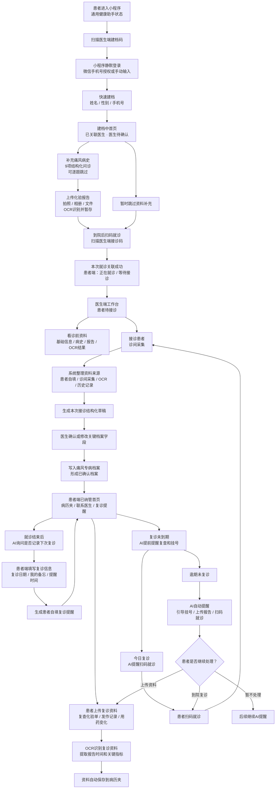

# 痛风智能体业务流程图定稿

<!-- mermaid-diagram: gout-agent-business-flow-final -->

```mermaid
flowchart TD
  start["患者进入小程序<br/>通用健康助手状态"] --> scanBuild["扫描医生端建档码"]
  scanBuild --> login["小程序静默登录<br/>微信手机号授权或手动输入"]
  login --> quickReg["快速建档<br/>姓名 / 性别 / 手机号"]
  quickReg --> pendingHome["建档中首页<br/>已关联医生 · 医生待确认"]

  pendingHome --> history["补充痛风病史<br/>9项结构化问诊<br/>可逐题跳过"]
  history --> lab["上传化验报告<br/>拍照 / 相册 / 文件<br/>OCR识别并暂存"]
  lab --> scanVisit["到院后扫码就诊<br/>扫描医生端接诊码"]
  pendingHome --> skip["暂时跳过资料补充"]
  skip --> scanVisit

  scanVisit --> linkedVisit["本次就诊关联成功<br/>患者端：正在就诊 / 等待接诊"]
  linkedVisit --> doctorQueue["医生端工作台<br/>患者待接诊"]
  doctorQueue --> prep["看诊前资料<br/>基础信息 / 病史 / 报告 / OCR结果"]
  doctorQueue --> encounter["接诊患者<br/>诊间采集"]

  encounter --> collect["系统整理资料来源<br/>患者自填 / 诊间采集 / OCR / 历史记录"]
  collect --> draft["生成本次接诊结构化草稿"]
  draft --> confirm["医生确认或修改关键档案字段"]
  confirm --> archive["写入痛风专病档案<br/>形成已确认档案"]

  archive --> managedHome["患者端已纳管首页<br/>病历夹 / 联系医生 / 复诊提醒"]

  managedHome --> afterVisit["就诊结束后<br/>AI询问是否记录下次复诊"]
  afterVisit --> patientFollow["患者端填写复诊信息<br/>复诊日期 / 我的备忘 / 提醒时间"]
  patientFollow --> followSaved["生成患者自填复诊提醒"]
  followSaved --> managedHome

  managedHome --> uploadFollow["患者上传复诊资料<br/>复查化验单 / 发作记录 / 用药变化"]
  uploadFollow --> ocrFollow["OCR识别复诊资料<br/>提取报告时间和关键指标"]
  ocrFollow --> saveFollow["资料自动保存到病历夹"]

  managedHome --> beforeDue["复诊未到期<br/>AI提前提醒复查和挂号"]
  beforeDue --> dueToday["今日复诊<br/>AI提醒扫码就诊"]
  dueToday --> scanFollow["患者扫码就诊"]
  scanFollow --> encounter

  beforeDue --> overdue["逾期未复诊"]
  overdue --> aiFollow["AI自动提醒<br/>引导挂号 / 上传报告 / 扫码就诊"]
  aiFollow --> patientAction{"患者是否继续处理？"}
  patientAction -->|上传资料| uploadFollow
  patientAction -->|到院复诊| scanFollow
  patientAction -->|暂不处理| aiRepeat["后续继续AI提醒"]
```
<!-- /mermaid-diagram: gout-agent-business-flow-final -->
