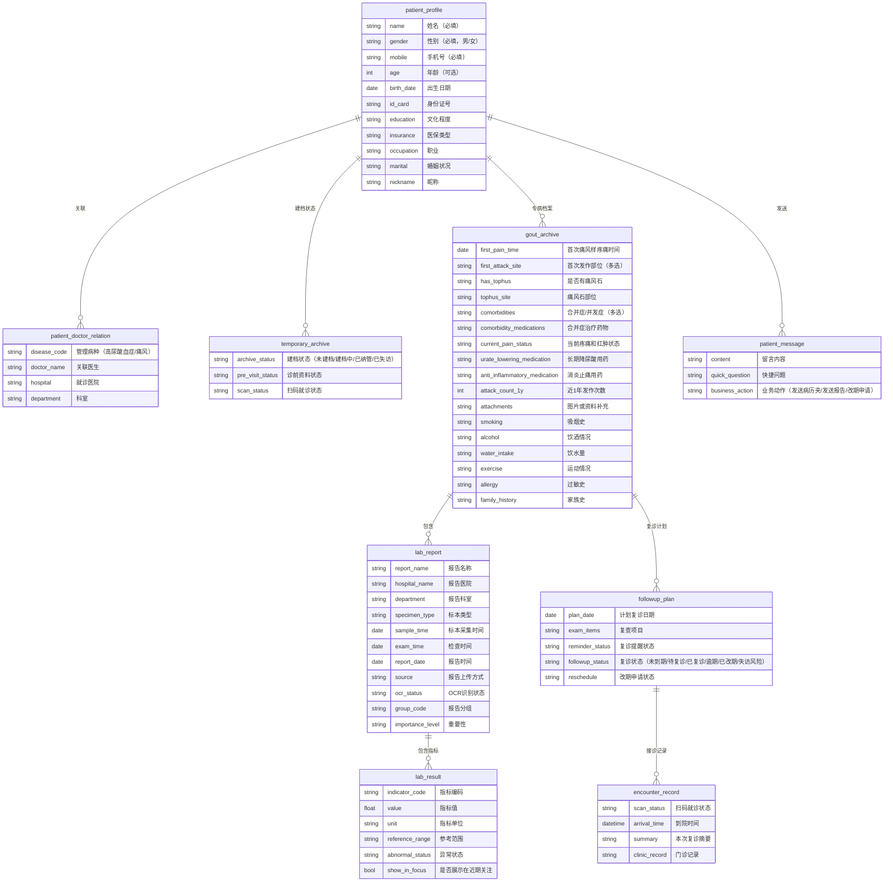

# 痛风专病智能体 — 项目总览与架构文档

> 版本：v1.0 | 日期：2026-07-10 | 适用端：患者端 + 医生端

---

## 1. 项目概述

**一句话说明**：痛风专病智能体是一款面向痛风患者的专病管理小程序，覆盖从医生发起建档、患者扫码建档、诊前资料补充、门诊扫码就诊、纳管后复诊管理与联系医生的完整闭环，核心目标是让医生在 5 分钟内完成专病建档与医患关联，让患者在就诊前后获得清晰的档案摘要、复诊提醒和后续联系入口。

**核心解决的问题**：
- 门诊场景中患者病史、用药、化验报告分散在口述、外院报告和历史记录中，医生信息收集成本高
- 患者就诊后缺少对个人档案、复诊安排和联系医生的持续感知
- 快速建档（仅姓名、性别、手机号三个必填字段）将建档时间控制在 5 分钟内

**产品定位**：痛风专病管理流程中的患者侧入口，不是独立健康管理平台，也不是通用问诊工具。患者端只承担患者可完成、可确认、可补充的动作，不直接替代医生诊断。

---

## 2. 核心功能清单

### 2.1 患者端功能模块

| 模块 | 功能说明 | 状态依赖 |
|------|---------|---------|
| **微信静默登录** | 患者进入小程序后自动完成身份识别 | 进入即触发 |
| **手机号补充** | 支持微信授权手机号和手动输入，患者端优先、医生端同样具备录入能力 | 未获取有效手机号时 |
| **快速建档** | 仅采集姓名、性别、手机号三个字段，病种由建档码自动带出 | 无痛风专病档案时 |
| **痛风病史补充** | 围绕 9 项结构化字段的引导式填写，每一步允许跳过 | 快速建档完成后 |
| **化验报告上传** | 拍照/相册上传报告原图，触发 OCR 识别生成候选字段 | 快速建档完成后，允许跳过 |
| **扫码就诊** | 扫描医生端出示的接诊码，建立本次门诊接诊关联 | 到院后 |
| **资料提交状态** | 展示已提交资料的处理状态，主按钮指向患者可执行动作 | 扫码就诊后 |
| **已纳管首页** | 展示病历夹、复诊提醒、联系医生等入口，体现患者获得感 | 档案建立并关联医生后 |
| **我的病历夹** | 展示病情小结、最近门诊、化验与用药、诊前资料摘要 | 已纳管后 |
| **复诊提醒** | 展示复诊提醒（明确不是预约），支持补充复诊资料 | 已纳管后 |
| **联系医生** | 留言、发送报告、发送病历夹、复诊改期申请 | 已纳管后 |

### 2.2 医生端关联功能模块

| 模块 | 功能说明 | 对患者端影响 |
|------|---------|------------|
| **发起痛风专病建档码** | 在工作台或患者列表外层生成建档二维码 | 患者扫码后进入建档流程 |
| **出示接诊码** | 门诊现场出示动态接诊码 | 患者扫码后建立本次接诊关联 |
| **查看患者提交资料** | 查看患者提交的建档信息、病史、报告原图和 OCR 结果 | 患者端展示资料已提交 |
| **修正档案** | 医生在接诊/档案编辑时直接修改任何字段，覆盖患者提交内容 | 患者端档案同步更新 |
| **回写结构化档案** | 医生编辑后字段回写痛风专病档案 | 患者端进入已纳管状态 |

### 2.3 首页状态体系

患者端首页根据患者当前状态展示 7 种不同视图：

| 状态 | 标题 | 触发条件 | 主行动 |
|------|------|---------|--------|
| S1 未建档 | 通用健康助手 | 无痛风专病档案 | 扫码关联医生 |
| S2 建档中 | 基本信息已提交 | 已提交快速建档 | 补充诊前资料 / 扫码就诊 |
| S3 待复诊 | 等待复诊 | 已纳管，有未来复诊计划 | 补充复诊资料 |
| S4 复诊当天 | 今日复诊 | 当前日期等于建议复诊日期 | 我已到院，扫码就诊 |
| S5 逾期未复诊 | 复诊已逾期 | 复诊日期已过且未完成 | 联系医生 |
| S6-A 确认无复诊需求 | 暂无复诊需求 | 医生明确判断无需复诊 | 联系医生（可选） |
| S6-B 暂无复诊安排 | 暂无复诊安排 | 已纳管但无复诊计划 | 联系医生 |
| 正在就诊 | 正在就诊 | 患者已扫码关联本次接诊 | 不展示主动作 |

---

## 3. 数据模型与字段设计

### 3.1 核心数据实体



### 3.2 核心枚举值

| 枚举类型 | 枚举值 |
|---------|--------|
| `archive_status` | `none`（未建档）/ `basic_submitted`（建档中）/ `in_progress`（资料补充中）/ `managed`（已纳管）/ `lost`（已失访） |
| `followup_status` | `not_due`（未到期）/ `due_today`（今日复诊）/ `arrived`（已到院）/ `waiting_record`（等待记录）/ `completed`（已完成）/ `overdue`（逾期）/ `rescheduled`（已改期）/ `at_risk`（失访风险） |
| `ocr_status` | `not_started` / `processing` / `success` / `partial_success` / `failed` / `manual_review` |
| `scan_status` | `not_scanned` / `scanned` / `arrived` / `linked` / `expired` |
| `abnormal_status` | `normal` / `high` / `low` / `positive` / `negative` / `abnormal` / `critical` / `pending` |

### 3.3 关键检验指标

| 指标类别 | 指标名称 | 是否展示在近期关注 |
|---------|---------|------------------|
| 核心指标 | 血尿酸、血尿酸目标、血尿酸达标状态 | 始终展示 |
| 肾功能 | 血肌酐、eGFR、尿素氮 | 异常时展示 |
| 尿常规 | 尿蛋白、尿潜血、尿红细胞、尿白细胞、尿pH | 异常时展示 |
| 炎症指标 | CRP、超敏CRP、血沉 | 异常时展示 |
| 代谢指标 | 空腹血糖、糖化血红蛋白、总胆固醇、甘油三酯、LDL-C、HDL-C | 异常时展示 |
| 肝功能 | ALT、AST、GGT | 异常时展示 |
| 基因检测 | HLA-B\*5801 | 阳性时展示 |
| 影像检查 | 双能CT尿酸盐沉积、超声双轨征、X线骨侵蚀 | 异常时展示 |

### 3.4 资料来源优先级

同一字段存在多来源时，回写优先级为：
1. **医生端直接编辑**（最高优先级，可随时覆盖其他来源）
2. **患者手动填写**（提交后直接入档）
3. **OCR 识别结果**（识别后直接入档，低置信度标注提示）
4. **医生端记录 / 诊间录音确认结果**
5. **线下简表 / AI 整理结果**

**核心规则**：患者提交内容和 OCR 识别结果直接写入档案，医生可随时在接诊/档案编辑时修正或覆盖。

---

## 4. 目录结构与规范

### 4.1 仓库根目录

```
痛风智能体/
├── AGENTS.md                    # AI 协作规则入口
├── README.md                    # 项目说明
├── .gitignore
├── assets/                      # 图片素材
│   ├── doctor-qr.png            # 医生建档二维码
│   └── qr-icon.svg              # 二维码图标
├── design-system/               # 设计系统（视觉令牌与组件）
│   ├── tokens.css               # 颜色、圆角、阴影、字号变量
│   ├── components.css           # 可复用组件样式
│   ├── component-gallery.html   # 组件样例页
│   └── templates/               # 场景模板
│       └── iphone-showcase-patient.html  # iPhone 真机演示外壳
├── demos/                       # Demo 原型文件
│   ├── 患者端/
│   │   ├── 痛风智能体患者端_V0.1_初始原型.html
│   │   └── 病历夹tab展示页面.html
│   └── 医生端/
│       ├── 医生端_信息降噪版Demo.html
│       └── 医生端_重绘版Demo.html
├── docs/                        # 文档
│   ├── 00-项目管理/              # 管理框架、风险登记、排期模板
│   ├── 01-产品需求/              # PRD、业务流程图
│   ├── 02-字段字典/              # 字段字典（研发版）
│   ├── 03-原型与规范/            # 设计规范、页面规范、复用规则
│   ├── 99-索引/                  # 仓库导航、字段索引、资产索引
│   └── _archive/                 # 历史归档
├── output/                      # 构建输出
│   └── playwright/              # Playwright 截图
└── .workbuddy/                  # WorkBuddy 工作记忆
    └── memory/
```

### 4.2 目录划分逻辑

| 目录 | 职责 | 规则 |
|------|------|------|
| `assets/` | 存放正式展示素材 | 所有 Demo 通过相对路径引用，禁止外链 |
| `design-system/` | 抽取稳定视觉语言 | 不是新业务 Demo，而是从现有 Demo 中抽离的可复用组件 |
| `demos/` | 可演示成品 | 按患者端/医生端分目录，每个文件是可直接打开的独立 HTML |
| `docs/` | 规则与文档 | 按产品需求、字段字典、原型规范分层，索引文件统一在 99-索引 |
| `output/` | 构建产物 | 截图、导出文件等 |

### 4.3 代码编写核心规范

1. **Demo 文件必须独立可运行**：所有 CSS/JS 内嵌在单个 HTML 文件中，不依赖外部构建工具
2. **设计系统优先复用**：新页面先引用 `design-system/tokens.css` 和 `components.css`，不重复定义颜色和组件
3. **对外成品标准**：页面上不出现开发说明、字段 ID、内部规则解释、占位备注
4. **图标使用 `.ui-icon` CSS 图形**：不使用 emoji 或符号占位作为功能图标
5. **患者端统一阿福式对话容器**：所有任务优先在首页对话内完成，例外：扫码、联系医生、病历夹总览允许独立页面
6. **医生端统一工作台风格**：高密度、低圆角、任务优先

---

## 5. 技术栈与依赖

### 5.1 核心技术栈

| 层级 | 技术 | 选型理由 |
|------|------|---------|
| **前端框架** | 纯 HTML/CSS/JS（无框架） | Demo 阶段追求零依赖、可直接浏览器打开、快速迭代 |
| **样式方案** | CSS 自定义属性（CSS Variables） | 通过 `tokens.css` 统一管理两端颜色、圆角、阴影、字号 |
| **设计系统** | 自建组件库（`components.css`） | 从现有 Demo 中抽取稳定组件，前缀 `ds-` 避免冲突 |
| **图标** | CSS 纯代码图标（`.ui-icon`） | 无外部依赖，可缩放，颜色随 `currentColor` |
| **图表/流程图** | Mermaid | 用于文档中的流程图和状态图 |
| **测试** | Playwright（用于截图验证） | 自动截图对比，确保 Demo 视觉一致性 |
| **版本管理** | Git + GitHub | 远程仓库备份与协作 |

### 5.2 关键依赖

| 依赖 | 用途 |
|------|------|
| `design-system/tokens.css` | 全局 CSS 变量（颜色、间距、字号、圆角、阴影） |
| `design-system/components.css` | 患者端/医生端可复用组件样式 |
| `assets/doctor-qr.png` | 医生建档码展示素材 |
| `assets/qr-icon.svg` | 二维码入口图标 |

### 5.3 患者端设计令牌（核心变量）

```css
--patient-primary: #03d49f;          /* 主色-青绿 */
--patient-primary-2: #01a1ff;        /* 主色-蓝色 */
--patient-gradient: linear-gradient(234deg, #03d49f 0%, #01a1ff 100%);
--patient-bg: linear-gradient(180deg, #e8f4ff 0%, #f0fff9 52%, #f5f7fb 100%);
--patient-card: #ffffff;
--patient-text: #333333;
--patient-sub: #666666;
--patient-hint: #999999;
```

### 5.4 医生端设计令牌（核心变量）

```css
--doctor-primary: #0052d9;           /* 主色-蓝 */
--doctor-bg: #eef2f7;
--doctor-panel: #ffffff;
--doctor-text: #1d2530;
--doctor-sub: #566579;
```

---

## 6. 运行与部署指南

### 6.1 本地预览

由于 Demo 为纯静态 HTML，无需构建步骤：

```bash
# 直接在浏览器中打开患者端 Demo
open demos/患者端/痛风智能体患者端_V0.1_初始原型.html

# 或使用 Python 启动本地服务器（推荐，避免跨域问题）
cd /path/to/痛风智能体
python3 -m http.server 8080
# 浏览器访问 http://localhost:8080/demos/患者端/痛风智能体患者端_V0.1_初始原型.html
```

### 6.2 设计系统组件预览

```bash
open design-system/component-gallery.html
```

### 6.3 iPhone 真机演示外壳

```bash
open design-system/templates/iphone-showcase-patient.html
```

### 6.4 Playwright 截图验证

```bash
# 安装 Playwright（首次）
npx playwright install chromium

# 对 Demo 页面截图
npx playwright screenshot "file://$(pwd)/demos/患者端/痛风智能体患者端_V0.1_初始原型.html" output/playwright/screenshot.png
```

### 6.5 Git 版本管理

```bash
# 仓库位置
cd /Users/libby/Documents/痛风智能体

# 查看当前状态
git status

# 查看提交历史
git log --oneline -10

# 远程仓库
git remote -v
```

---

## 7. 已知限制与待办

### 7.1 架构层面限制

| 限制 | 影响 | 建议 |
|------|------|------|
| **Demo 为纯静态 HTML** | 无后端数据持久化，页面刷新后状态丢失 | 后续需对接后端 API 实现真实数据流 |
| **OCR 为模拟状态** | Demo 中 OCR 识别结果使用静态数据占位 | 需对接真实 OCR 服务（如腾讯云 OCR） |
| **微信登录为模拟** | Demo 无法调用真实微信授权 | 需在真实小程序环境中集成微信登录 SDK |
| **二维码为固定图片** | 建档码和接诊码使用静态图片 | 需对接医生端动态生成二维码服务 |
| **无真实消息推送** | 复诊提醒和医生回复为模拟状态 | 需对接微信服务通知或短信通道 |

### 7.2 功能层面待办

| 优先级 | 待办事项 | 说明 |
|--------|---------|------|
| **P0** | 主任确认「患者建档时是否需要选择病种」 | 当前默认不选，由建档码带入；若需多专病支持需重新设计 |
| **P0** | 主任确认「候诊自填是否作为一期主路径」 | 当前默认候诊自填；若改为诊间医生引导则需调整交互 |
| **P1** | 医生端完整 PRD | 当前只定义了与患者端闭环相关的关联规则 |
| **P1** | 多来源冲突 UI | 医生端需支持查看同一字段的多来源差异并选择最终值 |
| **P1** | 报告去重逻辑 | 患者重复上传同一报告时的合并与标记规则需细化 |
| **P2** | 联系医生消息闭环 | 当前为模拟，需确认是否实现真实消息收发 |
| **P2** | 健康打卡与饮食问答定位 | 当前为辅助入口，需确认是否保留在首页 |
| **P2** | 多专病扩展 | 当前只支持痛风，后续需支持其他专病（类风湿等） |

### 7.3 边缘情况与潜在 Bug

| 场景 | 风险 | 当前处理 |
|------|------|---------|
| 手机号对应多个疑似档案 | 患者选错档案 | 提示需到诊间由医生协助确认，不让患者自行选择 |
| 已纳管患者再扫建档码 | 重复建档 | 识别既有档案，不重复创建 |
| 接诊码/建档码混用 | 流程错误 | 通过识别结果区分，不同码走不同流程 |
| OCR 识别失败 | 阻断流程 | 保留原图，患者仍可继续扫码就诊 |
| 医生回写失败 | 状态不一致 | 患者端保持当前状态，支持重试 |
| 多来源字段冲突 | 自动覆盖 | 医生端编辑 > 患者提交，后者可被医生随时覆盖 |
| 网络异常 | 数据丢失 | 保留已填内容，不清空表单 |

---

## 8. 关键设计决策

| 决策 | 原因 |
|------|------|
| 快速建档仅三个字段 | 5 分钟建档目标；年龄/病史/化验进入后续流程 |
| 患者提交内容直接入档 | 降低医生操作负担，提交后直接更新档案；医生保留随时修正能力 |
| 统一"扫码就诊"口径 | 接诊码不是签到，建立的是就诊关联关系 |
| 手机号双端补充 | 患者端优先授权，医生端兜底录入，双端来源需去重合并 |
| 录音不作为医生端显眼模块 | 录音只是证据来源，不是独立功能入口 |
| 不使用底部四栏导航 | 主交互收敛到首页对话容器，减少跳转 |

---

## 附：跨端说明（患者端 ↔ 医生端）

患者端只承担患者可完成、可确认、可补充的动作，不直接感知医生端内部流程。医生端具备以下患者端不涉及的能力，详见 [`医生端_PROJECT_SUMMARY.md`](./医生端_PROJECT_SUMMARY.md) 与 [`医生端_PRD_决策日志.md`](./医生端_PRD_决策日志.md)：

- **医生端可主动建档（无码）**：医生在工作站「+ 建档」填姓名/性别/手机号即可建档案，不依赖患者扫任何码，覆盖无码患者/外院转诊/事后补建（ADR-D09）。
- **医生端可事后拍照补录**：接诊结束甚至跨日后，医生可重新进入患者档案拍照补拍外院病历，OCR 结果同样直接入档，不依赖患者在线（ADR-D09）。
- **弱接诊与兜底**：患者扫接诊码即资料可见，医生未点「接诊患者」也可采集/OCR/AI 辅助；未接诊患者安静留在工作站「待接诊」分组，超时触发「到院未接诊」预警（ADR-D01）。

逻辑基线（双端手机号、直接入档、弱接诊等）贯穿全部 8 份文档，详见 [`INDEX.md`](./INDEX.md)。
