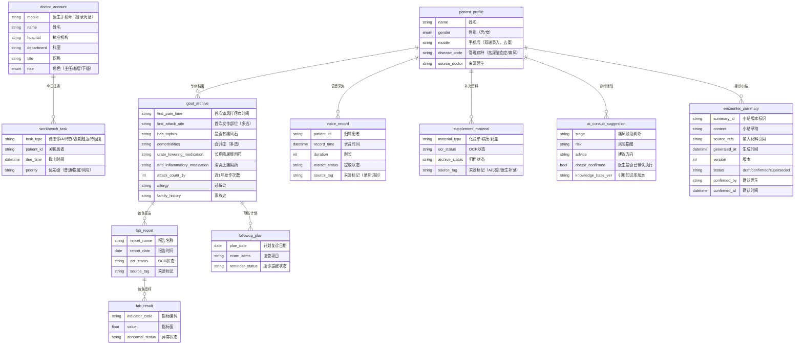

# 痛风专病智能体 · 医生端 — 项目总览与架构文档

> 版本：v1.0 | 日期：2026-07-13 | 适用端：医生端（专科工作台）| 配套：患者端_PROJECT_SUMMARY.md

---

## 1. 项目概述

**一句话说明**：痛风专病智能体医生端 1.0 是一款面向门诊医生（主任 / 基层 / 下级医生）的轻量专病管理工作台，覆盖从医生登录、今日工作站、快速建档与关联、诊间采集（语音 + 拍照 + OCR）、AI 个性化诊疗方案辅助、AI 病史小结沉淀、联系患者与逾期未复诊提醒的完整闭环。核心目标是让医生在 5 分钟内把患者纳入痛风专病管理，把主任和专科团队沉淀的诊疗标准转化为下级医生可参考的处理路径，并把患者说不清、写不清、记不清的信息通过语音、照片和 AI 结构化整理出来。

**核心解决的问题**：
- 门诊场景中患者病史、用药、化验报告分散在口述、外院报告和历史记录中，医生信息收集成本高
- 下级医生面对复杂痛风患者时缺乏来自主任团队的、可参考的规范化处理路径
- 诊后复诊提醒、逾期触达和必要的医生联系缺乏轻量闭环，患者容易失访

**产品定位**：痛风专病管理流程中的医生侧工作台，不是完整慢病管理平台，也不是医院 HIS / LIS / 处方系统的替代品。它只补齐医院系统覆盖不足的部分——快速纳管、结构化采集、AI 诊疗辅助、诊后闭环。

---

## 2. 核心功能清单

### 2.1 医生端功能模块（7 大核心）

| 模块 | 功能说明 | 状态依赖 |
|------|---------|---------|
| **医生登录与身份校验** | 手机号验证码登录，后台已认证执业机构、科室和医生身份 | 进入即触发 |
| **今日工作站** | 默认首页，集中展示当日待接诊、AI 诊疗待办、复诊触达任务 | 登录后默认进入 |
| **快速建档 / 档案关联** | 手机号快速建档（姓名/性别/手机号），也可搜索/建档码/就诊码/补录/医生端主动建档进入同一档案 | 无档案或需关联时 |
| **医生端主动建档（无码）** | 工作站「+ 建档」填姓名/性别/手机号直接建档案，不依赖患者扫任何码；覆盖无码患者/外院转诊/事后补建 | 无码场景 |
| **AI 智能诊疗** | 按专病知识库生成个性化诊疗方案辅助（依据/风险/建议三段式），医生确认执行 | 医生手动触发 |
| **诊间采集 / 事后补录** | 语音接诊提取结构化字段、拍照上传化验单/病历/药盒并 OCR、手动补录；**支持接诊后/跨日补拍外院病历** | 进入患者档案后 |
| **AI 病史小结** | 根据语音/报告/处方自动生成医生端过程草稿；医生确认后才进入正式字段或患者病历夹 | 接诊后自动生成 |
| **联系患者 / 逾期提醒** | AI 先回复 + 医生兜底；逾期 AI 触达、短信兜底、医生只处理例外 | 诊后自动触发 |

### 2.2 患者端关联能力（医生端视角）

| 模块 | 功能说明 | 对患者端影响 |
|------|---------|------------|
| **发起建档码** | 工作台固定展示痛风专病建档二维码（长期有效） | 患者扫码进入建档流程 |
| **出示就诊码** | 本次就诊动态生成接诊码（有时效性） | 已建档患者到院扫码确认本次就诊身份 |
| **查看患者资料** | 查看患者自填病史、上传报告、OCR 结果与录音识别候选字段 | 患者端仅展示资料已提交，不提前展示候选值 |
| **确认并回写档案** | 医生采纳、修正或忽略候选字段；只有采纳或修正后写入正式档案 | 正式回写成功后患者端同步更新 |
| **回写随访计划** | 医生确认后随访计划同步患者端 | 患者端进入复诊提醒状态 |

### 2.3 医生端页面清单（11 屏 + 就诊码屏）

| 屏 | 名称 | 核心职责 |
|----|------|---------|
| login | 登录 | 手机号验证码身份校验 |
| workbench | 今日工作站 | 主任务 + 关键数字 + 今日待办 |
| patients | 患者队列 | 搜索 / 列表，按状态与风险分层 |
| detail | 患者详情 / 专病档案 | 接诊前准备 + 正式结果页（接入诊前后） |
| voice | 语音接诊（诊间采集） | 录音 → AI 提取结构化候选字段 → 进入资料确认 |
| supplement | 补充资料 | 拍照保存原图 → OCR 候选 → 医生确认归档 |
| previsit | 看诊前资料 | 触发 AI 前汇总患者已有资料与完整度 |
| encounter | AI 诊疗辅助 | 生成诊疗方案辅助（依据/风险/建议） |
| confirm | 资料确认与正式回写 | 采纳/修正/忽略候选字段，处理多来源冲突并正式回写 |
| summary | 本次接诊小结 | 生成、编辑和确认 AI 病史小结草稿；未经确认仅医生端可见 |
| qr | 建档码 | 展示长期有效的专病建档二维码 |
| doctor-create | 医生端主动建档（无码） | 填姓名/性别/手机号直接建档案，来源「医生补录」 |
| encounter-qr | 就诊码 | 展示本次就诊动态码（就诊结束失效） |
| overdue | 复诊 / 逾期提醒 | 逾期列表 + 一键批量提醒（含到院未接诊预警） |

### 2.4 医生端主线状态（4 态）

| 状态 | 标题 | 触发条件 | 主行动 |
|------|------|---------|--------|
| 待接诊 | 建档中 · 待接诊 | 患者已扫接诊码，医生未开始本次接诊（弱接诊：资料已可见可处理） | 接诊患者（计时标记，非门禁）/ 直接看资料采集 |
| 采集中 | 接诊中 · 正在整理字段 | 医生进入诊间采集，系统后台整理字段 | 结束接诊，确认字段 |
| 待确认回填 | AI 草稿已生成 | 接诊结束，AI 生成字段草稿 | 核对字段，回写档案 |
| 已写入档案 | 已接诊 · 档案更新 | 字段确认回写完成 | 生成随访计划 / 联系患者 |

---

## 3. 数据模型与字段设计

### 3.1 核心数据实体



### 3.2 来源标记六类（医生端追溯）

| 来源标记 | 含义 | 出现端 |
|----------|------|--------|
| 患者自填 | 患者端自行填写/补充的字段 | 医生端 |
| 患者上传 | 患者端拍照上传的化验单/报告 | 医生端 |
| 录音识别 | 医生语音接诊录音后 AI 提取 | 医生端 |
| AI 识别 | OCR/系统自动识别（病历/化验单/药盒） | 医生端 |
| 医生补录 | 医生事后手动补充/修改 | 医生端 |
| 医生确认 | 医生在资料确认页采纳或修正的字段 | 医生端 |

> 来源、原始依据与确认状态属于医生端内部协作信息。患者端不展示这些标签和过程，只展示正式回写后的结果。

### 3.3 核心枚举值（医生端相关）

| 枚举类型 | 枚举值 |
|---------|--------|
| `archive_status` | `none`（未建档）/ `basic_submitted`（建档中）/ `in_progress`（资料补充中）/ `managed`（已纳管）/ `lost`（已失访） |
| `encounter_status` | `pending`（待接诊，弱接诊下资料已可见）/ `collecting`（采集中）/ `draft_ready`（草稿待回写）/ `archived`（已写入档案） |
| `ocr_status` | `not_started` / `processing` / `success` / `partial_success` / `failed` / `manual_review` |
| `material_archive_status` | `not_archived`（原图已保存）/ `pending_confirm`（OCR 已完成待确认）/ `archived`（已确认归档）/ `ignored`（已忽略） |
| `confirm_status` | `candidate`（候选）/ `confirmed`（已采纳）/ `corrected`（修正后确认）/ `ignored`（已忽略） |
| `followup_status` | `not_due` / `due_today` / `overdue` / `at_risk` / `completed` / `rescheduled` |
| `abnormal_status` | `normal` / `high` / `low` / `positive` / `negative` / `abnormal` / `critical` |
| `doctor_role` | `chief`（主任）/ `primary`（基层）/ `junior`（下级） |

### 3.4 资料来源优先级

同一字段存在多来源时，患者提交、OCR、录音识别、AI 整理和线下简表均保留为候选资料，不按来源自动覆盖正式值。医生在资料确认页查看来源、时间和原始依据，选择采纳、修正或忽略；医生确认或修正后的正式值优先。

**核心规则**：原图、原始回答和原始消息即时保存；病史、用药、检验指标、OCR 结果、录音提取与 AI 整理只有经医生采纳或修正后才写入正式档案。患者端不展示来源标签和确认过程，只在正式回写成功后展示确认结果。AI 诊疗辅助的治疗建议仍须医生确认执行后才成为医疗处理记录。

---

## 4. 目录结构与规范

### 4.1 仓库根目录（节选医生端相关）

```
痛风智能体/
├── demos/
│   └── 医生端/
│       ├── 医生端_信息降噪版Demo.html
│       └── 医生端_重绘版Demo.html        # 11 屏 + 就诊码屏
├── design-system/
│   ├── tokens.css                        # 两端共用变量
│   ├── 医生端Demo设计令牌_v1.0.md         # 医生端视觉令牌（蓝色工作台）
│   └── components.css
├── docs/
│   ├── 01-产品需求/
│   │   ├── 医生端1.0产品报告.md
│   │   ├── 不同端口资料覆盖原则_v1.0.0_20260707.md
│   │   └── 医生端患者端交互交叉确认_断裂点反馈.md
│   ├── 02-字段字典/
│   │   └── 痛风智能体病历夹记录Tab字段梳理_用药门诊_v1.0_20260710.md
│   └── 03-原型与规范/
│       └── 医生端信息降噪与层级优化建议.md
└── assets/
    └── doctor-qr.png                     # 医生建档二维码
```

### 4.2 目录划分逻辑

| 目录 | 职责 | 规则 |
|------|------|------|
| `demos/医生端/` | 医生端可演示成品 | 每个文件是可直接打开的独立 HTML，内嵌 CSS/JS |
| `design-system/` | 共享视觉语言 | 医生端复用 `tokens.css` 变量，不另起色板 |
| `docs/01-产品需求/` | 医生端 PRD、覆盖原则、断裂点反馈 | 医生端规则与口径集中处 |
| `docs/02-字段字典/` | 字段权威来源 | 病历夹 Tab 字段梳理为医生端档案展示依据 |

### 4.3 代码编写核心规范

1. **Demo 文件必须独立可运行**：所有 CSS/JS 内嵌在单个 HTML 文件中，不依赖外部构建工具
2. **设计系统优先复用**：医生端复用 `tokens.css` 变量与 `components.css` 组件，新增组件追加 `ds-doctor-` 前缀
3. **对外成品标准**：页面不放开发说明、字段 ID、内部规则解释
4. **医生端统一工作台风格**：高密度、低圆角、任务优先；底部用操作条而非四胶囊导航
5. **来源可追溯到字段**：每个数据字段必须带来源标记；每个关键操作可确认（确认按钮 + 时间戳）

---

## 5. 技术栈与依赖

### 5.1 核心技术栈

| 层级 | 技术 | 选型理由 |
|------|------|---------|
| **前端框架** | 纯 HTML/CSS/JS（无框架） | Demo 阶段零依赖、可直接浏览器打开、快速迭代 |
| **样式方案** | CSS 自定义属性 | `tokens.css` 统一管理两端颜色、圆角、阴影、字号 |
| **设计系统** | 自建组件库（`ds-doctor-` 前缀） | 从 Demo 抽取、工作台风格一致 |
| **图标** | SVG 线性图标（`.ui-icon` / `ds-doctor-*`） | 无外部依赖，颜色随 `currentColor` |
| **图表/流程图** | Mermaid | 文档中的流程图和状态图 |
| **测试** | Playwright（截图验证） | 自动截图对比，确保 Demo 视觉一致性 |

### 5.2 医生端设计令牌（核心变量，来自 `医生端Demo设计令牌_v1.0.md`）

```css
--doctor-primary: #0052d9;           /* 主色-蓝（不渐变主色） */
--doctor-primary-2: #1f73f1;         /* 主色亮 */
--doctor-bg: #eef2f7;                /* 页面背景 */
--doctor-panel: #ffffff;             /* 面板/卡片 */
--doctor-text: #1d2530;              /* 主文字 */
--doctor-sub: #566579;               /* 次文字 */
--doctor-hint: #8a94a6;              /* 弱文字 */
--doctor-orange: #ed7b2f;            /* 橙=待确认/待处理（仅此语义） */
--doctor-green: #2ba471;             /* 绿=已确认/已完成 */
--doctor-red: #d54941;               /* 红=异常/风险/删除 */
```

### 5.3 与患者端的视觉差异

| 维度 | 患者端 | 医生端 |
|------|--------|--------|
| 主色 | 青绿+蓝渐变 | 蓝色 `#0052d9`（不渐变主色） |
| 调性 | 温暖、引导式 | 专业、紧凑、任务驱动 |
| 圆角 | 大圆角 22–26px | 低圆角 10–18px |
| 行高 | 宽松 1.55–1.6 | 紧凑 1.2–1.45 |
| 信息密度 | 低 | 高（分割线、紧凑列表） |
| 底部 | 四胶囊浮动导航 | 底部操作条（按页定制） |

---

## 6. 运行与部署指南

### 6.1 本地预览

```bash
# 直接在浏览器中打开医生端重绘版 Demo
open demos/医生端/医生端_重绘版Demo.html

# 或启动本地服务器
cd /path/to/痛风智能体
python3 -m http.server 8080
# 浏览器访问 http://localhost:8080/demos/医生端/医生端_重绘版Demo.html
```

### 6.2 设计系统组件预览

```bash
open design-system/component-gallery.html
```

### 6.3 Playwright 截图验证

```bash
npx playwright install chromium
npx playwright screenshot "file://$(pwd)/demos/医生端/医生端_重绘版Demo.html" output/playwright/doctor-screenshot.png
```

### 6.4 Git 版本管理

```bash
cd /Users/libby/Documents/痛风智能体
git status
git log --oneline -10
```

---

## 7. 已知限制与待办

### 7.1 架构层面限制

| 限制 | 影响 | 建议 |
|------|------|------|
| **Demo 为纯静态 HTML** | 无后端持久化，刷新后状态丢失 | 后续对接后端 API |
| **OCR 为模拟状态** | Demo 用静态数据占位 | 对接真实 OCR（如腾讯云 OCR） |
| **登录为模拟验证码** | 无法真实校验医生身份 | 真实环境集成机构认证 |
| **二维码为固定/模拟** | 建档码固定、就诊码为模拟动态 | 对接医生端动态生成服务 |
| **无真实消息推送** | 联系患者/逾期提醒为模拟 | 对接服务通知或短信通道 |

### 7.2 功能层面待办

| 优先级 | 待办事项 | 说明 |
|--------|---------|------|
| **P0** | 落地「资料确认与正式回写」 | 作为正式档案和患者端同步的必要节点；支持一致字段批量采纳、冲突字段逐项处理 |
| **P0** | 手机号双端去重合并 | 患者端与医生端录入需按最近有效录入合并 |
| **P1** | 多来源冲突 UI | 医生端查看同一字段多来源差异并选择最终值 |
| **P1** | 报告去重逻辑 | 患者/医生重复上传同一报告的合并与标记 |
| **P1** | 专病知识库后台 | AI 诊疗辅助依赖的诊疗路径/用药规则/复诊周期需后台可维护 |
| **P2** | 联系患者消息闭环 | 当前为模拟，确认是否实现真实收发 |
| **P2** | 多专病扩展 | 当前只支持痛风 |

### 7.3 边缘情况与潜在 Bug

| 场景 | 风险 | 当前处理 |
|------|------|---------|
| 手机号对应多个疑似档案 | 误合并 | 一期不做自动合并，进入人工确认/后台合并 |
| 手机号缺失/变更/家属代填 | 归并失败 | 人工修正，避免误合并 |
| 已纳管患者再扫建档码 | 重复建档 | 识别既有档案，不重复创建 |
| 建档码/就诊码混用 | 流程错误 | 识别码类型走不同流程 |
| OCR 识别失败 | 阻断 | 保留原图，医生手动录入 |
| 录音归属错误 | 录完不知是谁 | 录音必须在患者档案内发起，准确归属 |
| 多来源字段冲突 | 候选值误覆盖正式值 | 候选资料不自动覆盖；医生采纳、修正或忽略后形成正式值 |
| 网络异常 | 数据丢失 | 保留已填内容，不清空 |

---

## 8. 关键设计决策

| 决策 | 原因 |
|------|------|
| 医生端主线从"确认档案"转向"接诊患者"（弱接诊） | 降低信息压力；接诊为计时标记而非门禁，忙时未接诊信息不丢，可三处兜底捞回 |
| 到院未接诊预警 | 扫码超阈值仍 `pending` 升级预警，避免患者白等、医生漏接 |
| 快速建档仅三个字段 | 5 分钟建档目标；年龄/病史进入后续流程 |
| 手机号双端补充 | 患者端优先授权，医生端兜底录入，双端去重合并 |
| 候选资料确认后正式回写 | 原始材料即时保存；医生确认后才更新正式档案和患者端结果 |
| 医生端主动无码建档 | 覆盖无码患者/外院转诊/事后补建，建档入口掌握在医生手里 |
| OCR 补录支持事后/跨日补拍 | 接诊后或隔日才拿到外院纸质病历，需独立补拍入档 |
| AI 诊疗建议必须医生确认执行 | 医疗安全：开药/调药/开检查等决策由医生执行 |
| 建档码/就诊码双码分离 | 建档（长期）与就诊身份确认（动态）场景不同 |
| 来源标记六类 | 医生端呈现来源、依据和确认状态；患者端不展示来源标签 |
| 录音不作为显眼模块 | 录音只是证据来源，不是独立功能入口 |
| 纯 HTML Demo 方案 | 零依赖、快速验证流程 |
