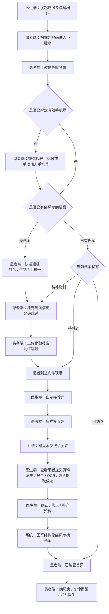
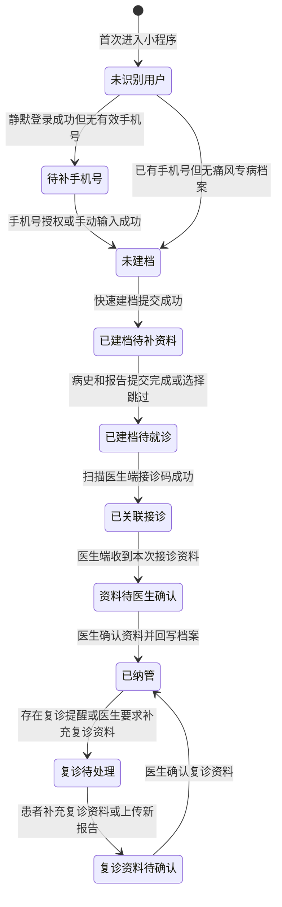
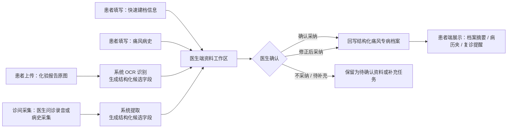

# 痛风专病智能体患者端 V1.0 需求文档

## 文档说明

本文档用于定义痛风专病智能体患者端 V1.0 的研发实现需求。患者端是本文档主体，医生端不作为完整独立模块展开，但本文档会写明患者端依赖的医生端发起建档码、出示接诊码、查看资料、确认资料、回写档案和状态同步规则，确保患者端流程能够被研发实现和测试验收。

本文档按章节逐步完善。当前版本先完成目录与第 1 章，后续章节将在同一文件中继续补充。

## 目录

1. 产品背景与目标
2. 角色与使用场景
3. 入口与权限规则
4. 主流程与状态流转
5. 患者端页面需求
6. 医生端关联规则
7. 字段、来源与回写规则
8. OCR、录音提取与资料合并规则
9. 空态、异常态与提示文案
10. 待确认事项
11. 验收标准

## 1. 产品背景与目标

### 1.1 背景

痛风专病管理需要覆盖患者从初次建档、诊前资料补充、门诊接诊、医生确认资料，到纳管后复诊提醒和持续管理的完整链路。现有门诊场景中，患者病史、用药情况、既往化验报告、复诊资料往往分散在患者口述、外院报告、历史就诊记录和医生问诊过程中，医生需要在有限接诊时间内完成信息收集、判断和归档，容易出现资料不完整、重复录入、确认成本高、患者就诊后缺少持续感知的问题。

本期患者端的建设目标，是通过小程序入口把患者纳入痛风专病管理流程，让患者在就诊前或就诊过程中完成基础建档、手机号补充、痛风病史补充和化验报告上传；医生端在接诊时查看患者提交资料，并结合诊间病史采集、OCR 识别结果和医生确认结果，形成结构化痛风专病档案。医生确认后的档案摘要、复诊提醒和联系医生入口同步展示到患者端，形成从诊前建档到纳管后管理的闭环。

### 1.2 产品定位

痛风专病智能体患者端 V1.0 定位为痛风专病管理流程中的患者侧入口，不是独立健康管理平台，也不是通用问诊工具。本版本重点服务门诊痛风患者的专病建档、资料补充、扫码就诊和纳管后基础管理，帮助医生减少重复采集成本，帮助患者获得清晰的病历摘要、复诊提醒和后续联系入口。

患者端只承担患者可完成、可确认、可补充的动作，不直接替代医生诊断，不直接生成最终医疗结论，不允许患者提交内容自动覆盖医生已确认的结构化档案。涉及诊断判断、关键病史确认、化验报告归档和档案回写的内容，均以医生端确认后的结果为准。

### 1.3 目标用户

本版本目标用户包括未建档痛风患者、已扫码建档但尚未完成就诊的患者、已完成医生确认并纳入痛风专病管理的患者，以及后续需要按复诊提醒补充资料或联系医生的复诊患者。

医生端相关使用者包括门诊医生、专病管理医生或承担痛风患者建档与随访管理的医护人员。医生端在本需求中不作为完整独立模块展开，但需要定义与患者端强相关的发起建档码、出示接诊码、查看患者资料、确认资料、回写档案和同步患者状态等规则。

### 1.4 版本目标

V1.0 需要完成患者端从建档到纳管后的最小闭环。患者可以通过医生发起的痛风专病建档入口进入小程序，完成静默登录、手机号授权或手动补充，并以最少字段完成快速建档。快速建档字段只包含姓名、性别、手机号，年龄、病史、用药、化验等信息进入后续专病档案或资料补充流程。

患者建档后，可以按流程补充痛风病史、上传化验报告，并在门诊现场扫描医生端出示的接诊码完成就诊关联。医生端收到患者资料后，可以查看患者提交的病史、报告、OCR 识别结果和诊间采集信息，对结构化资料进行确认、修正或补充。医生确认后，系统将确认后的结构化内容回写痛风专病档案，并同步患者端状态。

患者完成纳管后，患者端需要展示与患者有直接获得感的内容，包括个人档案摘要、病历夹、复诊提醒、联系医生等入口。复诊提醒仅作为提醒能力，不表示患者已完成预约，不展示“预约成功”等容易误解的状态。

### 1.5 版本边界

V1.0 不做完整互联网医院问诊，不做患者自行诊断，不做复杂 AI 对话分诊，不把健康打卡和饮食问答作为主流程入口，不把患者端设计成医生端工作台的替代品。患者端的核心链路围绕“快速建档、补充病史、上传报告、扫码就诊、医生确认、档案回写、纳管后管理”展开。

本版本中，医生端只定义与患者端闭环相关的关联规则，不在本文档中完整展开医生端全部页面和管理功能。医生端完整工作台、患者列表、接诊详情、结构化档案编辑等内容如需详细展开，可作为医生端 PRD 或关联章节另行编写。

### 1.6 成功标准

患者可以在 5 分钟内完成痛风专病快速建档和基础资料提交。医生可以在接诊时看到患者已提交的关键资料，并能对患者病史、报告识别结果和诊间采集内容进行确认后回写结构化档案。患者完成医生确认后，患者端状态能够正确进入已纳管，并展示病历夹、复诊提醒和联系医生等后续管理入口。

本版本验收时，应重点验证主流程是否闭环、患者端状态是否清晰、建档码和接诊码是否区分、患者提交资料是否需要医生确认后才进入正式档案、医生确认后的内容是否能同步到患者端。

## 2. 角色与使用场景

### 2.1 角色范围

本版本以患者端为主要建设对象，患者是小程序内所有页面和状态流转的直接使用者。医生端不在本文档中完整展开，但医生端的建档发起、接诊关联、资料确认和档案回写会直接影响患者端入口、状态和展示内容，因此作为关联角色纳入需求定义。

| 角色 | 角色说明 | 本版本相关动作 | 与患者端的关系 |
| --- | --- | --- | --- |
| 未建档患者 | 尚未在痛风专病智能体中建立专病档案的患者 | 扫描医生端发起的痛风专病建档码，进入患者端完成手机号补充和快速建档 | 进入患者端主流程的起点 |
| 已建档待就诊患者 | 已完成快速建档，但尚未完成本次门诊接诊关联的患者 | 补充痛风病史、上传化验报告、到诊后扫描医生端接诊码 | 处于诊前资料补充和就诊关联阶段 |
| 资料待确认患者 | 已提交病史或报告，医生端尚未完成资料确认和档案回写的患者 | 查看资料提交状态，必要时继续补充报告或等待医生处理 | 患者提交内容不能直接成为正式档案 |
| 已纳管患者 | 医生已确认资料并回写痛风专病档案的患者 | 查看个人档案摘要、病历夹、复诊提醒、联系医生入口 | 进入纳管后管理状态 |
| 复诊患者 | 已纳管且需要按复诊提醒再次就诊或补充资料的患者 | 查看复诊提醒、补充复诊资料、上传新的化验报告、联系医生 | 复诊提醒仅为提醒，不代表预约成功 |
| 门诊医生 / 专病管理医生 | 在医生端发起建档、接诊、确认资料和回写档案的医护人员 | 发起痛风专病建档码、出示接诊码、查看患者资料、确认或修正资料、回写结构化档案 | 患者端状态变化和档案展示的主要触发方 |

### 2.2 患者端核心使用场景

患者端核心场景围绕“进入、建档、补资料、就诊、纳管后查看”展开。每个场景都需要明确患者当前状态、患者可执行动作、医生端是否参与，以及该场景结束后患者状态如何变化。

| 场景 | 触发条件 | 患者端动作 | 医生端关联动作 | 场景结果 |
| --- | --- | --- | --- | --- |
| 扫建档码进入 | 医生端在工作台或患者 / 居民列表发起痛风专病建档码，患者通过微信扫描进入小程序 | 小程序静默登录，检查是否已有手机号和专病建档记录 | 医生端生成建档码，建档码携带痛风专病上下文 | 患者进入手机号补充或快速建档流程 |
| 补充手机号 | 患者首次进入或系统未获取到有效手机号 | 患者通过微信授权手机号或手动输入手机号 | 医生端不录入患者手机号 | 患者获得继续建档资格 |
| 快速建档 | 患者已进入痛风专病建档链路，且未完成快速建档 | 患者填写姓名、性别、手机号并提交 | 医生端可在后续患者资料中看到建档信息 | 生成痛风专病临时档案或待确认档案 |
| 补充痛风病史 | 患者完成快速建档后，进入诊前资料补充阶段 | 患者按固定字段补充痛风病史，每一步允许跳过 | 医生端后续查看患者提交的病史内容，并决定是否采纳、修正或补充 | 患者病史进入待医生确认资料 |
| 上传化验报告 | 患者有既往或本次化验报告需要提交 | 患者拍照或上传化验报告，可继续上传多张 | 医生端查看报告原图、OCR 识别结果和异常字段 | 报告进入待识别、待确认或已归档状态 |
| 扫码就诊 | 患者到达门诊现场，医生端出示接诊码 | 患者扫描接诊码，完成本次就诊关联 | 医生端展示接诊码，并接收患者本次就诊关联关系 | 患者与本次门诊接诊建立关联 |
| 医生确认资料 | 患者已提交病史、报告或完成扫码就诊 | 患者端展示资料已提交或待医生处理状态 | 医生查看患者资料、结合录音提取和 OCR 结果进行确认、修正、补充 | 确认后的内容回写结构化痛风专病档案 |
| 纳管后查看 | 医生确认资料并完成档案回写后 | 患者查看个人档案摘要、病历夹、复诊提醒、联系医生入口 | 医生端已完成患者纳管或档案确认动作 | 患者端进入已纳管状态 |
| 复诊资料补充 | 患者已纳管，存在复诊提醒或医生希望患者补充资料 | 患者查看复诊提醒，补充复诊资料或上传新报告 | 医生端后续查看复诊资料，并按需确认或回写 | 新资料进入复诊资料补充和医生确认流程 |

### 2.3 医生端关联使用场景

医生端在本文档中的作用，是为患者端提供入口、状态变化和档案回写依据。医生端相关需求在患者端 PRD 中只写到与患者端闭环直接相关的部分，不展开医生端完整工作台和全部业务页面。

医生在建档阶段需要能够从工作台或患者 / 居民列表外层发起痛风专病建档入口，生成患者可扫码进入的小程序建档码。建档码用于引导患者进入痛风专病快速建档链路，并自动带出痛风专病上下文。建档码不用于门诊现场接诊，不等同于接诊码。

医生在接诊阶段需要能够出示本次门诊接诊码。患者端扫描接诊码后，系统建立患者与本次接诊的关联关系。接诊码用于门诊现场就诊关联，不用于患者快速建档入口。患者端统一使用“扫码就诊”或“扫接诊码”的口径，不使用“扫码签到”。

医生在资料确认阶段需要能够查看患者提交的快速建档信息、痛风病史、化验报告原图、OCR 识别结果，以及诊间录音或病史采集形成的结构化候选内容。医生可以确认、修正或补充这些内容。只有医生确认后的内容才能回写正式痛风专病档案，并作为患者端病历夹和档案摘要的展示依据。

医生在纳管和复诊管理阶段需要能够维护患者复诊提醒、查看患者补充的复诊资料，并按需联系患者。患者端展示的复诊提醒只代表医生或系统对患者的复诊提示，不代表患者已完成挂号或预约。患者端不得展示容易让患者误解为预约成功的状态。

### 2.4 使用场景边界

患者端不承担医生端录入替代功能。患者可以补充信息、上传报告、查看医生确认后的摘要，但患者不能直接修改医生已确认的关键医疗字段，不能直接覆盖正式结构化档案，不能自行生成诊断结论。

医生端不在患者快速建档环节代替患者录入手机号。手机号补充发生在患者端页面，可通过微信授权或手动输入完成。医生端快速建档或发起建档码时，快速建档字段只保留姓名、性别、手机号，年龄进入后续专病档案，病史、用药、化验资料进入后续资料补充或医生确认流程。

患者端 V1.0 不把健康打卡、饮食问答作为核心流程入口。此类能力如后续保留，应作为纳管后的辅助内容或二级入口，不影响“建档、补病史、上传报告、扫码就诊、医生确认、档案回写、复诊提醒”的主流程闭环。

## 3. 入口与权限规则

### 3.1 入口类型

患者端 V1.0 支持三类核心入口：痛风专病建档码入口、接诊码入口、患者端常规访问入口。不同入口对应不同业务目的，不得混用。

痛风专病建档码由医生端发起，用于引导未建档或未完成痛风专病建档的患者进入患者端建档流程。患者扫描建档码后，系统进入小程序静默登录、手机号补充和快速建档流程，并自动带出痛风专病上下文。建档码用于“进入专病建档链路”，不用于门诊现场接诊。

接诊码由医生端在门诊现场出示，用于患者扫描后完成本次就诊关联。患者扫描接诊码后，系统应识别患者身份、当前专病档案状态和本次接诊信息，并将患者与医生端当前接诊场景建立关联。接诊码用于“扫码就诊”，不用于首次建档入口。患者端统一使用“扫码就诊”或“扫接诊码”口径，不使用“扫码签到”。

患者端常规访问入口用于已建档或已纳管患者再次进入小程序。患者通过微信小程序历史访问、服务通知、复诊提醒或医生分享入口进入时，系统应根据患者当前状态进入对应首页，包括待补资料状态、待医生确认状态、已纳管首页或复诊提醒相关页面。

### 3.2 登录与身份识别规则

患者端采用微信小程序静默登录。患者首次进入小程序时，系统通过微信登录能力获取用户身份标识，并检查该微信身份是否已绑定有效手机号和痛风专病档案。

如果系统已识别到患者微信身份、手机号和既有痛风专病档案，患者进入小程序后应直接进入与当前档案状态对应的页面，不重复要求患者填写快速建档信息。

如果系统仅识别到微信身份，但未获取到有效手机号，患者应先进入手机号补充流程。手机号补充支持微信授权手机号和手动输入手机号两种方式。手机号补充发生在患者端页面，不放在医生电脑或医生端建档表单中完成。

如果系统识别到手机号对应多个疑似患者档案，V1.0 不在患者端开放复杂合并能力。系统应进入安全提示或待医生确认状态，由医生端在后续接诊或档案确认环节处理身份匹配问题，避免患者自行选择错误档案。

### 3.3 建档码规则

医生端应在工作台或患者 / 居民列表外层提供痛风专病建档入口，医生点击后生成患者可扫描的建档码。建档入口不应隐藏在居民详情深层，避免影响门诊快速建档效率。

建档码应携带痛风专病上下文，至少能够让患者端识别当前进入的是痛风专病建档流程。患者扫描建档码后，快速建档表单不要求患者选择病种。当前版本默认由医生端痛风专病建档入口或痛风专病建档码自动带出病种。

建档码进入后的快速建档字段只包含姓名、性别、手机号。年龄、痛风病史、用药情况、化验报告等信息不放在快速建档表单中，而进入后续专病档案补充或医生确认流程。

建档码失效、解析失败或不属于痛风专病建档入口时，患者端应展示明确异常提示，并提供重新扫码或联系医生的处理方式，不进入错误建档流程。

### 3.4 接诊码规则

医生端在门诊接诊阶段出示接诊码。患者端扫描接诊码后，系统应完成患者与本次门诊接诊的关联，并将患者已提交的建档信息、痛风病史、化验报告和 OCR 识别结果提供给医生端查看。

接诊码和建档码必须区分。建档码用于患者进入专病建档链路，接诊码用于患者到诊后建立本次接诊关系。患者端不得把接诊码描述为“签到码”，不得把扫码动作写成“扫码签到”。

患者扫描接诊码时，如果患者尚未完成快速建档，系统应引导患者先完成手机号补充和快速建档，再建立接诊关联。若患者已完成快速建档但未补充病史或未上传报告，系统允许继续扫码就诊，不得因资料未补齐阻断接诊关联。

### 3.5 患者权限规则

患者只能查看与本人微信身份、手机号或医生端确认档案关联的患者端内容。患者可以填写和补充本人基础建档信息、痛风病史、化验报告和复诊资料，但患者提交内容默认属于待确认资料，不直接覆盖医生已确认的正式结构化档案。

患者可以查看医生确认后同步到患者端的档案摘要、病历夹、复诊提醒和联系医生入口。患者不能直接修改医生已确认的关键医疗字段，不能自行改变纳管状态，不能自行生成诊断结论，不能将复诊提醒改成预约成功状态。

患者跳过病史补充或未上传化验报告时，系统仍允许患者继续主流程。跳过行为只影响资料完整度，不影响患者完成扫码就诊。医生端应能看到患者哪些资料已提交、哪些资料未提交。

### 3.6 医生端关联权限规则

医生端只有具备痛风专病管理权限或接诊权限的医生，才能发起痛风专病建档码、出示接诊码、查看患者提交资料、确认资料并回写结构化档案。

医生端确认资料后，患者端才能展示对应的正式档案摘要和病历夹内容。医生端未确认前，患者端可以展示“资料已提交”“待医生查看”等状态，但不得展示为已写入正式档案。

医生端修改、确认或补充患者资料后，系统应同步更新患者端状态。患者端不需要展示医生端内部审核过程，只展示患者需要知道的状态和下一步动作。

### 3.7 异常入口处理规则

患者通过过期建档码、过期接诊码、错误二维码或非痛风专病入口进入时，患者端应展示异常提示，不创建错误档案，不建立错误接诊关联。

患者已纳管后再次扫描建档码时，系统不应重复创建新的痛风专病档案。系统应识别既有档案，并根据入口来源引导患者进入已纳管首页、补充资料流程或扫码就诊流程。

患者已完成快速建档但尚未医生确认时，再次进入小程序应恢复到当前待处理状态，不重复要求患者填写姓名、性别、手机号。

## 4. 主流程与状态流转

### 4.1 主流程概述

患者端 V1.0 主流程围绕“医生发起建档、患者补充资料、门诊扫码就诊、医生确认回写、患者纳管后查看”展开。患者端负责承接患者可以自行完成的动作，医生端负责发起入口、完成接诊关联、确认资料并回写正式结构化档案。

主流程中需要区分两个二维码入口。建档码用于患者进入痛风专病建档链路，接诊码用于患者到诊后建立本次门诊接诊关系。患者可以先扫建档码完成建档和资料补充，再到诊后扫接诊码；如果患者直接扫接诊码但尚未完成快速建档，系统应先引导患者完成手机号补充和快速建档，再继续建立接诊关联。

患者端各步骤允许患者在不影响就诊关联的前提下跳过部分资料补充。病史补充和报告上传的跳过行为只影响资料完整度，不阻断扫码就诊。医生端需要能看到患者资料的完成情况，并在接诊时通过医生确认、修正或补充完成正式档案回写。

### 4.2 端到端主流程图

### 4.3 患者状态流转图

患者端状态用于决定患者再次进入小程序时看到的首页、主按钮和下一步动作。状态变化由患者提交动作、扫码就诊动作和医生端确认回写动作共同触发。

| 患者状态 | 进入条件 | 患者端主展示 | 可执行动作 | 退出条件 |
| --- | --- | --- | --- | --- |
| 待补手机号 | 已完成微信静默登录，但未获取有效手机号 | 手机号授权或手动输入入口 | 授权手机号、手动输入手机号 | 手机号校验通过 |
| 未建档 | 已识别患者身份，但无痛风专病档案 | 快速建档表单 | 填写姓名、性别、手机号并提交 | 快速建档成功 |
| 已建档待补资料 | 已完成快速建档，尚未完成诊前资料补充 | 补充痛风病史、上传化验报告入口 | 补病史、上传报告、跳过 | 资料提交完成或患者选择跳过 |
| 已建档待就诊 | 已完成或跳过诊前资料补充，尚未建立本次接诊关联 | 扫码就诊入口和资料提交状态 | 扫接诊码、继续补充资料 | 扫描接诊码成功 |
| 已关联接诊 | 已扫描接诊码并建立本次门诊接诊关联 | 等待医生查看或处理状态 | 查看已提交资料，继续补充报告 | 医生端收到并进入资料处理 |
| 资料待医生确认 | 医生端已查看或正在处理患者资料，尚未完成档案回写 | 资料待医生确认状态 | 查看状态，按需补充资料 | 医生确认并回写档案 |
| 已纳管 | 医生确认资料并回写痛风专病档案 | 已纳管首页、病历夹、复诊提醒、联系医生 | 查看档案摘要、查看复诊提醒、联系医生 | 出现复诊提醒或补充资料任务 |
| 复诊待处理 | 已纳管患者存在复诊提醒或复诊资料补充要求 | 复诊提醒和补充复诊资料入口 | 补充复诊资料、上传新报告、联系医生 | 复诊资料提交成功或医生处理完成 |

### 4.4 资料流向图

患者端资料不能直接成为正式档案。患者填写、患者上传、OCR 识别和诊间录音提取均属于资料来源或候选结果，最终需要经过医生端确认后，才能回写结构化痛风专病档案，并同步到患者端展示。

资料流向需要遵循以下规则：患者填写的姓名、性别、手机号用于快速建档和身份关联；患者补充的痛风病史用于医生接诊参考，医生确认前不作为正式结构化档案；患者上传的化验报告原图应保留原图并按报告或化验时间归档，OCR 识别结果只作为候选字段；诊间录音或病史采集提取结果只作为医生确认候选，不在患者端展示为系统已诊断结论。

医生端确认后，系统应将确认后的结构化字段回写痛风专病档案。患者端病历夹、个人档案摘要和后续复诊提醒中展示的正式内容，应以后端已回写的医生确认结果为准。患者端可以展示“资料已提交”“医生待确认”等状态，但不得把未确认内容展示为已写入正式档案。

### 4.5 主流程关键规则

建档码和接诊码必须在系统数据结构和页面文案中明确区分。建档码对应专病建档入口，接诊码对应本次门诊接诊关联。患者端所有与接诊码相关的文案统一使用“扫码就诊”或“扫接诊码”，不得使用“扫码签到”。

快速建档必须保持轻量。快速建档字段只包含姓名、性别、手机号，不要求患者填写年龄，不要求患者选择病种，不要求患者在快速建档页填写痛风病史、用药情况或化验资料。痛风专病上下文由医生端发起入口或建档码带出。

病史补充和报告上传是诊前资料补充路径，但不应成为扫码就诊的强阻断条件。患者可以跳过其中任一步继续扫码就诊。系统应记录跳过状态，医生端应能看到资料缺失情况，并可在诊间通过问诊、录音提取、手动补充或后续患者补充完成资料完善。

医生确认是正式档案回写的必要前置条件。患者提交资料、OCR 识别结果和录音提取结果均不能自动覆盖医生已确认档案。存在多来源冲突时，应进入医生端确认流程，由医生确认最终采用内容。

患者纳管后的首页应体现患者获得感，展示个人档案摘要、病历夹、复诊提醒和联系医生等内容。复诊提醒只表示提醒患者按医嘱复诊，不表示系统已经完成挂号或预约，不得展示“预约成功”等状态。

## 5. 患者端页面需求

### 5.1 页面清单

患者端 V1.0 页面围绕建档、诊前资料补充、扫码就诊、医生确认后纳管、复诊管理展开。页面设计应优先保证主流程清晰，不在首页或主流程中突出健康打卡、饮食问答等非核心能力。

| 页面 | 适用状态 | 页面目的 | 主操作 | 医生端关联 |
| --- | --- | --- | --- | --- |
| 手机号补充页 | 待补手机号 | 获取患者有效手机号，完成身份关联前置条件 | 微信授权手机号、手动输入手机号 | 医生端不代录手机号 |
| 快速建档页 | 未建档 | 以最少字段建立痛风专病临时档案或待确认档案 | 提交姓名、性别、手机号 | 医生端建档码带出痛风专病上下文 |
| 诊前任务页 | 已建档待补资料、已建档待就诊 | 串联病史补充、报告上传、扫码就诊三个任务 | 补充病史、上传报告、扫码就诊 | 医生端可查看任务完成情况 |
| 痛风病史补充页 | 已建档待补资料、复诊待处理 | 采集痛风专病结构化病史 | 填写字段、跳过、提交 | 医生端确认后才回写正式档案 |
| 化验报告上传页 | 已建档待补资料、复诊待处理 | 上传化验报告原图并触发 OCR 识别 | 拍照 / 上传、继续上传、提交 | 医生端查看原图和 OCR 候选结果 |
| 扫码就诊页 | 已建档待就诊、已关联接诊前 | 扫描医生端接诊码，建立本次接诊关联 | 扫接诊码 | 医生端出示接诊码 |
| 资料提交状态页 | 已关联接诊、资料待医生确认 | 告知患者资料已提交或医生待确认 | 查看已提交资料、继续补充 | 医生端处理资料并回写档案 |
| 已纳管首页 | 已纳管 | 展示患者纳管后核心入口和获得感内容 | 查看病历夹、复诊提醒、联系医生 | 医生确认档案后同步展示 |
| 我的病历夹页 | 已纳管、复诊待处理 | 展示医生确认后的患者档案摘要和就诊资料 | 查看病情小结、化验用药、门诊记录 | 展示医生确认后的正式内容 |
| 复诊提醒页 | 已纳管、复诊待处理 | 展示复诊提醒，不表达预约结果 | 查看提醒、补充复诊资料 | 医生端维护或触发复诊提醒 |
| 联系医生页 | 已纳管、复诊待处理 | 提供患者联系医生或团队的入口 | 发起留言或查看联系方式 | 医生端接收或查看患者联系请求 |

### 5.2 页面通用规则

患者端页面应始终围绕患者当前最需要完成的一步组织信息。未建档和待就诊阶段，页面主按钮应指向下一步主流程动作；已纳管阶段，页面主按钮应指向复诊提醒、病历夹或联系医生等后续管理入口。

页面文案只展示患者当下需要理解的操作信息、状态信息和业务内容，不展示产品逻辑、开发说明、演示说明、内部判断规则或“AI 已完成推理”等容易被患者误解的内容。涉及医生确认、OCR 识别、录音提取等内部流程时，患者端只展示“资料已提交”“医生确认后更新”等面向患者的结果性状态。

患者端所有与门诊现场接诊相关的动作统一使用“扫码就诊”或“扫接诊码”。不得出现“扫码签到”“等待医生确认”作为主按钮。医生尚未确认资料时，可以展示“资料已提交，医生确认后将更新档案”等状态，但主按钮不应把“等待”包装成患者可点击操作。

病史补充、报告上传和复诊资料补充均允许患者跳过。跳过后应记录资料未完成状态，并在患者端后续页面保留继续补充入口。跳过不得阻断患者扫码就诊，医生端应能看到对应资料缺失状态。

### 5.3 手机号补充页

手机号补充页用于患者端完成有效手机号绑定。患者首次进入小程序且系统未获取有效手机号时，应进入本页面。手机号补充发生在患者端，不在医生电脑或医生端建档表单中完成。

| 项目 | 需求 |
| --- | --- |
| 页面入口 | 患者扫描建档码、接诊码或常规进入小程序后，系统静默登录成功但未识别有效手机号 |
| 页面展示 | 当前流程说明、微信授权手机号入口、手动输入手机号入口 |
| 主操作 | 优先支持微信授权手机号 |
| 备用操作 | 手动输入手机号并完成校验 |
| 成功后跳转 | 已有痛风专病档案时进入对应状态页面；无档案时进入快速建档页 |
| 异常规则 | 授权失败、手机号格式错误、校验失败时展示明确提示，并保留重试入口 |

手机号补充页不展示复杂建档字段，不要求患者选择病种，不展示医生端内部信息。若患者拒绝授权手机号，应允许手动输入手机号继续流程。

### 5.4 快速建档页

快速建档页用于在 5 分钟建档目标下完成患者基础信息采集。快速建档字段只包含姓名、性别、手机号。年龄、病史、用药情况、化验报告、既往诊断等内容不放入快速建档页。

| 字段 | 是否必填 | 填写方式 | 规则 |
| --- | --- | --- | --- |
| 姓名 | 必填 | 手动输入 | 用于建立患者基础身份信息 |
| 性别 | 必填 | 单选 | 仅用于基础建档，不承载病情判断 |
| 手机号 | 必填 | 微信授权带入或手动输入 | 已在手机号补充页完成时自动带入 |

快速建档页由建档码或接诊码触发时，应自动带出痛风专病上下文，不要求患者选择病种。当前“患者建档时是否需要手动选择或填写病种”仍属于待主任确认事项，确认前不得把选择病种作为快速建档必填字段。

患者提交快速建档后，系统生成痛风专病临时档案或待确认档案，并进入诊前任务页。若患者是通过接诊码直接进入且尚未建档，快速建档成功后应继续回到扫码就诊关联流程。

### 5.5 诊前任务页

诊前任务页用于串联患者端核心任务：补充痛风病史、上传化验报告、扫码就诊。页面应以任务列表或步骤卡片形式展示每项任务的完成状态和下一步动作，避免把患者引导到过多并列入口。

| 任务 | 展示状态 | 操作规则 |
| --- | --- | --- |
| 补充痛风病史 | 未开始、填写中、已提交、已跳过 | 可进入病史补充页；允许跳过；跳过后可继续补充 |
| 上传化验报告 | 未上传、识别中、待医生确认、已提交、已跳过 | 可进入报告上传页；允许多次上传；允许跳过 |
| 扫码就诊 | 待扫码、已关联接诊 | 点击后进入扫码就诊页 |

诊前任务页不应把“等待医生确认”作为主按钮。患者完成或跳过病史、报告任务后，页面主操作应指向“扫码就诊”。若患者已完成扫码就诊，则主展示应切换为资料提交状态或已关联接诊状态。

### 5.6 痛风病史补充页

痛风病史补充页用于患者补充痛风专病结构化病史。页面体验应是轻量、清晰的引导式填写，不应呈现为复杂 AI 问诊或开放式长对话。患者填写内容属于待医生确认资料，医生确认前不得作为正式档案展示。

V1.0 痛风病史补充字段应采用固定字段顺序。字段内容在第 7 章统一定义，本页面只定义交互和提交规则。每个字段应展示字段名称、填写控件、可选项或示例提示。患者可以逐项填写，也可以跳过暂时无法回答的问题。

| 页面规则 | 说明 |
| --- | --- |
| 入口 | 诊前任务页、复诊资料补充入口、已建档待补资料状态恢复 |
| 填写方式 | 固定字段表单或引导式分步表单 |
| 跳过规则 | 每一步允许跳过；跳过状态需要记录 |
| 提交规则 | 患者提交后进入待医生确认资料 |
| 医生端关联 | 医生端查看患者填写结果，并可确认、修正、补充 |
| 患者端展示 | 提交后展示“病史已提交，医生确认后更新档案” |

页面不得展示“AI 已诊断”“AI 已确认”等医疗判断型文案。如需体现系统辅助整理能力，可在患者端弱化为“已整理为医生可查看的资料”，正式判断和档案回写以医生确认为准。

### 5.7 化验报告上传页

化验报告上传页用于患者上传既往或本次化验报告。上传方式应支持拍照和从相册选择。系统应保留报告原图，并触发 OCR 识别生成候选字段供医生端确认。

| 项目 | 需求 |
| --- | --- |
| 页面入口 | 诊前任务页、复诊资料补充入口、资料待确认状态下继续补充 |
| 上传对象 | 化验报告、外院资料、历史资料、复诊新报告 |
| 上传方式 | 拍照上传、相册选择 |
| 多张规则 | 支持连续上传多张报告 |
| 识别状态 | 上传中、识别中、识别完成、识别失败、待医生确认 |
| 归档规则 | 报告应按报告时间或化验时间归档，无法识别时间时进入待确认 |

OCR 识别结果不直接写入正式档案。患者端可以展示上传状态和识别状态，但不应把 OCR 候选结果展示为医生已确认内容。识别失败时，应保留报告原图并提示“报告已上传，医生仍可查看原图”，不得要求患者必须重新上传才能继续扫码就诊。

### 5.8 扫码就诊页

扫码就诊页用于患者扫描医生端出示的接诊码，建立患者与本次门诊接诊的关联关系。页面文案统一使用“扫码就诊”或“扫接诊码”，不得使用“扫码签到”。

患者点击扫码就诊后，系统调用扫码能力识别接诊码。识别成功后，系统校验接诊码有效性、患者身份和当前档案状态。若患者尚未完成快速建档，应先引导患者完成手机号补充和快速建档，再继续建立接诊关联。若患者已完成快速建档但未补齐病史或报告，应允许继续建立接诊关联。

| 场景 | 页面规则 |
| --- | --- |
| 接诊码有效且患者已建档 | 建立本次接诊关联，进入资料提交状态页 |
| 接诊码有效但患者未建档 | 引导完成手机号补充和快速建档，再建立接诊关联 |
| 接诊码过期或无效 | 展示异常提示，支持重新扫码 |
| 扫描到建档码 | 按建档码入口规则处理，不建立接诊关联 |
| 患者已纳管 | 建立本次复诊或接诊关联，不重复创建专病档案 |

扫码就诊成功后，患者端应展示明确的已关联状态。医生端应能在当前接诊场景中看到该患者及其提交资料。

### 5.9 资料提交状态页

资料提交状态页用于患者完成扫码就诊或提交资料后查看当前处理状态。页面应说明资料已提交给医生端，医生确认后会更新档案。该页面不应把“等待医生确认”作为主按钮。

页面可展示患者已提交内容的摘要，包括已提交病史、已上传报告数量、是否已完成扫码就诊。页面可提供继续补充资料入口，例如继续上传化验报告或补充病史，但不要求患者停留等待医生处理。

| 状态 | 展示规则 | 可执行动作 |
| --- | --- | --- |
| 已提交待查看 | 提示资料已提交给医生 | 查看已提交资料、继续补充 |
| 医生处理中 | 提示医生正在处理或确认资料 | 继续补充资料 |
| 已确认回写 | 提示档案已更新 | 进入已纳管首页或病历夹 |
| 需补充资料 | 提示医生需要患者补充资料 | 进入对应补充页面 |

### 5.10 已纳管首页

已纳管首页用于患者完成医生确认和档案回写后的长期入口。页面应体现患者获得感，展示患者真正需要看到的内容，包括个人档案摘要、复诊提醒、病历夹和联系医生入口。

已纳管首页不应把健康打卡、饮食问答作为核心流程主入口。若保留相关能力，应作为二级入口或辅助内容，不影响复诊提醒、病历夹和联系医生的优先级。

| 模块 | 展示内容 | 操作 |
| --- | --- | --- |
| 个人档案摘要 | 医生确认后的痛风专病摘要、最近更新状态 | 查看详情 |
| 复诊提醒 | 下次复诊时间或复诊建议；明确提醒不是预约 | 查看提醒、补充复诊资料 |
| 我的病历夹 | 病情小结、最近门诊、化验与用药、诊前资料摘要 | 进入病历夹 |
| 联系医生 | 医生或团队联系入口 | 留言或查看联系方式 |

已纳管首页展示内容必须来自医生确认后回写的正式档案或医生端维护的管理信息。患者提交但尚未确认的内容，可以作为“待确认资料”提示，不得混入正式档案摘要。

### 5.11 我的病历夹页

我的病历夹页用于展示医生确认后的患者档案和就诊资料。页面应保持轻量，不把结构化字段全部堆叠在首页层级。详细病史字段可以通过“查看详情”进入。

| 模块 | 内容来源 | 展示规则 |
| --- | --- | --- |
| 病情小结 | 医生确认后的结构化档案摘要 | 展示患者可理解的摘要，不展示内部规则 |
| 下次复诊 | 医生端维护的复诊提醒或管理建议 | 明确不是预约结果 |
| 最近门诊 | 最近一次接诊或确认记录 | 展示时间、医生、主要处理结果 |
| 化验与用药 | 医生确认后的化验报告摘要和用药信息 | 未确认 OCR 结果不得作为正式内容展示 |
| 诊前资料摘要 | 患者提交并已被医生确认或标记的资料摘要 | 区分已确认和待确认状态 |

患者可以查看病历夹内容，但不能直接修改医生已确认的关键医疗字段。如果患者需要补充资料，应通过“补充复诊资料”或“上传报告”进入补充流程，补充内容仍需医生确认。

### 5.12 复诊提醒页

复诊提醒页用于展示医生端或系统生成的复诊提醒。复诊提醒只表示提醒患者按医嘱复诊，不表示已完成挂号或预约。页面不得展示“预约成功”“已预约”等状态。

页面应展示复诊建议时间、提醒说明、需要提前准备的资料，以及“补充复诊资料”“上传化验报告”“联系医生”等操作入口。页面应明确提示患者需要按医院实际规则挂号或就诊。

| 场景 | 页面规则 |
| --- | --- |
| 有明确复诊时间 | 展示建议复诊时间和准备事项 |
| 无明确复诊时间 | 展示医生建议或暂无复诊提醒 |
| 复诊日期临近 | 提醒患者准备资料并按医院规则挂号 |
| 复诊已逾期 | 展示逾期提醒，可联系医生或补充资料 |
| 患者已补充复诊资料 | 展示资料已提交，医生确认后更新 |

### 5.13 联系医生页

联系医生页用于患者在纳管后联系医生或管理团队。页面能力应根据实际业务支持范围定义，可以是留言入口、联系电话展示、团队二维码或客服入口。若 V1.0 仅支持展示联系信息，应明确页面只展示联系渠道，不承诺在线即时回复。

患者通过联系医生页提交的信息，应进入医生端或管理端可查看的消息或待办。若医生端暂不支持消息闭环，患者端不应展示“医生已收到并将立即回复”等承诺型文案。

### 5.14 页面跳转规则

患者再次进入小程序时，系统应根据患者当前状态恢复到对应页面。待补手机号进入手机号补充页，未建档进入快速建档页，已建档待补资料进入诊前任务页，已建档待就诊优先展示扫码就诊入口，资料待医生确认进入资料提交状态页，已纳管进入已纳管首页。

患者从任意资料补充页面返回时，应回到诊前任务页或复诊提醒页，并保留已填写内容。上传报告、补充病史等操作失败时，不应导致患者已填写内容丢失。患者跳过某项任务后，页面应保留“继续补充”入口。

患者通过过期二维码或错误入口进入时，应进入异常提示，不创建错误档案，不清空已有状态。患者已纳管后再次扫描建档码时，系统应识别既有档案，不重复建档。

## 6. 医生端关联规则

### 6.1 关联范围

本文档中的医生端关联规则，只定义患者端流程必须依赖的医生端能力，不替代完整医生端需求文档。医生端完整工作台、患者列表、接诊详情、结构化档案编辑、随访管理等功能可在医生端 PRD 中展开；本章仅定义这些能力与患者端状态、入口和数据回写之间的关系。

医生端在患者端 V1.0 闭环中承担五类动作：发起痛风专病建档码、出示本次接诊码、查看患者提交资料、确认或修正结构化资料、回写痛风专病档案并同步患者端状态。

| 医生端动作 | 触发阶段 | 对患者端的影响 |
| --- | --- | --- |
| 发起痛风专病建档码 | 患者未建档或需进入专病建档流程 | 患者扫码后进入手机号补充和快速建档流程 |
| 出示接诊码 | 门诊现场接诊阶段 | 患者扫码后建立本次就诊关联 |
| 查看患者提交资料 | 患者已建档、已补资料或已扫码就诊后 | 患者端展示资料已提交或待医生确认 |
| 确认 / 修正资料 | 医生接诊或资料审核阶段 | 患者提交内容转为正式档案候选或正式档案内容 |
| 回写结构化档案 | 医生确认完成后 | 患者端进入已纳管状态或更新病历夹内容 |

### 6.2 发起痛风专病建档码

医生端应在工作台或患者 / 居民列表外层提供痛风专病建档入口，便于医生在门诊、筛查或专病管理场景下快速生成建档码。建档入口不应隐藏在居民详情深层，以免影响 5 分钟内完成建档的目标。

医生点击发起建档后，系统生成痛风专病建档码。建档码应至少携带专病类型、发起医生或机构、有效期、入口来源等信息，使患者端能够识别当前进入的是痛风专病建档链路。患者扫码后，患者端不要求患者再选择病种。

| 规则项 | 说明 |
| --- | --- |
| 入口位置 | 医生端工作台、患者 / 居民列表外层或接诊前可快速触达的位置 |
| 入口目的 | 引导患者进入痛风专病建档流程 |
| 二维码类型 | 建档码，不是接诊码 |
| 携带信息 | 痛风专病上下文、发起医生或机构、有效期、入口来源 |
| 患者端结果 | 进入小程序静默登录、手机号补充、快速建档流程 |
| 限制 | 不要求患者在快速建档页选择病种 |

建档码失效、被错误分享或入口参数异常时，患者端不得创建错误档案。医生端应支持重新生成建档码，患者端应提示患者重新扫码或联系医生。

### 6.3 出示接诊码

医生端在门诊现场需要出示本次接诊码。接诊码用于患者扫描后建立患者与本次门诊接诊的关联关系。接诊码不承担首次建档入口职责，不得与建档码混用。

患者扫描接诊码后，医生端应能在当前接诊场景中看到该患者及其已提交资料。若患者扫描接诊码时尚未完成快速建档，系统应先引导患者完成手机号补充和快速建档，再回到接诊关联流程。若患者已完成快速建档但病史或报告未补齐，系统仍应允许建立接诊关联。

| 场景 | 医生端规则 | 患者端结果 |
| --- | --- | --- |
| 患者已完成快速建档 | 接诊码校验通过后建立本次接诊关联 | 进入资料提交状态页 |
| 患者未完成快速建档 | 系统引导患者先完成建档，再建立接诊关联 | 完成建档后继续扫码就诊流程 |
| 患者已纳管 | 建立本次复诊或接诊关联，不重复建档 | 保持已纳管状态并关联本次就诊 |
| 接诊码过期或无效 | 不建立接诊关联 | 患者端提示重新扫码或联系医生 |

医生端出示接诊码的页面或弹窗中，应明确这是用于患者扫码就诊的二维码。患者端统一使用“扫码就诊”或“扫接诊码”，不使用“扫码签到”。

### 6.4 查看患者提交资料

患者完成快速建档、病史补充、报告上传或扫码就诊后，医生端应能在对应患者资料区查看患者提交内容。医生端展示应区分资料来源、提交时间、识别状态和确认状态，避免医生误把未确认资料当作正式档案内容。

医生端至少需要查看以下资料类型：

| 资料类型 | 来源 | 医生端展示要求 | 对患者端状态影响 |
| --- | --- | --- | --- |
| 快速建档信息 | 患者填写或手机号授权带入 | 展示姓名、性别、手机号 | 建档成功后患者进入诊前任务页 |
| 痛风病史 | 患者端补充 | 按结构化字段展示填写值、来源和提交时间 | 患者端展示病史已提交或待确认 |
| 化验报告原图 | 患者上传 | 展示原图、上传时间、报告时间候选 | 患者端展示报告已上传 |
| OCR 识别结果 | 系统识别 | 展示识别字段、置信度或异常提示、待确认状态 | 患者端不得展示为正式档案 |
| 诊间采集内容 | 医生问诊、录音提取或医生手动补充 | 展示候选结构化字段和来源 | 医生确认后才影响患者端档案 |
| 复诊补充资料 | 患者复诊阶段提交 | 展示补充内容、上传报告和提交时间 | 患者端展示复诊资料待确认或已确认 |

医生端查看资料时，应能看到患者哪些资料已提交、哪些资料跳过、哪些资料识别失败、哪些资料待确认。患者端只展示患者需要知道的状态，不展示医生端内部处理细节。

### 6.5 资料确认与修正规则

医生端需要对患者提交资料、OCR 识别结果和诊间采集候选字段进行确认。确认动作可以是直接采纳、修正后采纳、标记不采纳、要求患者补充资料。只有被医生确认采纳或修正后采纳的内容，才能进入正式结构化痛风专病档案。

| 医生处理动作 | 说明 | 患者端同步规则 |
| --- | --- | --- |
| 确认采纳 | 医生认为患者提交或系统识别内容准确，可进入档案 | 更新档案摘要或病历夹 |
| 修正后采纳 | 医生修改字段值、补充内容或调整来源后采纳 | 展示医生确认后的最终内容 |
| 标记不采纳 | 医生认为该内容不准确或不适用于档案 | 不进入正式档案；患者端不展示为正式内容 |
| 要求补充 | 医生需要患者补充资料或重新上传 | 患者端展示补充资料任务或提示 |
| 暂不处理 | 医生尚未完成确认 | 患者端保持待确认状态 |

医生确认时应保留字段来源。对于同一字段存在患者填写、OCR 识别、诊间录音提取、医生手动填写等多个来源时，医生端应支持查看来源差异，并由医生选择或修正最终值。系统不得自动用患者提交内容或 OCR 结果覆盖医生已确认字段。

### 6.6 档案回写规则

医生确认完成后，系统应将确认后的结构化字段回写痛风专病档案。回写成功后，患者端才能展示正式档案摘要、病历夹内容和已纳管状态。

档案回写需要区分首次纳管回写和复诊资料回写。首次纳管回写用于患者从资料待确认状态进入已纳管状态；复诊资料回写用于更新已纳管患者的病历夹、化验与用药、复诊资料摘要或后续复诊提醒。

| 回写类型 | 触发条件 | 回写内容 | 患者端结果 |
| --- | --- | --- | --- |
| 首次建档确认回写 | 医生完成首次资料确认 | 基础信息、痛风病史、报告摘要、诊间确认内容 | 患者进入已纳管首页 |
| 报告确认回写 | 医生确认报告原图和 OCR 候选字段 | 报告时间、检验项目、关键指标、报告来源 | 病历夹化验模块更新 |
| 病史修正回写 | 医生修正患者填写或录音提取的病史字段 | 医生确认后的病史字段 | 病情小结或病史详情更新 |
| 复诊资料回写 | 医生确认患者复诊补充资料 | 新报告、复诊说明、处理结果 | 复诊提醒或病历夹更新 |
| 复诊提醒维护 | 医生设置或调整复诊提醒 | 建议复诊时间、提醒说明、准备事项 | 患者端展示复诊提醒 |

回写失败时，医生端应提示失败并允许重试。患者端不得提前展示回写成功状态。若医生端已确认但回写失败，患者端应保持待确认或资料处理中状态，避免展示不一致内容。

### 6.7 患者端状态同步规则

医生端动作完成后，系统应同步更新患者端状态。状态同步应以服务端状态为准，患者端再次进入小程序或刷新页面时，应展示最新状态。

| 医生端动作 | 患者端状态变化 | 患者端展示 |
| --- | --- | --- |
| 生成建档码 | 无直接状态变化 | 患者扫码后进入建档流程 |
| 患者扫码接诊码成功 | 已建档待就诊变为已关联接诊 | 展示资料已提交或已关联接诊 |
| 医生开始查看资料 | 已关联接诊变为资料待医生确认 | 展示资料待确认状态 |
| 医生要求补充资料 | 保持待确认或进入复诊待处理 | 展示补充资料入口 |
| 医生确认并回写档案成功 | 资料待医生确认变为已纳管 | 展示已纳管首页 |
| 医生更新复诊提醒 | 已纳管变为复诊待处理或更新提醒内容 | 展示复诊提醒 |

患者端不需要展示医生端所有内部处理节点。例如医生打开资料、切换页面、临时保存草稿等动作，不应直接展示给患者。患者端只展示患者需要知道的状态和可执行动作。

### 6.8 医生端权限与安全规则

只有具备痛风专病管理权限或当前接诊权限的医生，才能发起痛风专病建档码、出示接诊码、查看患者提交资料、确认资料并回写档案。无权限医生不得查看患者提交的痛风专病资料，不得修改或确认患者档案。

医生端查看患者资料时，应遵循机构、医生、接诊关系或管理关系的权限边界。患者扫描接诊码建立本次接诊关联后，当前接诊医生可以查看本次流程所需资料。非当前接诊或非管理关系的医生，需要按照系统既有权限规则控制访问。

涉及患者手机号、身份证号、报告图片等敏感信息时，医生端和患者端均应按系统隐私和脱敏规则展示。患者端仅展示本人相关信息，医生端仅展示业务处理所需信息。

### 6.9 与患者端不一致时的处理

当医生端状态和患者端本地缓存不一致时，以服务端最新状态为准。患者端再次进入、刷新或完成关键操作后，应重新拉取状态并更新页面。

如果患者端显示资料待确认，但医生端已完成确认并回写成功，患者端应更新为已纳管或对应病历夹更新状态。如果医生端确认失败或回写失败，患者端不得展示已纳管成功。

如果患者重复提交资料或多次上传报告，医生端应按资料来源和提交时间展示，避免覆盖旧资料。医生确认时可以选择采纳、忽略或归档为历史资料。患者端只展示患者需要知道的提交状态和医生确认后的正式结果。

## 7. 字段、来源与回写规则

### 7.1 字段规则总则

字段定义以已落地的《痛风专病智能体患者端字段字典（研发版）》为准，对应本地文件为 `docs/02-字段字典/痛风专病智能体患者端字段字典_v1.1.0_20260706.md`。该字段字典已经定义患者端 V1.0 所需的数据实体、字段编码、数据类型、枚举编码、状态流转、报告 / 指标模型、接口方向和确认规则。本文档不重新定义字段编码，不新增与该字段字典冲突的字段。

本章只补充患者端 PRD 需要明确的采集范围、来源规则、确认规则、回写规则和展示边界。研发实现时，应优先读取并复用字段字典中的“字段编码”“数据实体”“接口方向”“确认状态规则”“来源优先级”和“状态流转表”。

患者端提交内容、OCR 识别结果、录音提取结果均不能直接等同于正式档案内容。正式档案、患者端病历夹和档案摘要，应使用医生确认且回写成功后的字段。医生确认前，患者端只展示患者可理解的提交状态或待确认状态。

### 7.2 快速建档字段

快速建档字段使用患者端字段字典中的关键字段编码，不新增字段。快速建档页只采集 `patient.name`、`patient.gender`、`patient.mobile`。`patient.age` 进入后续资料详情或线下简表录入，不进入快速建档必填项；`relation.disease_code` 由建档码带入，患者端不填写、不选择病种。

| 字段 | 字段编码 | 数据实体 | 患者端规则 | 来源规则 | 回写规则 |
| --- | --- | --- | --- | --- | --- |
| 姓名 | `patient.name` | `patient_profile` | 快速建档页必填 | 患者填写优先，医生端可后续修正 | 写入患者基础档案 |
| 性别 | `patient.gender` | `patient_profile` | 快速建档页必填 | 患者填写优先，医生端可后续修正 | 写入患者基础档案 |
| 手机号 | `patient.mobile` | `patient_profile` | 手机号补充页或快速建档页必填 | 微信授权优先，其次患者手动填写 | 用于身份关联、消息和复诊提醒 |
| 管理病种 | `relation.disease_code` | `patient_doctor_relation` | 患者端不填写、不选择 | 建档码带入，医生端可修正 | 建立医患专病关系 |
| 建档状态 | `archive.status` | `temporary_archive` | 系统生成 | 快速建档、资料补充、医生确认触发状态变化 | 驱动患者端首页状态 |

手机号补充发生在患者端页面，不在医生电脑或医生端建档表单中完成。若手机号对应多个疑似档案，患者端不开放复杂合并，进入待医生确认或安全提示状态。

### 7.3 痛风病史字段

痛风病史字段使用患者端字段字典中的 `gout_history.*` 字段。患者端 V1.0 病史采集应围绕字段字典中已经落地的 9 项痛风病史组织，不得在 PRD 或页面中另造字段。页面可以采用口语化提问或分步表单，但后台落库必须对应字段字典中的字段编码。

| 采集项 | 字段编码 | 数据实体 | 患者端规则 | 医生端确认规则 |
| --- | --- | --- | --- |
| 首次痛风样疼痛时间 | `gout_history.first_pain_time` | `gout_archive` | 可填写、可跳过 | 医生确认后入档 |
| 首次发作部位 | `gout_history.first_attack_site` | `gout_archive` | 可填写、可跳过，可补充其他部位 | 医生确认后入档 |
| 是否有痛风石 | `gout_history.has_tophus` | `gout_archive` | 可填写、可选择不确定、可跳过 | 医生确认后入档 |
| 痛风石部位 | `gout_history.tophus_site` | `gout_archive` | 有痛风石时可补充 | 医生确认后入档 |
| 合并症 / 并发症 | `gout_history.comorbidities` | `gout_archive` | 可多选，可补充其他 | 医生确认后入档 |
| 合并症当前治疗药物 | `gout_history.comorbidity_medications` | `gout_archive` | 可补充，可跳过 | 医生确认后入档 |
| 当前疼痛和红肿活动状态 | `gout_history.current_pain_status` | `gout_archive` | 可多选，可跳过 | 医生确认后入档 |
| 长期降尿酸用药情况 | `gout_history.urate_lowering_medication` | `gout_archive` | 可填写、可跳过 | 医生确认后入档 |
| 当前消炎止痛用药情况 | `gout_history.anti_inflammatory_medication` | `gout_archive` | 可填写、可跳过 | 医生确认后入档 |
| 近 1 年发作次数 | `gout_history.attack_count_1y` | `gout_archive` | 可填写、可跳过 | 医生确认后入档 |
| 图片或资料补充 | `gout_history.attachments` | `attachment_file` | 可上传、可跳过 | 原件保存，归档需医生确认 |

患者端是否采集年龄、生活方式、饮食、女性生育情况、家族史、过敏史等扩展字段，应以患者端字段字典的“入口、登录与快速建档”“已纳管首页与我的病历夹”“复诊闭环与扫码就诊”等章节为准；若采集，仍必须使用字段字典中的字段编码、枚举和确认规则。

患者端不展示“AI 诊断结果”。如果系统基于患者填写内容进行结构化整理，只能作为医生端候选资料。医生确认前，患者端仅展示“病史已提交，医生确认后更新档案”等状态。

### 7.4 化验报告字段

化验报告字段使用患者端字段字典中的 `lab_report`、`lab_result`、`lab_indicator_dict`、`attachment_file`、`ocr_task` 等模型。患者端负责上传报告原图、展示上传和识别状态；医生端负责确认报告归档、重点指标、异常状态和是否进入近期关注。

| 数据对象 | 关键字段编码 | 患者端规则 | 医生端确认规则 |
| --- | --- | --- | --- |
| 报告记录 | `report.source`、`report.report_date`、`report.sample_time`、`report.hospital_name`、`report.ocr_status`、`report.group_code`、`report.importance_level` | 患者端上传原图或文件，只展示上传和识别状态 | 缺失、冲突、低置信度时需医生确认 |
| 指标结果 | `result.indicator_code`、`result.value`、`result.unit`、`result.reference_range`、`result.abnormal_status`、`result.show_in_focus` | 患者端不把 OCR 候选展示为正式指标 | 异常、重要或低置信度指标需医生确认 |
| 血尿酸与目标 | `gout_archive.uric_acid_target`、`gout_archive.uric_acid_at_goal`，以及指标字典中的尿酸相关编码 | 医生确认前不展示为正式达标结论 | 个体化目标必须医生确认 |
| 附件归档 | `attachment.archive_status`、`gout_history.attachments` | 展示附件已上传、识别中、待确认等状态 | 归档需医生确认 |

OCR 识别失败时，报告原图仍应保留并进入医生端可查看资料。识别失败不得阻断患者扫码就诊。报告日期、指标值、单位、参考范围缺失或冲突时，按字段字典中的确认规则进入医生确认。

### 7.5 诊间采集与医生确认字段

诊间采集包括医生问诊录音、医生手动采集、医生端结构化表单编辑、系统从录音或文本中提取的候选字段。诊间采集结果不直接展示给患者作为最终结论，必须经过医生确认后才进入正式档案。

| 字段类型 | 字段字典来源口径 | 业务状态 | 医生端处理 | 患者端展示规则 |
| --- | --- | --- | --- | --- |
| 患者填写 / 患者对话输入 | 患者填写、患者对话输入 | 患者自填、已提交、待医生确认、医生已确认、医生修正后确认、医生已忽略 | 医生按资料类型确认、修正或忽略；不要求每条患者自用记录都逐条确认 | 确认前展示提交状态，确认后展示正式摘要 |
| 附件上传 / OCR 识别 | 附件上传、OCR 识别 | 已上传、识别中、待医生确认、医生已确认、医生修正后确认、医生已忽略 | 医生查看原图后确认、修正、忽略或归档 | 确认前不展示为正式指标 |
| 医生确认回写 | 医生确认回写 | 医生已确认、医生修正后确认 | 医生确认、修正或补充后保存 | 回写成功后展示正式内容 |
| 线下简表录入 | 线下简表录入 | 已提交、待医生确认、医生已确认、医生修正后确认、医生已忽略 | 医生确认后入档 | 确认前不展示为正式内容 |

医生端应保留字段来源和处理记录，便于追溯某个字段来自患者填写、报告 OCR、录音提取、线下简表还是医生手动填写。患者端不展示完整来源链路，只区分正式内容、患者自填内容、已提交资料和待医生确认资料。

### 7.6 复诊管理字段

复诊管理字段使用患者端字段字典中的 `followup_plan`、`encounter_record`、`doctor_contact_thread`、`patient_message` 等实体和字段编码，不在本文档中直接新增字段。复诊提醒只表示提醒，不代表预约成功。

| 复诊信息类型 | 字段来源规则 | 患者端展示 | 医生端规则 |
| --- | --- | --- | --- |
| 计划复诊日期 | 使用 `followup.plan_date` | 展示为复诊提醒，不展示预约成功 | 医生下发为正式安排，患者自填保留来源 |
| 复诊提醒状态 | 使用 `followup.reminder_status` 和 `followup_status` 枚举 | 展示未到期、今日复诊、逾期、已扫码、等待记录、已完成等状态 | 由系统和医生端记录共同决定 |
| 扫码就诊状态 | 使用 `encounter.scan_status`、`encounter.arrival_time` | 展示扫码就诊结果 | 接诊码识别后写入 |
| 复诊改期申请 | 使用 `doctor_contact_thread`、`contact.message_content`、`contact.business_action` 等相关字段 | 展示已发送、待医生处理、已确认新日期等 | 医生确认后更新复诊计划 |
| 复诊报告 / 复查结果 | 使用 `lab_report`、`lab_result`、`attachment_file` | 展示上传、识别、待确认、已确认状态 | 医生确认后进入报告详情、近期关注或病历夹 |

患者不能把复诊提醒修改为预约结果，不能自行标记已完成复诊。复诊是否完成、资料是否采纳、病历夹是否更新，均由医生端或系统确认状态决定。

### 7.7 字段状态与来源标记

系统底层可以按患者端字段字典记录状态，但业务和页面统一使用患者可理解、医生可处理的状态口径。页面状态、任务状态、报告状态、确认状态、附件归档状态分别使用字段字典中的对应枚举，不能混用；页面文案不得直接暴露内部编码。

字段业务状态统一为：暂无资料、患者自填、已提交、待医生确认、医生已确认、医生修正后确认、医生已忽略。

暂无资料表示该字段当前没有有效内容。患者自填表示内容由患者记录或提交，可用于患者个人备忘、健康打卡、联系医生留言、复诊时间备忘等场景，不等于正式医疗字段。已提交表示资料已经进入系统或医生端可查看，但尚未判断是否需要进入正式档案。待医生确认表示该资料准备进入正式病史、化验归档、用药记录、诊疗判断、复诊安排或管理状态，必须由医生确认、修正或忽略。医生已确认和医生修正后确认都属于正式档案内容。医生已忽略表示该条候选资料不采纳，但保留来源和处理记录。

不是每一条资料都需要医生确认。必须医生确认的是会进入正式专病档案、影响诊疗判断、用药记录、化验归档、复诊安排和医生侧管理状态的内容。患者上传原图、患者原始回答、聊天留言、健康打卡、饮食问答、患者自填复诊备忘、资料上传成功状态、识别中或识别失败状态，可以直接保存为患者自填、已提交或流程状态，医生端可查看，但不默认变成正式医疗字段。

| 状态类型 | 关键枚举 | 患者端展示 | 医生端 / 后端用途 |
| --- | --- | --- | --- |
| 建档状态 | `archive_status.none/basic_submitted/in_progress/pending_confirm/managed` | 驱动未建档、建档中、待确认、已纳管首页 | 写入 `temporary_archive` 或 `gout_archive` |
| 任务状态 | `task_status.not_started/collecting/submitted/skipped/pending_confirm/confirmed` | 驱动病史、报告、扫码就诊任务卡 | 标识患者任务进度 |
| OCR 状态 | `ocr_status.not_started/processing/success/partial_success/failed/manual_review` | 展示报告识别中、识别失败、需人工复核 | 写入 `ocr_task` |
| 确认状态 | `confirm_status.candidate/confirmed/corrected/ignored` | 候选资料不展示为正式内容；确认后展示 | 医生确认、修正、忽略 |
| 附件归档状态 | `attachment_archive_status.not_archived/pending_confirm/archived/ignored` | 展示附件是否已归档或待确认 | 写入 `attachment_file` |
| 复诊状态 | `followup_status.not_due/due_today/overdue/arrived/waiting_record/completed` | 驱动复诊提醒和扫码就诊状态 | 写入 `followup_plan`、`encounter_record` |

上传中、识别中、识别失败、需补充等页面提示应落到字段字典已有的任务状态、OCR 状态或附件归档状态中，不应另造状态枚举。

### 7.8 回写优先级与冲突处理

同一字段存在多来源内容时，不允许系统自动覆盖医生已确认内容。业务优先级为医生确认最高，其次医生端手动记录或医生端录音确认结果，再次 OCR、患者填写、线下简表和 AI 整理候选。不同字段如字段字典已有单独来源优先级，以字段字典为准，但不得引入“待更新”这类新状态。

| 冲突场景 | 处理规则 |
| --- | --- |
| 患者填写与医生问诊不一致 | 进入医生确认，最终以医生确认值回写 |
| OCR 识别与报告原图不一致 | 医生查看原图后修正，修正值回写 |
| 患者重复提交病史 | 医生端按提交时间展示，医生选择采纳版本 |
| 患者重复上传报告 | 按报告时间或上传时间归档，医生确认是否为同一报告 |
| 已确认字段后续被患者再次补充 | 新内容作为补充资料，不自动覆盖已确认字段 |
| 医生端回写失败 | 患者端不展示正式更新，保持待确认或处理中状态 |

正式档案、病历夹和患者端档案摘要，必须使用医生确认且回写成功后的字段。患者提交内容、OCR 候选结果、录音提取候选结果可以用于医生端辅助判断，但不能绕过医生确认直接进入患者端正式展示。

同一个业务字段可以同时存在一个正式值和多条待医生确认资料。例如近一年痛风发作次数已由医生确认，患者复诊前又补充新的发作情况时，原正式值保持不变，新内容作为待医生确认资料并列展示。医生采纳或修正后形成新的正式值，旧值进入历史记录；医生不采纳时，新内容标记为医生已忽略，正式值不变。

## 8. OCR、录音提取与资料合并规则

### 8.1 规则范围

本章定义患者端提交资料、OCR 识别、患者对话输入、线下简表录入、诊间录音提取和医生确认回写之间的合并规则。字段、实体、状态和接口方向均以《痛风专病智能体患者端字段字典（研发版）》为准，本章不新增字段编码。

OCR、AI 整理和录音提取只能生成候选资料，不能直接生成正式医疗结论。正式痛风专病档案、患者端病历夹正式摘要、近期关注、报告详情中的正式指标和复诊状态，必须以医生确认回写或系统已确认状态为准。

### 8.2 OCR 识别流程

患者通过上传报告、附件面板、联系医生页发送报告或复诊资料补充上传检查资料后，系统应保存原始附件，并创建报告记录和 OCR 任务。上传成功后，患者端可以展示“已上传”“识别中”“识别失败”“待医生确认”等状态，但不得把 OCR 候选结果展示为正式诊断或正式指标结论。

OCR 识别流程按字段字典中的接口方向执行：患者端提交 `attachment_file` 和 `report.source`，后端创建 `lab_report` 和 `ocr_task`；OCR 完成后回写 `ocr_task`、`lab_report`、`lab_result[]` 和 `ocr_status`；医生确认报告后回写 `lab_report`、`lab_result[]`、`confirm_status` 和 `focus_status`。

| 阶段 | 输入 | 输出 | 患者端展示 | 医生端处理 |
| --- | --- | --- | --- | --- |
| 上传附件 | 报告图片、PDF、文件 | `attachment_file`、`lab_report`、`ocr_task` | 已上传或上传失败 | 可查看原始附件 |
| OCR 处理中 | `ocr_task` | `ocr_status=processing` | 识别中 | 暂不作为正式结果 |
| OCR 成功 | OCR 结构化结果 | `lab_result[]`、`ocr_status=success/partial_success` | 识别完成或待医生确认 | 查看报告、指标、单位、参考范围 |
| OCR 失败 | 无法识别或文件不可读 | `ocr_status=failed/manual_review` | 报告已上传，医生仍可查看原图 | 查看原图，必要时手动录入 |
| 医生确认报告 | `report_id`、`result_id[]`、`confirm_status` | 确认后的报告和指标 | 医生确认后更新报告详情或近期关注 | 确认、修正、忽略或归档 |

OCR 识别失败不得阻断患者扫码就诊。OCR 低置信度、报告日期缺失、指标值与单位冲突、异常项、重要指标和进入近期关注的指标，均应进入医生确认流程。

### 8.3 患者对话输入与 AI 整理规则

患者在病史采集、复诊资料补充、联系医生页或首页对话中输入的文字、语音、快捷选项和附件，可以由系统整理为候选资料。候选资料应落到字段字典中的 `gout_history.*`、`patient_message`、`doctor_contact_thread`、`attachment_file`、`lab_report` 等对应实体。

AI 整理的作用是把患者输入转成医生可确认的结构化候选，不直接入正式档案。病史 AI 采集提交时，入参为 `gout_history.*` 和 `message_id`，出参为 `gout_archive` 候选字段和 `confirm_status`。医生确认档案后，才将 `archive_status` 更新为 `managed`，并回写正式 `gout_archive`。

患者端展示时应使用口语化问题和患者可理解的状态，不展示字段编码、内部确认状态、AI 推理过程或“AI 已诊断”等文案。医生端需要能看到候选字段、原始患者输入、来源和提交时间，方便确认或修正。

### 8.4 录音提取规则

诊间录音或医生问诊文本属于医生端资料采集来源，不在患者端作为显眼模块出现。录音只作为病史采集、字段回填、查看依据和证据来源中的材料，用于生成医生端可确认的候选字段。

录音提取结果应进入医生端确认区，不能直接覆盖患者已提交内容，也不能直接覆盖医生已确认字段。医生可对录音提取结果执行确认、修正或忽略。确认或修正后，系统按医生确认回写规则更新 `gout_archive`、`encounter_record`、`medication_record` 或其他对应实体。

患者端不展示录音转写全文，不展示医生端内部确认过程。患者端只在医生确认并回写成功后，展示患者可见的病历夹摘要、门诊记录摘要、用药记录或复诊结果。

### 8.5 多来源合并优先级

多来源冲突时，优先级以患者端字段字典中的“来源优先级”为准。一般规则为：医生确认高于医生端记录或录音确认结果，医生端记录高于 OCR，OCR 高于患者手动填写，患者手动填写高于线下简表和 AI 整理候选。不同字段如字段字典已有单独来源优先级，以字段字典为准。

| 来源 | 是否可直接入正式档案 | 合并规则 |
| --- | --- | --- |
| 医生确认回写 | 可以 | 作为患者端正式展示依据 |
| 医生端记录 / 诊间录音确认结果 | 医生确认后可以 | 作为医生端采集来源，确认后入档 |
| OCR 识别 | 不直接入正式档案 | 生成报告和指标候选，低置信度、异常、重要项需医生确认 |
| 患者填写 | 基础资料可保存；医疗判断类字段需确认 | 病史、用药、检验相关内容作为候选资料 |
| 患者对话输入 / AI 整理 | 不直接入正式档案 | 只作为结构化候选，医生确认后入档 |
| 附件上传 | 原文件保存；归档需确认 | 原图保留，OCR 和归档结果需医生确认 |
| 线下简表录入 | 基础资料可保存；医疗内容需确认 | 作为候选资料或医生端录入来源 |

同一字段已经医生确认或医生修正后确认时，后续患者补充、OCR 识别、录音提取或 AI 整理不得自动覆盖。新内容应作为新增待医生确认资料，进入医生端对比和确认。

### 8.6 报告合并与去重规则

患者可能多次上传同一份报告，也可能同时存在患者上传、医生端录入和 OCR 识别结果。系统应按报告来源、原始附件、报告日期、报告医院、报告分组、指标组合等信息进行去重和归档。

| 场景 | 处理规则 |
| --- | --- |
| 同一附件重复上传 | 保留一份主记录，重复上传可关联到同一 `attachment_file` 或标记重复 |
| 同一报告不同图片页 | 合并为同一 `lab_report` 的多附件或多页报告 |
| 患者上传与医生端录入疑似同一报告 | 保留医生端记录优先，患者上传作为附件证据，需医生确认 |
| OCR 识别报告日期缺失 | 使用医生确认日期；确认前不用于趋势排序 |
| 报告日期与标本采集时间冲突 | 进入医生确认；趋势排序按字段字典规则处理 |
| 同一指标存在多个结果 | 按报告日期、指标名称、单位、来源和确认状态区分；医生确认最终展示值 |
| 外院报告无法完全识别 | 保留原图和可识别字段，未识别字段进入人工确认 |

报告和指标进入患者端“近期需要关注”前，必须满足字段字典中的重要性、异常状态、确认状态和展示规则。患者端不得因为 OCR 识别出异常字样，就直接展示正式异常结论。

### 8.7 病史资料合并规则

痛风病史资料可能来自患者端病史采集、患者对话输入、线下简表录入、诊间录音提取、医生手动填写和历史档案。系统应把这些资料作为同一 `gout_archive` 下的候选来源进行管理。

同一病史字段存在多来源时，医生端应能看到来源、提交时间和候选值。医生可选择采纳某一来源、手动修正、合并多个来源或忽略某些来源。患者端只展示医生确认后的病史小结或病历夹查看依据，不展示多来源冲突详情。

病史 9 项完成或跳过后，患者端任务状态可以更新为已补充或已跳过，但这不代表字段已入正式档案。医生确认后，病史问诊状态才可更新为已确认，并用于病历夹 AI 病史小结、查看依据和医生端专病档案。

### 8.8 复诊资料合并规则

复诊阶段产生的报告、留言、复诊改期申请、发作咨询、近期疼痛部位、近期用药情况等资料，应分别进入字段字典定义的 `lab_report`、`lab_result`、`doctor_contact_thread`、`patient_message`、`followup_plan`、`encounter_record` 等实体。

复诊资料不应自动覆盖首次建档时医生确认的病史字段。若复诊资料涉及病情变化、用药调整、报告异常或复诊结果，应由医生确认后更新门诊记录、用药记录、病历夹、近期关注或复诊状态。

复诊提醒和复诊计划仍然不是预约结果。患者自填的复诊日期或改期申请应保留来源；医生下发或确认的新复诊计划优先级更高。

### 8.9 患者端展示边界

患者端只展示患者需要知道的结果、状态和下一步动作。候选资料、OCR 置信度、字段冲突、医生端内部确认过程、AI 整理依据等不在患者端直接展示。

患者端可以展示“资料已提交”“报告识别中”“报告已上传，医生可查看原图”“医生确认后更新档案”“复诊提醒，请提前挂号”等状态。患者端不得展示“AI 已诊断”“OCR 已确认异常”“预约成功”“已写入正式档案”等未经过医生确认或容易误导患者的文案。

## 9. 空态、异常态与提示文案

### 9.1 通用原则

患者端空态和异常态只展示患者当下需要知道的信息、可执行动作和必要提示，不展示内部错误码、字段编码、OCR 置信度、医生端处理细节或产品说明。所有提示文案应使用患者能理解的表述，避免制造医疗结论、预约结果或系统已经确认的误解。

患者端不得出现以下文案或同义表达：“扫码签到”“预约成功”“AI 已诊断”“AI 已确认”“OCR 已确认异常”“已自动写入正式档案”“等待医生确认”作为主按钮。接诊相关统一使用“扫码就诊”或“扫接诊码”；复诊相关统一表达为提醒，不表达为真实预约结果。

### 9.2 小程序进入与登录异常

| 场景 | 页面展示 | 可执行动作 | 备注 |
| --- | --- | --- | --- |
| 微信静默登录失败 | 暂时无法进入，请稍后重试 | 重新进入、刷新 | 不展示技术错误细节 |
| 未获取手机号 | 请补充手机号，方便医生识别和后续提醒 | 微信授权手机号、手动输入 | 发生在患者端 |
| 手机号格式错误 | 手机号格式不正确，请重新输入 | 重新输入 | 前端即时校验 |
| 手机号对应多个疑似档案 | 暂时无法自动匹配档案，请到就诊时由医生确认 | 联系医生或扫码就诊 | 不让患者自行选择复杂档案 |
| 未同意用户协议或隐私政策 | 请先阅读并同意相关协议后继续 | 勾选协议 | 不进入建档流程 |

### 9.3 建档码异常

| 场景 | 页面展示 | 可执行动作 | 处理规则 |
| --- | --- | --- | --- |
| 建档码过期 | 建档码已过期，请让医生重新出示 | 重新扫码 | 不创建档案 |
| 建档码无效 | 未识别到有效建档信息，请重新扫码 | 重新扫码、联系医生 | 不创建档案 |
| 建档码不是痛风专病入口 | 当前二维码不是痛风专病建档入口 | 重新扫码 | 不进入痛风建档 |
| 患者已纳管后再次扫建档码 | 已找到你的痛风管理档案 | 进入已纳管首页、继续补充资料 | 不重复创建档案 |
| 建档码缺少医生或机构信息 | 当前建档信息不完整，请联系医生重新生成 | 重新扫码 | 不建立医患关系 |

### 9.4 接诊码异常

| 场景 | 页面展示 | 可执行动作 | 处理规则 |
| --- | --- | --- | --- |
| 接诊码过期 | 接诊码已过期，请让医生重新出示 | 重新扫码 | 不建立接诊关联 |
| 接诊码无效 | 未识别到有效接诊信息，请重新扫码 | 重新扫码、联系医生 | 不建立接诊关联 |
| 扫到建档码 | 当前是建档码，将进入建档流程 | 继续建档、返回扫码 | 按建档码规则处理 |
| 患者未完成快速建档 | 请先完成基础信息，再继续扫码就诊 | 补充手机号、快速建档 | 建档后继续接诊关联 |
| 患者资料未补齐 | 资料还可以继续补充，不影响本次扫码就诊 | 继续扫码就诊、稍后补充 | 不阻断接诊 |
| 接诊关联失败 | 本次就诊关联失败，请重新扫码 | 重新扫码 | 不清空已有资料 |

患者端所有接诊码相关页面和按钮使用“扫码就诊”“扫接诊码”“重新扫码”。不得使用“签到”“扫码签到”“签到成功”等表达。

### 9.5 快速建档空态与异常

| 场景 | 页面展示 | 可执行动作 | 处理规则 |
| --- | --- | --- | --- |
| 姓名为空 | 请填写姓名 | 填写姓名 | 必填校验 |
| 性别未选择 | 请选择性别 | 选择性别 | 必填校验 |
| 手机号为空 | 请补充手机号 | 授权或手动输入 | 必填校验 |
| 建档提交失败 | 提交失败，请稍后重试 | 重新提交 | 保留已填内容 |
| 网络异常 | 网络不稳定，请稍后重试 | 重新提交 | 不清空表单 |
| 建档成功 | 基础信息已提交 | 继续补充资料 | 进入诊前任务页 |

快速建档页不展示年龄、身份证、病种选择、详细病史、化验报告等额外必填项。若系统已从建档码带出医生、医院、科室和痛风专病上下文，可以在页面上用患者可理解的方式提示当前进入痛风专病管理，但不得要求患者手动选择病种。

### 9.6 痛风病史补充空态与异常

| 场景 | 页面展示 | 可执行动作 | 处理规则 |
| --- | --- | --- | --- |
| 病史未开始 | 补充痛风病史，医生接诊时可参考 | 开始补充、暂时跳过 | 任务状态为未开始 |
| 病史填写中退出 | 已保留当前填写内容 | 继续填写 | 保留草稿或当前进度 |
| 单项不会回答 | 这一项可以先跳过 | 跳过本题、继续下一项 | 记录跳过 |
| 病史提交成功 | 病史已提交，医生确认后会更新档案 | 查看已提交、继续上传报告 | 状态为候选资料 |
| 病史提交失败 | 提交失败，请稍后重试 | 重新提交 | 保留已填内容 |
| 医生要求补充 | 医生需要你补充部分病史 | 去补充 | 进入对应补充项 |

病史补充页面不展示字段编码，不把候选资料展示为正式病史。系统可以提示“已整理为医生可查看的资料”，不得提示“AI 已确认病史”。

### 9.7 报告上传与 OCR 异常

| 场景 | 页面展示 | 可执行动作 | 处理规则 |
| --- | --- | --- | --- |
| 未上传报告 | 如有化验报告，可以先上传给医生参考 | 上传报告、暂时跳过 | 不阻断扫码就诊 |
| 上传中 | 报告上传中 | 等待 | 防止重复提交 |
| 上传失败 | 上传失败，请重新上传 | 重新上传 | 不影响其他流程 |
| OCR 识别中 | 报告识别中，医生也可以查看原图 | 等待、继续下一步 | 可继续扫码就诊 |
| OCR 识别失败 | 报告已上传，医生仍可查看原图 | 重新上传、继续下一步 | 原图保留 |
| OCR 部分识别 | 报告已上传，部分内容待医生确认 | 继续上传、继续下一步 | 低置信度进入医生确认 |
| 医生已确认报告 | 报告已确认 | 查看报告详情 | 展示医生确认后的内容 |

患者端不得把 OCR 候选指标展示为正式异常结论。涉及血尿酸是否达标、肾功能异常、用药安全等提示，必须以医生确认或字段字典定义的确认状态为准。

### 9.8 资料待确认状态

| 场景 | 页面展示 | 可执行动作 | 处理规则 |
| --- | --- | --- | --- |
| 资料已提交 | 资料已提交，医生接诊时可以查看 | 继续补充资料、返回首页 | 不要求患者等待 |
| 医生处理中 | 医生正在处理你的资料，确认后会更新档案 | 继续补充资料 | 不展示医生端内部进度 |
| 医生已确认 | 档案已更新 | 查看我的病历夹 | 进入已纳管首页 |
| 医生忽略某项资料 | 不单独提示为“被拒绝” | 查看当前档案 | 患者端不展示内部审核结果 |
| 需要患者补充 | 医生需要你补充资料 | 去补充 | 展示具体补充入口 |

资料待确认页面不把“等待医生确认”作为主按钮。可展示状态文案，但主操作应是“继续补充资料”“查看已提交资料”“返回首页”等患者可执行动作。

### 9.9 已纳管首页空态与异常

| 场景 | 页面展示 | 可执行动作 | 处理规则 |
| --- | --- | --- | --- |
| 已纳管但病历夹暂无完整摘要 | 医生确认后将逐步完善病历夹 | 查看已有资料、联系医生 | 不展示空白大区块 |
| 暂无复诊提醒 | 暂无新的复诊提醒 | 查看病历夹、联系医生 | 不制造待办 |
| 暂无近期关注 | 暂无需要特别关注的新报告 | 上传报告、查看病历夹 | 不展示异常提示 |
| 联系医生不可用 | 当前暂未开通在线联系，请按医生提供方式联系 | 返回首页 | 不承诺即时回复 |
| 首页数据加载失败 | 内容加载失败，请重试 | 重试 | 不清空已纳管状态 |

已纳管首页应优先展示患者可获得的内容，不因某个模块无数据而整页空白。缺失模块使用轻量空态，不影响其他模块展示。

### 9.10 复诊提醒异常与提示

| 场景 | 页面展示 | 可执行动作 | 处理规则 |
| --- | --- | --- | --- |
| 复诊未到期 | 下次复诊提醒：YYYY-MM-DD | 查看准备事项、上传报告 | 明确提醒不是预约 |
| 今日复诊 | 今天是建议复诊时间，请按医院规则就诊 | 扫码就诊、上传报告 | 提醒提前挂号 |
| 复诊逾期 | 复诊时间已过，建议尽快联系医生 | 联系医生、申请改期 | 不自动关闭提醒 |
| 已扫码就诊 | 已完成扫码就诊，等待医生记录本次复诊 | 查看资料、继续补充 | 不展示预约成功 |
| 等待医生记录 | 医生记录后会更新本次复诊信息 | 返回首页 | 不展示内部处理进度 |
| 本次复诊完成 | 本次复诊信息已更新 | 查看病历夹 | 医生保存记录后展示 |

复诊提醒页必须包含“请按医院实际规则挂号或就诊”含义的提示。患者自填或改期申请不能被展示为医生已确认的正式复诊安排，除非医生端已确认并回写。

### 9.11 联系医生异常

| 场景 | 页面展示 | 可执行动作 | 处理规则 |
| --- | --- | --- | --- |
| 未绑定医生 | 暂未绑定医生，请先扫码关联医生 | 扫码关联医生 | 不进入联系医生页 |
| 留言为空 | 请输入想咨询的内容 | 输入内容 | 前端校验 |
| 留言发送失败 | 发送失败，请稍后重试 | 重新发送 | 保留输入内容 |
| 报告发送失败 | 报告发送失败，请重新发送 | 重新上传或发送 | 不影响已有留言 |
| 改期申请已发送 | 改期申请已发送，医生确认后会更新提醒 | 返回首页 | 不直接改复诊计划 |
| 医生暂未回复 | 医生暂未回复，请留意后续消息 | 返回首页 | 不承诺即时回复 |

联系医生页中的留言、报告发送、病历夹发送和改期申请不直接改变正式档案。医生处理后，才按医生端回写结果更新病历夹、复诊提醒或门诊记录。

### 9.12 文案禁用清单

| 禁用文案 | 替代表达 |
| --- | --- |
| 扫码签到 | 扫码就诊、扫接诊码 |
| 签到成功 | 已完成扫码就诊 |
| 预约成功 | 复诊提醒已记录、请按医院规则挂号 |
| AI 已诊断 | 已整理为医生可查看的资料 |
| AI 已确认 | 医生确认后更新档案 |
| OCR 已确认异常 | 报告待医生确认 |
| 已自动写入正式档案 | 医生确认后写入档案 |
| 等待医生确认（按钮） | 继续补充资料、查看已提交资料、返回首页 |

## 10. 待确认事项

### 10.1 患者建档时是否需要选择病种

当前 V1.0 需求默认患者不需要手动选择病种。痛风专病上下文由医生端痛风专病建档码或医生端发起入口自动带出，对应字段使用患者端字段字典中的 `relation.disease_code`。快速建档页不展示病种选择字段，不把病种作为患者必填项。

待与主任确认的是：真实门诊场景中是否存在一个二维码对应多个专病、患者跨专病建档、或需要患者自行选择病种的情况。如果存在，需要补充多专病入口和病种选择规则；如果不存在，则继续保持当前轻量建档方案。

### 10.2 候诊自填是否作为一期主路径

当前 V1.0 需求默认患者在扫码建档后、就诊前或候诊阶段自行补充痛风病史、上传报告，并允许每一步跳过。医生端在接诊时查看患者补充资料，并结合诊间采集、OCR 和医生确认完成档案回写。

待与主任确认的是：候诊自填是否是一期开通的主路径。如果真实流程更倾向于诊间由医生引导患者完成，则需要调整主流程，把患者端病史补充弱化为补充路径，把医生端诊间采集和录音回填作为主路径。

### 10.3 复诊提醒的来源和生效规则

当前 V1.0 需求默认复诊提醒可以来自医生端维护、系统规则生成或患者自填补充，但患者端展示必须明确“提醒不是预约”。医生下发或医生确认的复诊计划优先级高于患者自填。

待确认的是：患者自填复诊日期是否允许直接在患者端生效为提醒，还是必须经过医生端确认后才能展示为下次复诊提醒。如果允许患者自填生效，需要在字段字典和页面文案中保留“患者自填”来源；如果必须医生确认，则患者自填只能进入待确认资料。

### 10.4 联系医生能力范围

当前 V1.0 需求将联系医生页定义为患者联系医生或管理团队的入口，能力可以是留言、发送报告、发送病历夹、复诊改期申请或查看联系方式。但是否支持医生端消息闭环，需要以实际研发范围为准。

待确认的是：V1.0 是否实现医生端真实消息接收和回复。如果不实现，患者端只能展示联系渠道或提交留言，不承诺医生即时回复；如果实现，需要补充消息状态、医生回复、未读提醒和消息归档规则。

### 10.5 健康打卡和饮食问答是否保留

当前 V1.0 需求默认健康打卡和饮食问答不作为主流程入口，不影响建档、补资料、扫码就诊、医生确认和纳管闭环。若保留，应作为已纳管后的辅助能力或二级入口。

待确认的是：V1.0 是否仍在患者端首页固定展示健康打卡和饮食问答。如果展示，需要明确它们不进入核心流程验收；如果不展示，需要从页面结构和验收标准中移除相关入口。

### 10.6 医生端确认范围

当前 V1.0 需求默认病史、报告、OCR 识别结果、录音提取结果、复诊资料中涉及医疗判断的内容，均需医生确认后才能进入正式档案。基础身份字段可以先保存，医生端可后续修正。

待确认的是：哪些字段必须医生确认，哪些字段可以患者提交后直接作为展示资料，哪些字段只保留在医生端不展示给患者。该范围应与患者端字段字典中的“确认状态规则”和“来源优先级”保持一致。

## 11. 验收标准

### 11.1 主流程验收

| 验收项 | 验收标准 |
| --- | --- |
| 建档码进入 | 医生端生成痛风专病建档码后，患者扫码进入患者端建档流程，并自动带出痛风专病上下文 |
| 静默登录 | 患者进入小程序后完成微信静默登录，未获取手机号时进入患者端手机号补充流程 |
| 快速建档 | 快速建档页只包含姓名、性别、手机号，不出现年龄、身份证、病种选择、病史、化验报告等额外必填项 |
| 诊前任务 | 患者完成快速建档后，可以补充痛风病史、上传化验报告、扫码就诊，每一步允许跳过 |
| 扫码就诊 | 患者扫描医生端接诊码后，系统建立本次接诊关联；接诊码不得与建档码混用 |
| 医生确认 | 患者提交的病史、报告、OCR 识别结果和录音提取候选，必须经医生确认后才能进入正式档案 |
| 已纳管状态 | 医生确认并回写档案后，患者端进入已纳管首页，并展示病历夹、复诊提醒、联系医生等入口 |

### 11.2 入口与权限验收

| 验收项 | 验收标准 |
| --- | --- |
| 建档码 | 建档码用于进入痛风专病建档链路，不用于门诊现场接诊 |
| 接诊码 | 接诊码用于患者扫码就诊和建立本次接诊关系，不用于首次建档入口 |
| 病种带入 | `relation.disease_code` 由建档码或医生端入口带入，患者端不要求手动选择病种 |
| 医生权限 | 只有具备痛风专病管理权限或接诊权限的医生，才能发起建档码、出示接诊码、确认资料和回写档案 |
| 患者权限 | 患者只能查看与本人身份、手机号或医生端确认档案关联的患者端内容 |
| 重复扫码 | 已纳管患者再次扫描建档码时，不重复创建痛风专病档案 |

### 11.3 页面验收

| 页面 | 验收标准 |
| --- | --- |
| 手机号补充页 | 支持微信授权手机号和手动输入手机号；手机号补充发生在患者端 |
| 快速建档页 | 只采集 `patient.name`、`patient.gender`、`patient.mobile` |
| 诊前任务页 | 清晰展示补充痛风病史、上传化验报告、扫码就诊三个核心任务及状态 |
| 痛风病史补充页 | 围绕患者端字段字典中的 `gout_history.*` 字段采集，不另造字段 |
| 化验报告上传页 | 支持上传报告原图或文件，展示上传和 OCR 状态，识别失败仍保留原图 |
| 扫码就诊页 | 页面文案使用“扫码就诊”或“扫接诊码”，不出现“扫码签到” |
| 资料提交状态页 | 展示资料已提交或待医生确认，但不把“等待医生确认”作为主按钮 |
| 已纳管首页 | 展示病历夹、复诊提醒、联系医生等患者有获得感的内容 |
| 我的病历夹页 | 展示医生确认后的摘要、报告、门诊记录、用药记录等，不平铺全部内部字段 |
| 复诊提醒页 | 明确复诊提醒不是预约，不展示“预约成功” |
| 联系医生页 | 未绑定医生时引导扫码关联医生；留言和报告发送不直接改变正式档案 |

### 11.4 字段与数据验收

| 验收项 | 验收标准 |
| --- | --- |
| 字段字典引用 | PRD 和研发实现均以 `docs/02-字段字典/痛风专病智能体患者端字段字典_v1.1.0_20260706.md` 为字段依据 |
| 快速建档字段 | 使用 `patient.name`、`patient.gender`、`patient.mobile`、`relation.disease_code`、`archive.status` 等字段编码 |
| 痛风病史字段 | 使用患者端字段字典中的 `gout_history.*` 字段；病史 9 项进入候选资料，医生确认后入档 |
| 报告字段 | 上传报告生成 `attachment_file`、`lab_report`、`ocr_task`；OCR 完成后生成 `lab_result[]` |
| 复诊字段 | 复诊提醒、扫码就诊、改期申请使用 `followup_plan`、`encounter_record`、`doctor_contact_thread`、`patient_message` 等实体 |
| 状态枚举 | 页面状态、任务状态、OCR 状态、确认状态、附件归档状态、复诊状态均使用患者端字段字典中的枚举 |
| 来源优先级 | 多来源冲突时按字段字典“来源优先级”处理，不自动覆盖医生已确认内容 |

### 11.5 OCR、AI 整理与资料合并验收

| 验收项 | 验收标准 |
| --- | --- |
| OCR 候选 | OCR 识别结果只作为候选资料，低置信度、异常、重要指标需医生确认 |
| OCR 失败 | OCR 失败时保留报告原图，患者仍可继续扫码就诊 |
| AI 整理 | AI 整理只生成医生可确认候选字段，不直接生成正式诊断或正式档案 |
| 录音提取 | 诊间录音提取结果进入医生端确认区，不在患者端作为显眼模块展示 |
| 报告去重 | 重复报告按附件、报告日期、医院、分组、指标组合等规则合并或标记 |
| 病史合并 | 患者填写、线下简表、录音提取、医生手动填写等多来源病史由医生确认最终值 |
| 复诊资料 | 复诊资料不自动覆盖首次建档确认字段，医生确认后更新门诊记录、病历夹或复诊状态 |

### 11.6 空态与异常验收

| 验收项 | 验收标准 |
| --- | --- |
| 登录异常 | 微信静默登录失败、手机号缺失、手机号格式错误均有患者可理解提示 |
| 建档码异常 | 建档码过期、无效、缺少信息时不创建错误档案 |
| 接诊码异常 | 接诊码过期、无效时不建立接诊关联；扫描到建档码时按建档码规则处理 |
| 表单异常 | 快速建档、病史补充、报告上传失败时保留已填内容或已上传原图 |
| 已纳管空态 | 病历夹、复诊提醒、近期关注等模块无数据时不影响首页其他内容展示 |
| 复诊异常 | 逾期复诊、等待医生记录、改期申请等状态有明确下一步动作 |
| 联系医生异常 | 未绑定医生、留言为空、发送失败等状态有明确提示和重试路径 |

### 11.7 文案验收

| 验收项 | 验收标准 |
| --- | --- |
| 扫码文案 | 患者端统一使用“扫码就诊”“扫接诊码”，不得出现“扫码签到” |
| 复诊文案 | 复诊提醒不得表达为预约成功，必须提示按医院实际规则挂号或就诊 |
| AI 文案 | 不出现“AI 已诊断”“AI 已确认”等医疗判断型文案 |
| OCR 文案 | 不出现“OCR 已确认异常”等未经医生确认的正式结论 |
| 档案文案 | 未经医生确认和回写，不展示“已写入正式档案” |
| 内部说明 | 页面不展示开发说明、演示说明、字段编码、内部判断规则或产品解释性备注 |

### 11.8 版本边界验收

| 验收项 | 验收标准 |
| --- | --- |
| 不做通用问诊 | V1.0 不建设完整互联网医院问诊或通用诊断工具 |
| 不替代医生诊断 | 患者端、OCR、AI 整理均不直接生成最终医疗结论 |
| 不突出非主流程能力 | 健康打卡、饮食问答不作为建档和就诊主流程入口 |
| 不展开完整医生端 PRD | 本文档只定义患者端闭环依赖的医生端关联规则 |
| 不重复定义字段 | 本文档不新增与患者端字段字典冲突的字段、实体或枚举 |
